<div align="center">


# EmbeddedDisplay Studio

**Describe it, draw it, or bring your own — and ship it to the glass.**

A desktop studio for embedded Linux HMI panels. Write a brief and a model builds the screen, or draw it on a canvas the size of the panel, or open an existing Qt application — then preview it with the panel's own renderer and deploy it over SSH, atomically, with automatic rollback. The panel runs a 1.4 MB C + LVGL runtime that reads the design file directly: no Qt, no compositor, no per-design build.

<br />

[](../../releases/latest)
[](https://github.com/Hitheshkaranth/EmbeddedDisplayStudio/actions/workflows/ci.yml)
[](LICENSE)

[](https://www.python.org/)
[](https://doc.qt.io/qtforpython-6/)
[](native/hmi-ui/)
[](yocto/)
[](#quick-start)
[](#ai-design)

<br />

[**Quick start**](#quick-start) &nbsp;·&nbsp; [**The Studio**](#the-studio) &nbsp;·&nbsp; [**AI Design**](#ai-design) &nbsp;·&nbsp; [**Code**](#code) &nbsp;·&nbsp; [**Deploying**](#deploying) &nbsp;·&nbsp; [**The panel runtime**](#the-panel-runtime) &nbsp;·&nbsp; [**Qt apps**](#qt-applications) &nbsp;·&nbsp; [**Changelog**](CHANGELOG.md)

</div>

<br />

<div align="center">

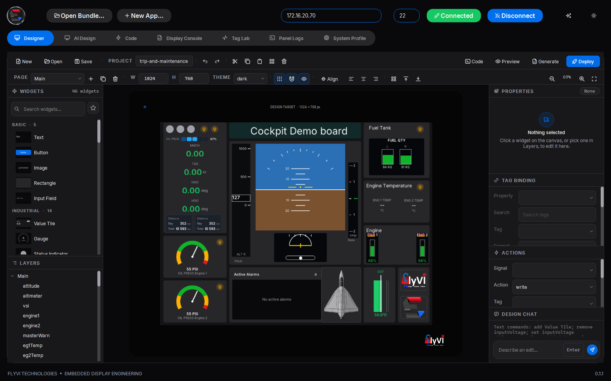

<sub><strong>The Designer</strong>, connected to a 10.1" panel — the canvas is 1024 × 768 because that is what the panel reported, and every widget on it is drawn by the panel's own renderer.</sub>

</div>

<br />

<table>
<tr>
<td width="33%" valign="top">
<a href="#ai-design">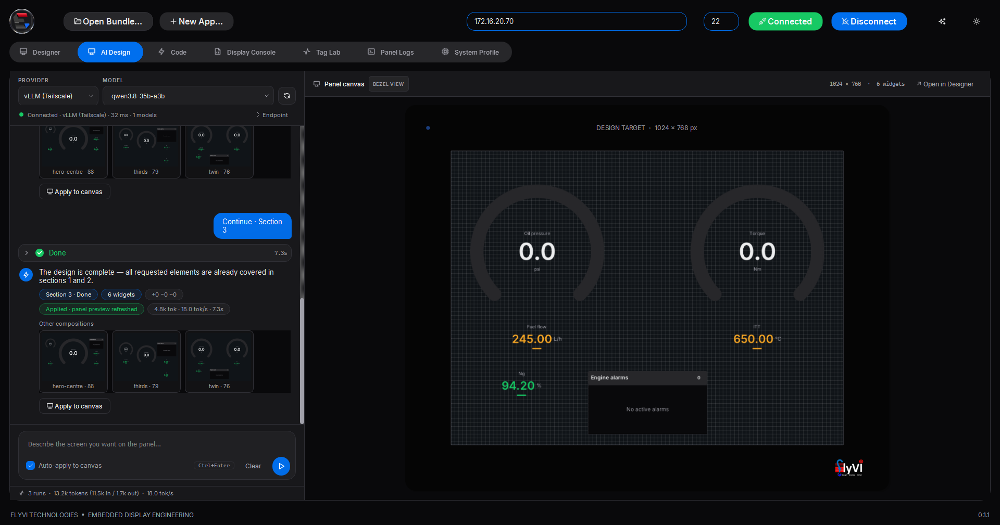</a>
<p><strong>Describe it</strong><br /><sub>A model builds the screen in sections, composed for the glass — split into pages when it will not fit.</sub></p>
</td>
<td width="33%" valign="top">
<a href="#code">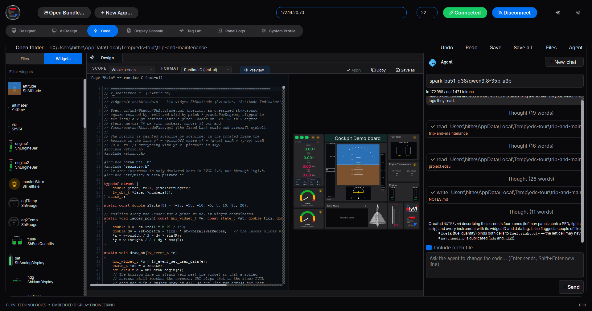</a>
<p><strong>Code it</strong><br /><sub>The design, the C that draws each widget, and a coding agent that edits the project.</sub></p>
</td>
<td width="33%" valign="top">
<a href="#deploying">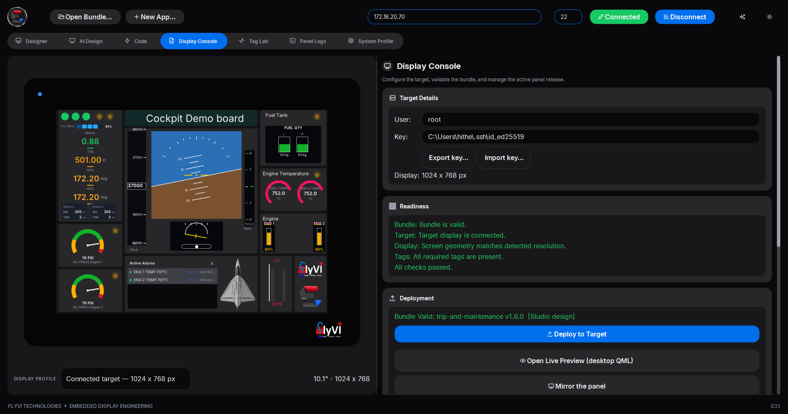</a>
<p><strong>Ship it</strong><br /><sub>Validate, deploy atomically, watch the panel's own screen at a frame a second.</sub></p>
</td>
</tr>
</table>

---

## The idea

A machine builder ships one panel image. Their customers — or their own app team — put a screen on it and push it with one button or one command. The app never touches a GPIO line, an ADC node or a serial port: it binds to **tags** that arrive over a loopback socket, and the platform does the rest.

<div align="center">

</div>

| | Layer | Owns | Knows nothing about |
|:-:|---|---|---|
| **1** | `hmi-hwd` — hardware daemon | GPIO, ADC, UART, Modbus, safe states | pixels |
| **2** | `hmi-ui` — panel runtime | the design file, bindings, alarms, pixels on DRM/KMS | hardware |
| **3** | deployment | atomic install, health check, rollback | either of the above |

Three ways to a screen, one pipeline after it:

| | Start from | Runs on the panel as |
|---|---|---|
| **Describe it** — [AI Design](#ai-design) | *"An engine page for a turboprop: torque, ITT, Ng, fuel flow and an alarm list"* | a Studio design, drawn by `hmi-ui` |
| **Draw it** — [Designer](#the-studio) | an empty canvas the size of the panel's glass | a Studio design, drawn by `hmi-ui` |
| **Bring your own** — [Qt apps](#qt-applications) | an existing PySide6 or PySide2 application | the application itself, with a Qt runtime the Studio installs at deploy |

---

## Quick start

> [!TIP]
> No hardware needed to start. The hardware daemon simulates its I/O and Tag Lab drives any tag a design invents, so the whole flow runs on a desktop.

**Packaged** — download `EmbeddedDisplayStudio.exe` (Windows) or the Linux x86-64 build from the [latest release](../../releases/latest). It carries its own Python, PySide6 and pip; nothing to install.

**From a checkout** — Python 3.12:

```bash
python -m pip install -r requirements.txt
python main.py                                            # --bundle <dir> to open one
python daemon/hmi_hwd.py --config daemon/hwd.json --sim   # optional: simulated I/O
```

**A panel**, once — key-based SSH as root, then the platform installed onto a stock image, no reflash:

```bash
ssh-copy-id root@<panel-ip>
python deploy/provision_panel.py --host <panel-ip> --check   # survey only
python deploy/provision_panel.py --host <panel-ip>
```

**From a sentence to the glass**

1. **AI Design** — pick a provider and model, describe the screen, <kbd>Ctrl</kbd>+<kbd>Enter</kbd>.
2. **Designer** — the result is an ordinary project; bind each instrument to its tag.
3. **Tag Lab** — drive those tags and watch the instruments move.
4. **Connect** — the panel's real display size retargets the canvas.
5. **Deploy** — the panel must draw the screen within 25 s, or it rolls itself back.

---

## The Studio

One window, seven workspaces, under a header with the panel's address, **Connect** / **Disconnect**, **Open Bundle…**, **New App…**, the theme and the animations switch.

| Workspace | |
|---|---|
| **Designer** | Draw the screen on a canvas the size of the panel's glass, bind widgets to tags, Preview, Generate, Deploy |
| **AI Design** | Describe the screen; a local or hosted model builds it onto the same canvas |
| **Code** | Files, the design as the panel reads it, the C that draws each widget, and a coding agent |
| **Display Console** | Target and key, readiness, **Deploy to Target**, **Mirror the panel**, rollback, restart, releases |
| **Tag Lab** | Drive any tag the design declares with a waveform, before the I/O exists |
| **Panel Logs** | The journal of `hmi-ui` and `hmi-hwd`, followed live |
| **System Profile** | What the live release costs the board |

**The Designer.** A searchable widget library with favorites, a layer tree that mirrors the page, and an inspector generated from the widget registry — paired X/Y and W/H cells, colour swatches, and a tag-binding editor with format, scale, unit and **warning / critical** thresholds. Resize from any of the eight handles, snap, align, z-order; **Tidy up** composes the page on a 12-column grid; **Design Chat** takes offline text commands. No bundle is needed to start: the first Preview or Deploy creates one under `Documents/EmbeddedDisplay Studio/projects/<name>/`.

**The canvas follows the glass.** On **Connect** the Studio reads the panel's real geometry from its DRM connector and retargets the canvas and the bezel to it.

**46 widgets from one registry** — shadcn/ui-derived basics (`ShButton`, `ShInput`, `ShCard`, `ShTabs`, …), industrial (`ShGauge`, `ShValueTile`, `ShTrendChart`, `ShAlarmTable`, …), avionics (`ShAttitude`, `ShTape`, `ShCompass`, `ShVSI`, `ShFlightDirector`, `ShEngineGauge`, `ShFuelQuantity`, `ShAnnunciator`, …) and automotive (`ShClusterGauge`, `ShGearIndicator`, `ShDriveMode`, `ShTelltale`, `ShTripInfo`, `ShVehicleStatus`, …). Every one binds to tags; interactive ones write back through actions.

<table>
<tr>
<td width="50%">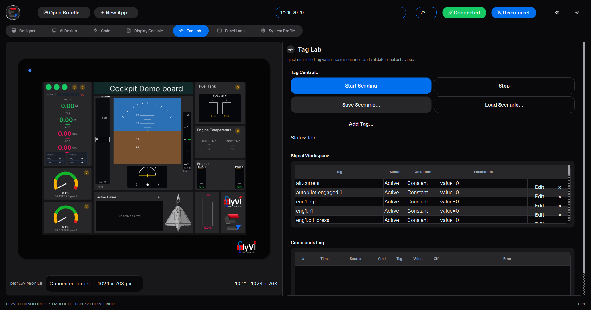<p align="center"><sub><strong>Tag Lab</strong> — every tag the design binds, ready to drive with a constant, ramp, sine, square or noise; scenarios save and replay.</sub></p></td>
<td width="50%">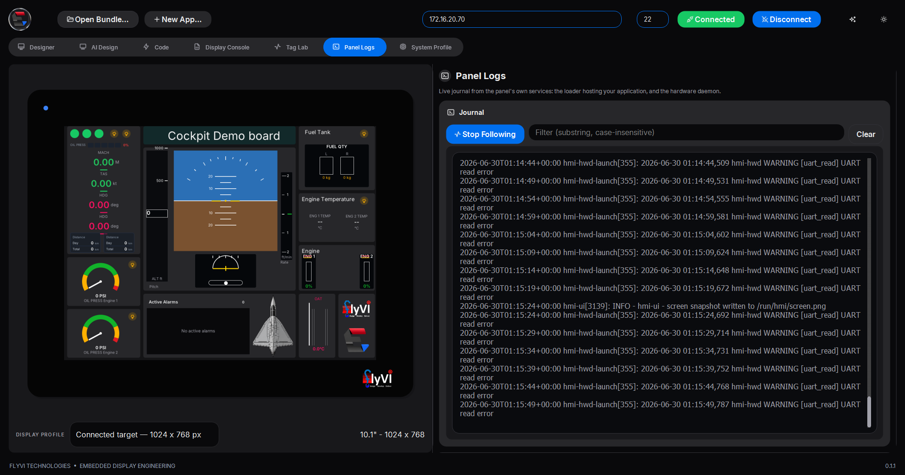<p align="center"><sub><strong>Panel Logs</strong> — the panel's journal, live: here a UART the daemon was configured for is not answering.</sub></p></td>
</tr>
<tr>
<td width="50%">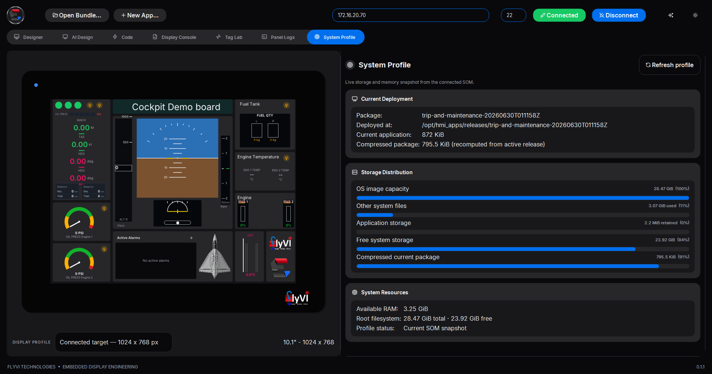<p align="center"><sub><strong>System Profile</strong> — the active release, its footprint, the storage split and free RAM, read over SSH.</sub></p></td>
<td width="50%">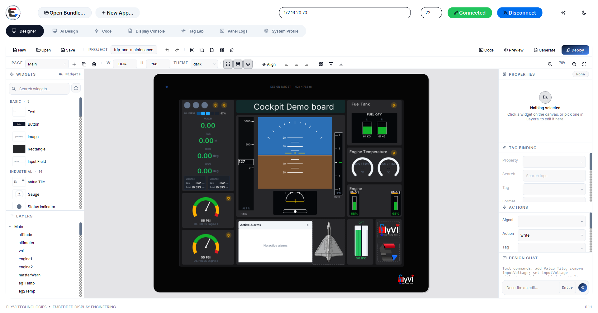<p align="center"><sub><strong>Light mode</strong> — the theme follows the operator; the design keeps its own colour mode for the panel.</sub></p></td>
</tr>
</table>

---

## AI Design

Describe the screen; the Studio streams the model's answer, turns it into Designer widgets, composes them for the panel's glass and puts them on the canvas. From there it previews and deploys exactly like a hand-drawn design.

<table>
<tr>
<td width="50%">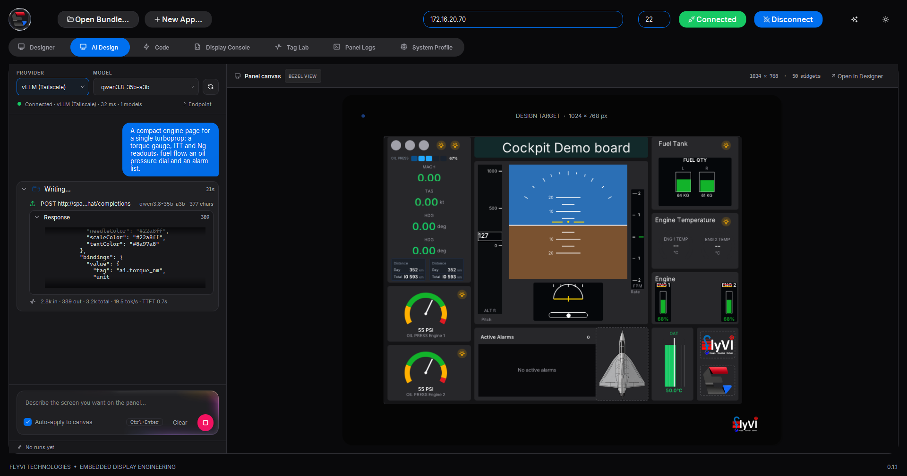<p align="center"><sub><strong>At work</strong> — the brief and the turn's execution shell: the request, the streamed answer, tokens and time to first token.</sub></p></td>
<td width="50%"><p align="center"><sub><strong>Composed</strong> — two instruments of a kind become a mirrored <em>twin</em>; other compositions wait as thumbnails.</sub></p></td>
</tr>
</table>

| Provider | How | Needs |
|---|---|---|
| **Ollama** | local, zero configuration | `ollama serve` |
| **OpenAI** · **Anthropic** · **Google** | hosted | an API key, remembered per provider |
| **vLLM** | your own server on the network or tailnet — preset `http://spark-ba51:8080`, `qwen3.8-35b-a3b` | the server's API key |
| **BYOK** | any OpenAI-compatible server | base URL + key |

The status line tells a server that is not there (`unreachable`) from one that refused the key (`API key required` / `rejected`), and a saved model the server no longer serves is replaced by one it does.

### How a brief becomes a screen

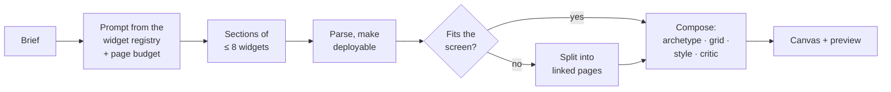

1. **A prompt from the palette** — built from the widget registry and the target screen, so the model only knows widgets the panel can draw. It carries a **per-page budget** for that screen and asks for gauge ranges in the tag's own units. A brief naming a different resolution from the panel's is reported.
2. **Sections** — at most eight widgets per response, merged by id and continued automatically until complete; a response cut off at the output limit is salvaged.
3. **Made deployable** — undeclared properties dropped, tags lowercased, actions on signals a widget cannot emit and links to pages never built removed, reused ids renamed.
4. **Fit** — if the widgets' minimum footprints will not fit, the design becomes pages: the instruments, alerts and controls that matter most stay on an overview, the rest go to a page per engine or system, linked with a row of buttons along the foot. The limit is measured: layout composes cleanly up to about sixteen widgets at 1024 × 768.
5. **Compose** — a human-designed archetype places the widgets (hero-centre, thirds, header-hero-rail, card-grid, split, and **twin** for paired instruments), the grid aligns them, each face gets its proportions, and a style pass repairs scales: a range too short for the widget's thresholds is widened, a 0..1 scale with a real readout becomes the real scale, paired instruments share one scale. A critic scores the page; one that still overlaps moves its least important widget on. After every section the whole page is composed again.
6. **Apply** — one undo step on the canvas, the preview reloads; the last three turns ride along, so *"make the RPM gauge bigger"* edits rather than restarts.

<div align="center">
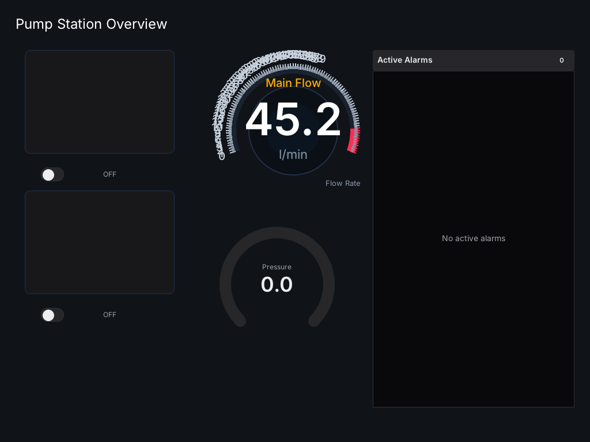&nbsp;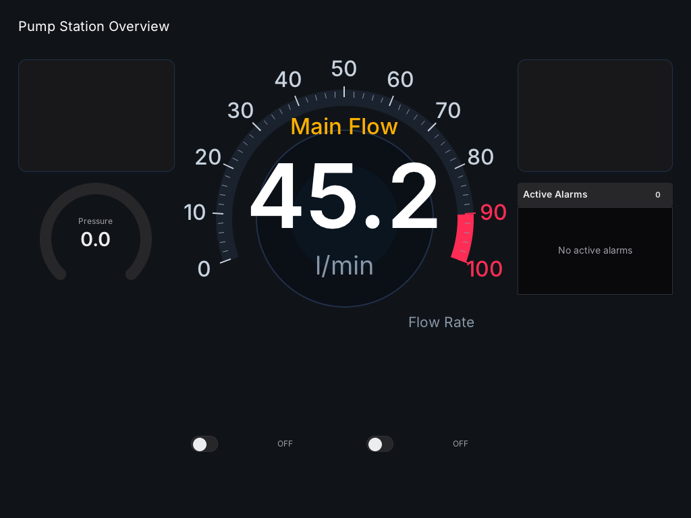
<br /><sub>The same model output before and after composition, both drawn by the panel's renderer.</sub>
</div>

<details>
<summary><strong>The execution shell, presets and the self-driving cluster</strong></summary>

<br />

Every turn is a foldable **execution shell** — request, thinking, response, parsed design, canvas diff (`+added −removed ~changed`), usage (`in · out · tok/s · TTFT`) — with chips such as `Section 2 · Fuel`, `14 widgets`, `Applied · panel preview refreshed`. A reasoning model's thinking pass is off by default: it counts against the output budget, and a long one returns no design at all.

**Design presets.** A brief that reads like an automotive cluster or an EV dashboard gets a hand-built exemplar and a style guide appended to the prompt (`python -m tools.hmi_deployer.design_presets --list`).

**A cluster that drives itself.** `sim.car.*` values are a sixty-second drive cycle, so a page bound to them carries its own clock on the canvas, in the Live Preview window and on the panel. `designer/templates/automotive_cluster_demo.edsui` is the preset wired to it.

<div align="center"></div>

</details>

---

## Code

The project as code, with a coding agent beside it.

<table>
<tr>
<td width="50%">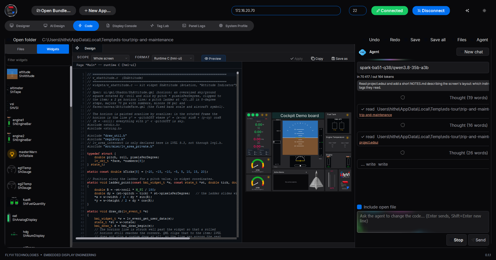<p align="center"><sub><strong>At work</strong> — the agent reads the design, thinks, writes; every tool call in the transcript.</sub></p></td>
<td width="50%"><p align="center"><sub><strong>Done</strong> — <code>NOTES.md</code> written, and two binding mistakes it noticed flagged for review.</sub></p></td>
</tr>
</table>

* **Files and Widgets** — the bundle's folder as a tree and a Widgets list with live thumbnails; any file opens in a tabbed editor (C, Python, QML, JSON, `.edsui`) with undo, redo and save.
* **The design as the panel reads it** — pick a widget and its `.edsui` sits beside `hmi-ui`'s render; edit and **Apply** as one undo step. **Runtime C (hmi-ui)** shows `native/hmi-ui/src/widgets/w_<type>.c`, the file compiled into the runtime.
* **The agent** — [opencode](https://opencode.ai) driven over its HTTP server in the project folder, on the model configured in opencode. Thinking, tools, file links and permission prompts show in the transcript; an edited file reloads in its tab. Install once with `npm i -g opencode-ai`. Notes in [docs/CODE_SECTION.md](docs/CODE_SECTION.md).

---

## Deploying

<div align="center">

</div>

* **Nothing is converted.** No build and no code generation for the target: the panel interprets `project.edsui` as the Designer saved it.
* **What travels is what runs** — `manifest.json`, `project.edsui` and `assets/`, packed by one packer shared with the CLI so both produce a byte-identical tarball.
* **Validated twice, by one implementation** — the Studio, the CLI and the panel's installer all call `schema/manifest.py`.
* **Readiness is the picture, not the process** — `hmi-install` starts the bundle's GUI service and waits for `/run/hmi/gui-ready`, touched only once the first page is on the glass.
* **The swap cannot leave the panel dark** — tmpfs landing, checksum, staging, validation, then `rename(2)`. No readiness within 25 s and the previous release comes back.
* **Boot default, rollback, releases, restart** — a proven release boots next time; the previous one is a button away; any release the panel still holds can be activated.

> [!NOTE]
> **Seeing the glass.** **Mirror the panel** signals the runtime, copies `/run/hmi/screen.png` and paints it at a frame a second — the panel itself, live values and all. By hand: `ssh <panel> 'kill -USR1 $(pidof hmi-ui)' && scp <panel>:/run/hmi/screen.png .`

**From the command line**, for CI or a headless machine — options in [`deploy/README.md`](deploy/README.md):

```bash
./deploy/deploy_to_hmi.sh deploy -H <panel-ip> -b ./trip-and-maintenance
```

<details>
<summary><strong>Sharing the deploy key</strong></summary>

<br />

A panel trusts one SSH key. A **deploy key bundle** (`.hmikey`) carries the key pair and the panel's address, so a colleague can Connect and Deploy at once.

<div align="center"></div>

**Export key…** tries each candidate key on its own against the panel and packs the one it accepts, with the panel's host key. **Import key…** installs it under `~/.ssh/hmi-deploy/` with owner-only permissions, writes the host key into `known_hosts`, fills the connection fields and verifies the link — naming the problem in plain words when there is one.

```bash
python -m tools.hmi_deployer.deploy_key export --host 172.16.20.70 --out line3.hmikey
python -m tools.hmi_deployer.deploy_key import line3.hmikey
```

The file holds a private key: hand it over directly. Passphrase-protected keys are refused; the Studio deploys non-interactively.

</details>

---

## The panel runtime

`hmi-ui` is the program that draws every Studio design on the panel: C11 on [LVGL](https://lvgl.io) 9.3, straight to the DRM/KMS device, with no compositor. It interprets `project.edsui` at start — pages, all 46 widget types, bindings, actions, the alarm engine, touch — so a new screen is new data, never a new build.

### How LVGL reaches the HMI

LVGL is not a package on the panel. It is compiled **into** `hmi-ui`: `native/hmi-ui/lvgl` is the upstream repository pinned as a git submodule (`release/v9.3`), configured by `native/hmi-ui/lv_conf.h` and linked statically, as is cJSON. What ships is one executable and a folder of assets:

| On the panel | Size | What it is |
|---|---|---|
| `/usr/lib/hmi/ui/hmi-ui` | ~1.4 MB | the runtime: LVGL, cJSON and the widget kit's C, one aarch64 binary. Links dynamically only against `libdrm`, `libm` and `libc` |
| `/usr/lib/hmi/kit/` | ~2.2 MB | Inter fonts and Tabler icons — what the runtime draws text and icons with |
| `hmi-ui.service`, `/etc/default/hmi-ui` | | the unit that runs it, and its display, touch and log settings |

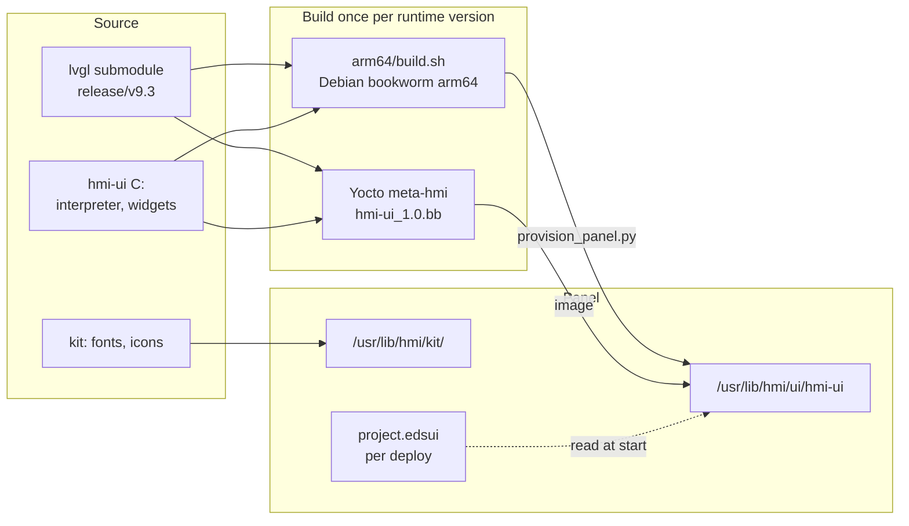

There are two ways to put it on a board, and both install the same files:

* **Onto a board already in the field** — `native/hmi-ui/arm64/build.sh` builds the aarch64 binary inside a Debian bookworm arm64 root under qemu (from WSL on Windows). Built against bookworm's glibc 2.36, it runs on any newer glibc, such as a Toradex image's 2.39. `deploy/provision_panel.py --host <ip>` packs that binary, the kit, the units and the installer into one tarball, uploads it and installs it — no reflash.
* **Into an image** — `yocto/meta-hmi` builds the same sources with bitbake: `hmi-ui_1.0.bb` (CMake, `DEPENDS = "libdrm"`) and `hmi-ui-kit_1.0.bb`, pulled in by `packagegroup-hmi`. No Qt layer is needed.

```bash
bitbake-layers add-layer /path/to/meta-hmi
bitbake <your-bsp-reference-image>
```

After that, **deploying a design never touches the runtime**: a deploy carries `project.edsui`, its assets and a manifest, and `hmi-ui` reads them on its next start. Updating the runtime itself — a new LVGL, a widget fix — is a new `hmi-ui` binary, shipped by provisioning again or by the next image.

**The same runtime on the desktop.** `native/hmi-ui/win64/` cross-compiles the identical sources for Windows without the DRM backend. The Studio carries that `hmi-ui.exe` and uses it to draw the canvas, the bezel and the Code previews, so the desktop shows exactly what the glass will draw — `win64/check.sh` compares its renders with the Linux build's.

<details>
<summary><strong>The widget kit is written twice, on purpose</strong></summary>

<br />

| | Where | Who reads it |
|---|---|---|
| **Spec** | `ui/qml/Shadcn/*.qml` — the reference drawing | the desktop Live Preview; humans |
| **Port** | `native/hmi-ui/src/widgets/w_*.c` — the same drawing on LVGL | the panel, and every still image the Studio shows |

`tests/ui/test_widget_parity.py` renders both and compares them. A parity suite proves only what it renders: drawn at their defaults, four faults hid for a long time — an attitude indicator with sky and ground inverted, a tape whose scale travelled with the needle, a VSI with hard-coded labels, a gauge that ignored the design's range. `hmi-ui --render-widget <Type> --props '{...}' --headless out.png` draws one widget in isolation.

</details>

---

## Qt applications

An existing PySide6 or PySide2 application deploys to the same Qt-free panel. **Open Bundle…** detects the entry point and the binding, proposes the manifest, and previews the real application in the bezel — clicks, drags and keys reach it — before anything is sent.

At deploy, the Studio asks the panel what the application needs and lacks, and installs it after one confirmation:

| Piece | What lands on the panel |
|---|---|
| **Launcher** | `hmi-gui-launch`, `hmi-gui.service` (under Weston), its defaults, a Weston drop-in, and an `hmi-install` that starts the right service per bundle |
| **PySide2** | `/opt/hmi-python-qt5` — CPython 3.11, PySide2 5.15 and a private Qt 5.15, assembled on the Studio's PC from Debian bookworm packages (no WSL, no `dpkg-deb`) and cached |
| **PySide6** | PySide6-Essentials wheels into `/opt/hmi-python` |
| **The app's packages** | aarch64 or pure-Python wheels fetched on the PC and installed with `pip --no-index` — the panel needs no internet |

`hmi-install` then starts `hmi-gui.service` and makes it the boot default; deploying a Studio design afterwards hands the display back to `hmi-ui`. Both directions have been run on a Verdin i.MX8M Plus.

> [!IMPORTANT]
> The panel image must already carry **Weston** for a Qt application. A Qt bundle declares its binding, because the two cannot share an interpreter:
> ```json
> { "runtime": "python", "entry": "main.py", "qt_binding": "pyside2", "qt": ">=5.15" }
> ```

The packaged Studio previews PySide6 applications with no Python on the machine; a PySide2 preview needs a PySide2 interpreter on PATH or named with `HMI_PREVIEW_PYTHON_QT5`.

---

## Bundles

A bundle is a directory: `manifest.json` plus the entry it names. Only `schema`, `name`, `version` and `entry` are required; the Designer writes the rest.

```
trip-and-maintenance/
├── manifest.json     runtime, screen, tags_required, alarms
├── project.edsui     the screen itself
└── assets/           images the design refers to
```

| runtime | entry | Runs on the panel as |
|---|---|---|
| `edsui` | `project.edsui` | interpreted by `hmi-ui` — what the Studio writes |
| `python` | `*.py` | the application under Weston, with the Qt runtime installed at deploy |
| `qml` | `*.qml` | legacy: needs the retired native Qt loader |

<details>
<summary><strong>A full manifest, and the rules it is held to</strong></summary>

<br />

```json
{
  "schema": 1,
  "name": "trip-and-maintenance",
  "version": "1.6.0",
  "entry": "project.edsui",
  "runtime": "edsui",
  "screen": { "width": 1024, "height": 768 },
  "theme": "dark",
  "tags_required": ["alt.current", "eng1.egt", "nav.pitch"],
  "alarms": [
    { "tag": "eng1.egt", "label": "ENG 1 TEMP", "unit": "°C",
      "warning": { "op": ">", "value": 650 },
      "critical": { "op": ">", "value": 700 } }
  ]
}
```

| Field | Rule | Why it is checked on the laptop |
|---|---|---|
| `schema` | exactly `1` | a future format should fail here, not halfway through an install |
| `name` | `^[a-z0-9][a-z0-9._-]{0,63}$` | it becomes a directory on the panel and a filename on the host |
| `version` | `1.4`, `1.4.0`, `2.0.0-rc1`, `1.0.0+build7` | it names artefacts |
| `entry` | relative, no `..`, must exist | an escaping path resolves somewhere else on the target |
| `runtime` | `qml` needs `.qml`, `python` needs `.py` | a mismatch would fail only on the panel |
| `qt_binding` | must match what the sources import | the wrong one starts the wrong interpreter |

`runtime` defaults to `qml`, `screen` to 1280×800, `qt_binding` to `pyside6`. Bundles are capped at 500 MB; `.git`, `__pycache__`, `build`, `dist`, `node_modules` and similar are excluded automatically, `.hmiignore` adds more.

</details>

> [!NOTE]
> **The one rule for an application:** never touch a GPIO line, an ADC node or a serial port — bind to tags. That is the whole contract, and it is what lets the same bundle run on a bench, in a preview and on a panel.

---

## Architecture

Three programs and one file; the file is the deliverable and the programs are deliberately ignorant of each other. The normative interface spec is [docs/CONTRACT.md](docs/CONTRACT.md).

**The tag link.** Tags arrive on a loopback UDP socket as JSON. `hmi-hwd` owns GPIO through libgpiod (1.6 and 2.x), analogue inputs through IIO, serial and Modbus, and publishes them on port 5000. `hmi-ui` keeps a tag map with a 2.5 s watchdog and goes visibly offline rather than showing a value that stopped arriving. Tag names are lowercase dotted.

```
hmi-ui  --->  {"cmd":"subscribe","ttl":5}              every 2 s
        <---  {"t":"tags","seq":41,"tags":{"eng1.n1":92.4,"gear.warning":false}}
        --->  {"id":"gui-7","cmd":"set","tag":"do.relay1","value":true}
        <---  {"t":"ack","id":"gui-7","ok":true}
```

**Bindings, thresholds and alarms.** A binding carries a unit and optional `warning` / `critical` thresholds (`"> 650"`). The Designer collects them into the manifest's `alarms`; the runtime's alarm engine raises, clears and timestamps entries that any `ShAlarmTable` shows. Thresholds are absolute, so the dial must be in the same units — a gauge left on 0..100 never reaches 650.

<details>
<summary><strong>What runs on the panel</strong></summary>

<br />

| Unit | What it does |
|---|---|
| `hmi-ui.service` | the runtime: design, bindings, actions, alarms, touch |
| `hmi-hwd.service` | GPIO, ADC, UART, Modbus → tags; safe states on shutdown |
| `hmi-gui.service` | only for a Qt bundle, installed at its first deploy |
| `hmi-tagsim.service` | bench only, optional: flies the deployed design |

| Path | Holds |
|---|---|
| `/opt/hmi_apps/current` | symlink to the running release — never write through it |
| `/opt/hmi_apps/previous` | what a rollback returns to |
| `/opt/hmi-python` | the complete CPython the installer and daemon run on |
| `/run/hmi/gui-ready` | touched once the first page is on the glass |
| `/run/hmi/screen.png` | what the panel shows, written on `SIGUSR1` |

</details>

<details>
<summary><strong>Bench data without an aircraft — <code>hmi-tagsim</code></strong></summary>

<br />

`hmi-hwd --sim` fakes the hardware channels but knows nothing of the tags a design invents. `daemon/tagsim.py` reads the tag list out of the **deployed design** and fills it from a single flight — taxi, climb, cruise, turn, descend, land — so the screen agrees with itself, and ramps that cross a binding's thresholds put real entries in the alarm table. It serves on 5010, leaving `hmi-hwd` on 5000:

```bash
scp daemon/tagsim.py          root@<panel>:/usr/lib/hmi/tagsim.py
scp daemon/hmi-tagsim.service root@<panel>:/etc/systemd/system/
echo 'HMI_UI_EXTRA_ARGS=--daemon-port 5010' >> /etc/default/hmi-ui
systemctl daemon-reload && systemctl enable --now hmi-tagsim && systemctl restart hmi-ui
```

Remove that line from `/etc/default/hmi-ui` to go back to the real inputs.

</details>

**Built for the field.** The daemon cannot be crashed by its socket — malformed JSON, oversized frames, binary noise and invalid UTF-8 are counted and answered with a typed error, or with silence where no correlation id survives, so it cannot be used as a UDP reflector. Outputs go to configured safe states on `SIGTERM`, with systemd watchdog keep-alives every cycle.

---

## Hardware

Not tied to one module: a 64-bit ARM Linux board that can put pixels on a display and accept an SSH connection. Developed and exercised on a **Toradex Verdin i.MX8M Plus** with a 10.1" 1024 × 768 panel.

<div align="center">

</div>

| | Needed | |
|---|---|---|
| **OS** | 64-bit Linux, systemd, a DRM/KMS display | `hmi-ui` draws to DRM itself |
| **Python** | a complete Python 3 — or provisioning's `/opt/hmi-python` | the installer and daemon run on it |
| **coreutils** | `flock`, `tar`, `sha256sum` | `hmi-install` serialises and verifies with them |
| **Weston** | only for a Qt bundle | the Qt application runs under it |
| **RAM** | 1 GB for Studio designs, 2 GB for Qt apps | `hmi-ui` runs in a few MB |
| **Storage** | ~2 GB free | releases are retained; the Qt5 runtime is ~300 MB |
| **Network** | Ethernet or Wi-Fi, SSH on 22 | the only channel the Studio uses |
| **Field I/O** | optional, each on its own | `hmi-hwd` disables what it cannot reach |

**Before first power-on**, confirm the board-specific parts `daemon/hwd.json` assumes (`gpioinfo`, `iio_info`, `ls /dev/serial/by-id/*`) and release the pins from their default pinmux with a device-tree overlay — `daemon/README.md` walks through it.

---

## Look and feel

Every pixel comes from a port of [shadcn/ui](https://github.com/shadcn-ui/ui) with [Tabler](https://github.com/tabler/tabler-icons) icons vendored offline; `ui/tokens.json` is the single source of truth and a test fails if `Theme.qml` drifts from it.

The Studio's motion is [Libraries.dev](https://github.com/Jakubantalik/Libraries.dev) (MIT, © 2026 Jakub Antalik) ported to plain QPainter in `ui/python/fx/` — no web engine, no OpenGL, no numpy: **liquid tabs** in the navigation, a **border beam** on whatever is working, **thinking orbs** for the AI run, a **bot avatar** for the coding agent, a **liquid-metal** mark, a **pixel mosaic** while a preview renders, and a **working glow** under the agent. One timer drives them all and stops when nothing moves; the sparkles button turns motion off. Notes in [docs/UI_FX.md](docs/UI_FX.md).

---

## Repository

```
docs/CONTRACT.md      the normative interface spec — read this first
schema/               manifest validation, bundle packing, dependency scan
daemon/               Layer 1: hmi-hwd, the tag map, tagsim
native/hmi-ui/        Layer 2: the panel runtime — C11 + LVGL (submodule), its Windows preview build
native/hmi-gui/       the Qt application launcher and unit, and the retired native QML loader
gui/                  the retired Python QML loader; its TagEngine drives the Live Preview
designer/             the Designer: model, canvas, registry, generators, layout, the Code IDE
tools/hmi_deployer/   the Studio: window, deploy, Qt runtime on demand, AI Design, Tag Lab, mirror
ui/                   design system: tokens, QML kit, icons, QPainter effects
target/               the installer (hmi-install), units, tmpfiles
deploy/               deploy_to_hmi.sh and the provisioning scripts
packaging/            the PyInstaller spec for the packaged Studio
yocto/meta-hmi/       the bitbake layer
tests/                1467 tests in 97 modules
```

---

## Verification

```bash
python tests/run_all.py            # 1467 tests in 97 modules
native/hmi-ui/build.sh --test      # the runtime's C tests
```

> [!NOTE]
> The installer and shell suites need `flock`, so they skip on Windows — the runner prints how many skipped, because a skip is not a pass. CI runs the whole suite on Linux; `tests/README.md` has the WSL command.

| Area | Coverage |
|---|---|
| Daemon | error codes, silence on unparseable input, `seq` monotonicity, hostile frames |
| Install | atomic swap, traversal refused before extraction, rollback, the GUI service per runtime, boot default |
| Panel runtime | protocol conformance and widget parity against the QML kit, through a real `hmi-ui` |
| Bundles | one validator, three callers; the dependency scan and offline wheel install |
| Qt on demand | the panel check, launcher and runtime installs, the PySide2 runtime assembled from `.deb` streams |
| Designer | model, canvas, inspector, generator, Live Preview, repairs on open |
| Layout | grid, archetypes, fit and pages on a real 35-widget AI design, scale repairs, the critic |
| AI Design | streaming for every provider, the key-aware probe, sections and merge, tag and action repairs |
| Code | project files, editor tabs, the opencode client on a recorded stream, the agent panel |
| Studio | connect/disconnect, deploy keys, mirror, the frozen entry points |

**The release gate.** Tagging builds `EmbeddedDisplayStudio.exe` on CI and then **runs it**: the binary previews a fixture whose imports were never visible to the build, grabs its bezel, and `tests/verify_smoke_capture.py` checks the fixture's colour is in the picture. Only a binary that passed is attached to a release.

---

## What's new in 0.1.1

<table>
<tr>
<td width="33%" valign="top"><strong>Qt apps on a Qt-free panel</strong><br /><sub>The Studio installs the PySide2 or PySide6 runtime, the launcher and the app's packages at deploy, offline; the panel switches between <code>hmi-ui</code> and the Qt app per bundle.</sub></td>
<td width="33%" valign="top"><strong>AI Design that fits the glass</strong><br /><sub>Designs too big for the screen become linked pages; a twin composition for paired instruments; gauge scales repaired; model output made deployable.</sub></td>
<td width="33%" valign="top"><strong>The Code workspace</strong><br /><sub>A project editor with an opencode agent, the new look, Mirror the panel, <code>hmi-tagsim</code>, and a Live Preview that says why a design did not load.</sub></td>
</tr>
</table>

Every change, and every earlier release, is in [**CHANGELOG.md**](CHANGELOG.md).

---

<div align="center">

**MIT licensed** — see [`LICENSE`](LICENSE). LVGL is MIT; Tabler Icons are MIT, with their notice in `ui/icons/LICENSE.tabler`. The packaged Studio also carries PySide6 and Qt, redistributed unmodified under the LGPL-3.0.

<sub>FLYVI TECHNOLOGIES · EMBEDDED DISPLAY ENGINEERING</sub>

</div>
