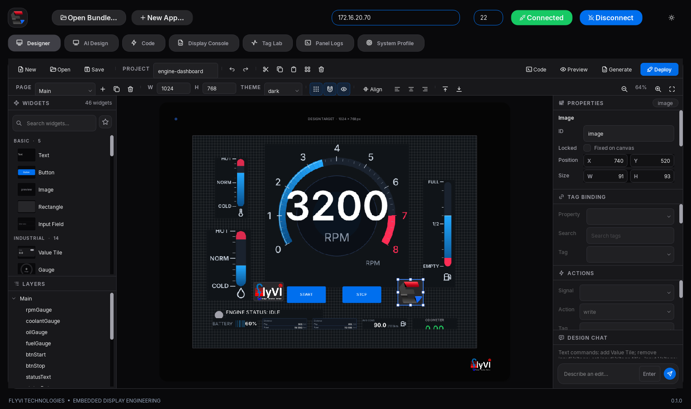
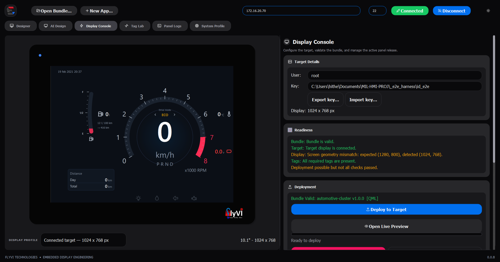
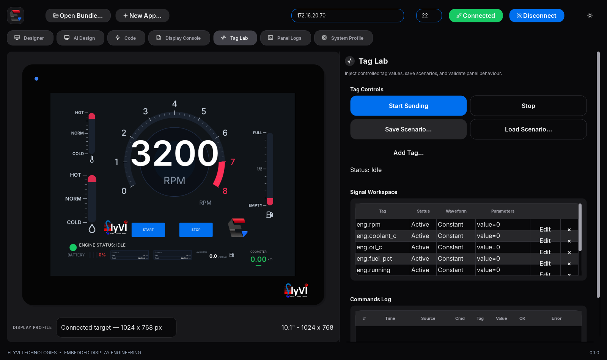
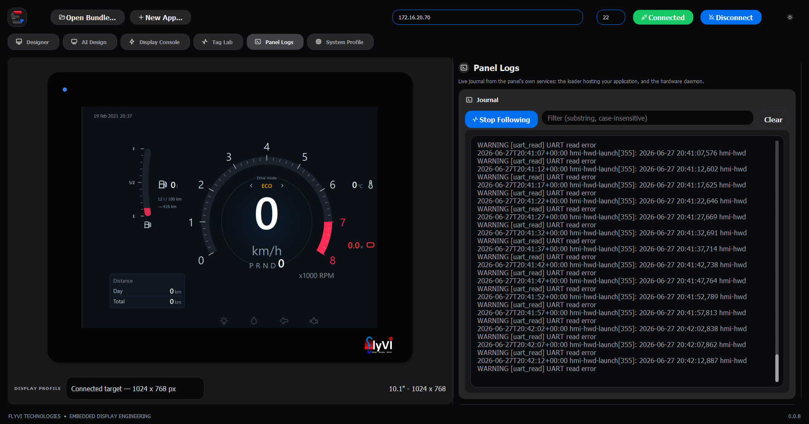
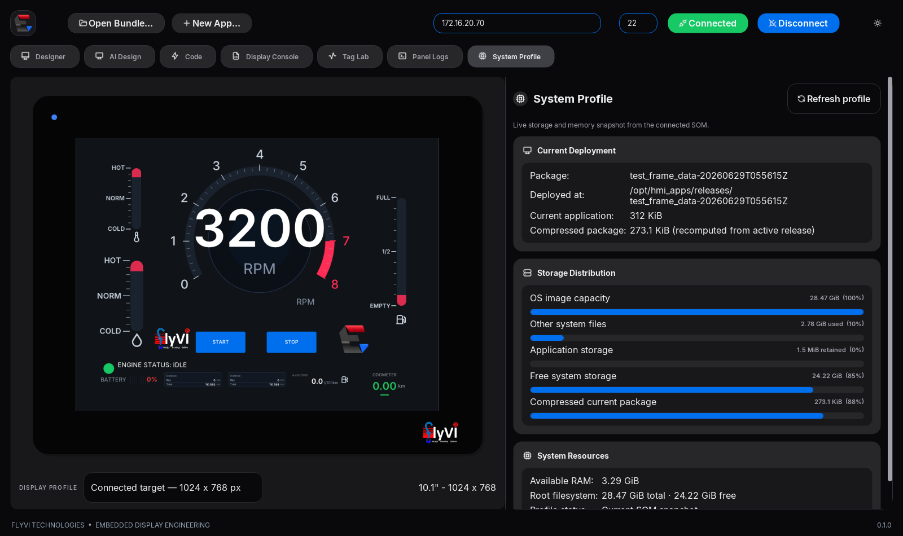
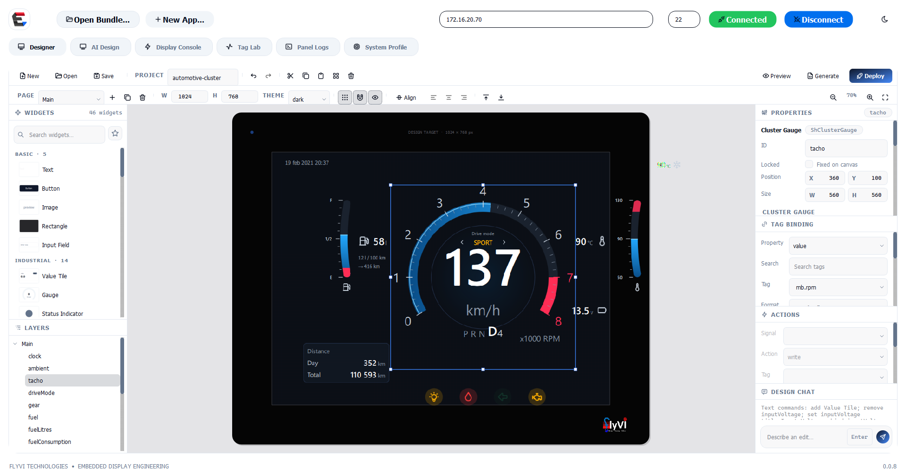

<div align="center">


### Bring Your Own App — HMI platform for embedded Linux panels

**EmbeddedDisplay Studio** lets teams visually design or import Qt 5/6 apps, preview them live, and deploy safely to embedded Linux panels over SSH.
Built for industrial, vehicle, marine, avionics, instrumentation and kiosk HMIs — with tag-driven data, no image reflash, and no hardware code in the app.

<br />

[](https://www.python.org/)
[](../../releases/tag/v0.0.5)
[](https://doc.qt.io/qtforpython-6/)
[](#qt5-and-qt6-applications-on-the-same-panel)
[](ui/qml/)
[](yocto/)
[](target/systemd/)
[](https://wayland.freedesktop.org/)
[](https://libgpiod.readthedocs.io/)
[](#from-a-python-app-to-the-panel)
[](packaging/)
[](ui/icons/)
[](#the-hardware-it-runs-on)
[](../../actions/workflows/ci.yml)
[](LICENSE)
[](LICENSE)

</div>

---

<div align="center">



<em>Drawing a panel screen in the Studio's own designer — palette and object
tree to the left, the canvas inside a bezel of the real glass, inspectors for
properties and tag bindings to the right. The canvas is 1024 × 768 because that
is what the panel at the top of the window reported; the same toolbar previews,
generates and deploys it.</em>

</div>

---

## The idea

A machine builder ships one panel image. Their customers — or their own app team —
write a Qt/QML application, or draw one in the Studio's own
[visual designer](#visual-designer), and push it to the panel with a single
command. The
app never touches a GPIO line, an ADC node or a serial port: it binds to **tags**
that arrive over a loopback socket, and the platform does the rest.



<sub>Source: <a href="docs/assets/architecture.mmd"><code>docs/assets/architecture.mmd</code></a></sub>

Three layers, deliberately decoupled:

| | Layer | Owns | Knows nothing about |
|---|---|---|---|
| **1** | `hmi-hwd` — hardware abstraction daemon | GPIO, ADC, UART, safe states | pixels |
| **2** | `hmi-gui` — app loader + tag engine | QML, bindings, the customer bundle | hardware |
| **3** | deployment | atomic install, health check, rollback | either of the above |

---

## What you need

### To run the Studio

The packaged Windows **`EmbeddedDisplayStudio.exe`** and Linux x86-64 release
need no Python installation: each carries its own Python, PySide6 and standard
library. Download the build for your workstation from the
[latest release](../../releases/latest). The Studio deploys applications to
64-bit ARM panels over SSH; the Linux x86-64 build is the desktop authoring and
deployment tool, not the panel runtime itself.

From a checkout:

| | |
|---|---|
| **Python** | 3.12 — the version CI runs and the executable is built from |
| **PySide6** | `6.8.1`, pinned in `requirements.txt` |
| **pyserial** | `3.5`, only for the simulated hardware daemon |
| **An SSH client** | `ssh` and `scp`. Windows: the built-in OpenSSH at `System32\OpenSSH`, which the tool resolves by absolute path so a PATH wrapper cannot shadow it |

```bash
python -m pip install -r requirements.txt
python main.py
```

Previewing a **PySide2** bundle needs a second interpreter with PySide2
installed, because the two bindings cannot share a process. It is found on PATH
or named explicitly with `HMI_PREVIEW_PYTHON_QT5`. This is the one thing the
packaged executable cannot supply for itself; PySide6 bundles preview with no
Python on the machine at all.

### To reach a panel

Key-based SSH as `root`, and nothing else from this end:

```bash
ssh-copy-id root@<panel-ip>
```

### On the panel

| | |
|---|---|
| **A 64-bit Linux image** | Yocto or similar, with **systemd**, and **Wayland/Weston** for the display |
| **A complete Python 3** | Read this twice: a Yocto image can ship `python3-core` alone — no `json`, `socket`, `hashlib` or `ctypes` — and the installer itself cannot run on that. `provision_panel.py` puts a self-contained interpreter at `/opt/hmi-python`, which every target script prefers |
| **A Qt runtime** | PySide6 for a Qt6 application; PySide2 at `/opt/hmi-python-qt5` for a Qt5 one. A panel can carry both |
| **coreutils** | `flock`, `tar` and `sha256sum` — `hmi-install` serialises on the first and verifies with the last |
| **libgpiod, IIO, pyserial** | Only for real I/O. Each is optional: `hmi-hwd` disables the feature it cannot reach rather than refusing to start |

If the panel is running a stock image, install the platform onto it first — no
reflash needed:

```bash
python deploy/provision_panel.py --host <panel-ip> --check   # survey only
python deploy/provision_panel.py --host <panel-ip>
```

`--check` names anything that would stop the board hosting the platform. Run it
before assuming an image is ready.

### The hardware it runs on

The platform is not tied to one module. It needs a 64-bit ARM Linux board that
can put pixels on a display and accept an SSH connection; everything below that
is the application's business, not the platform's.

<div align="center">



<sub>Source: <a href="docs/assets/hardware.mmd"><code>docs/assets/hardware.mmd</code></a></sub>

</div>

| | Needed | Why |
|---|---|---|
| **CPU** | 64-bit ARM, quad core in practice | Qt and the interpreter both live here; the tag engine is idle most of the time |
| **RAM** | 2 GB comfortably | A Qt Widgets application with its runtime sits in the low hundreds of MB |
| **Storage** | ~2 GB free after the OS | Retention keeps `current`, `previous` and three more releases; an unpacked release is typically 100–300 MB |
| **Display** | Whatever the manifest declares | The Studio composes the preview at that geometry, and the panel reports its real size on connect |
| **Touch** | Optional | Nothing in the platform requires it |
| **Network** | Ethernet or Wi-Fi | SSH on port 22 is the only channel the Studio uses — no agent, no broker, no open port on the panel beyond sshd |
| **GPU** | Optional | Qt Widgets renders through the raster engine and issues no desktop GL calls |

Field I/O is entirely optional and independently so: `hmi-hwd` disables the
feature it cannot reach rather than refusing to start, so a board with no ADC
still runs an application that only uses digital inputs.

---

### To develop on it

The full suite needs a POSIX shell with `flock`, so run it on Linux or under
WSL; on Windows the installer and shell-validator suites skip. Regenerating the
diagrams in this README needs `npx` and `@mermaid-js/mermaid-cli`.

### No hardware at all

Everything above is for a real panel. The whole stack also runs on a desktop —
see [Quick start](#quick-start), where the daemon simulates its I/O.

---

## Quick start

**On your laptop — no hardware needed.** The daemon simulates I/O so the whole
stack runs on a desktop.

```bash
python -m pip install PySide6

# terminal 1 — simulated hardware
python daemon/hmi_hwd.py --config daemon/hwd.json --sim

# terminal 2 — the panel UI, in a window
python gui/hmi_loader/main.py --apps-dir apps/demo-app --windowed

# terminal 3 — EmbeddedDisplay Studio
python main.py
```

### Running EmbeddedDisplay Studio

```bash
python -m pip install PySide6              # once
python main.py                             # from the repository root
```

`--bundle <dir>` opens an application on start; with no argument the last one
is restored. Then, in the window:

1. **Open Bundle…** — point it at your application's directory. The manifest is
   validated, or proposed and written for you if there is none, and the
   application starts rendering in the bezel at the target's resolution. The
   preview is live, not a picture: click it, drag it, type into it, and the
   events reach the widget under your cursor in the real application.
2. **Designer** — or draw the screen here instead of writing QML: drag controls
   from the palette onto a canvas the size of the panel's real glass, set their
   properties, bind them to tags, and let the Studio generate the QML. The
   design is saved as `project.edsui` beside the bundle it belongs to, and
   **Preview**, **Generate** and **Deploy** on that same toolbar run the same
   pipeline an imported application does. See [Visual Designer](#visual-designer).
3. **Target IP** and **Port** in the command strip, with `root` and the private
   key that reaches the panel under **Target Details** on the Display Console
   tab. `ssh-copy-id root@<panel-ip>` once, if you have not.
4. **Connect** — proves the link, reports the panel's real display size and
   which release is live on it. The badge beside it carries the link state, and
   the bezel re-composes itself at the resolution the panel reported.
5. **Deploy to Target** — everything in [the pipeline below](#from-a-python-app-to-the-panel).
   The bar names the stage it is in, and the console carries the panel's own
   words.
6. **Rollback** returns to the previous release. **Installed Releases** reaches
   any of the others the board still holds: activating one re-points the panel
   at it and makes the outgoing release the new rollback target, so it is
   undoable in turn. **Restart GUI** restarts what is running.
7. **Tag Lab** drives the application with signals instead of hardware — sine,
   square, ramp, noise or a constant, per tag — so panel behaviour can be
   exercised before the I/O it binds to exists. **Panel Logs** follows the
   journal from `hmi-gui` and `hmi-hwd`, which is where a fault that appears an
   hour after a successful deploy shows up. **System Profile** reports what the
   live release costs the board.

**From the command line**, for CI or a headless machine:

```bash
ssh-copy-id root@<panel-ip>                       # once
./deploy/deploy_to_hmi.sh -H <panel-ip> -b ./my-qt-app
```

If the panel is running a stock image rather than one built from
`yocto/meta-hmi`, install the platform onto it first — no reflash needed:

```bash
python deploy/provision_panel.py --host <panel-ip> --check   # survey only
python deploy/provision_panel.py --host <panel-ip>
```

`--check` surveys the board and names anything that would stop it hosting the
platform. Read it before assuming a stock image is ready: a **base** vendor
image ships `python3-core` alone — no `json`, no `socket`, no `ctypes` — and no
Qt, which is enough to stop the installer, the loader and any application. See
[`deploy/README.md`](deploy/README.md#what-a-minimal-image-is-still-missing) for
what to add and where the scripts expect it.

If the new app fails to render within 25 s, the panel **rolls itself back** to the
previous release and the command exits non-zero. A bad deploy cannot leave a
machine without a UI.

A successful deploy also makes the app the panel's **boot default**: once the
release has been proven to render, `hmi-gui.service` is enabled, so a power
cycle brings the same application back with no further action. Deploying is the
only step — there is nothing to enable by hand afterwards.

---

## From a Python app to the panel

What happens between pressing **Deploy to Target** and the application being the
panel's boot default. Every step is the same whether it is driven from the
window or from `deploy_to_hmi.sh`.



<sub>Source: <a href="docs/assets/deploy-pipeline.mmd"><code>docs/assets/deploy-pipeline.mmd</code></a></sub>

A few of those steps are worth their own sentence.

**Nothing is converted.** There is no build, no freezing, no cross-compilation:
the panel carries a complete CPython and the Qt binding the manifest asks for,
so the application runs there from the same sources it runs from on your
machine. What the pipeline does is decide what travels, prove it arrived
intact, and swap it in without a window where the panel has no UI.

**The dependency check reads the application, not a list.** Every file that
would be packaged is parsed, each absolute import reduced to its top-level
name, and the standard library, the bundle's own modules, the Qt bindings the
platform pins, and anything guarded by `try: … except ImportError` are removed.
What is left is what pip must supply — and the panel is asked to *import* each
one, because a wheel built for another architecture is present on disk and
still fatal at startup.

**What travels is what runs.** Build outputs, caches and VCS metadata are
excluded by one packer shared with the CLI, so the same folder produces a
byte-identical tarball either way, and the checksum the target verifies does
not depend on which tool sent it.

**The swap cannot leave the panel dark.** `current` is promoted by `rename(2)`,
never `rm` then `ln`. If the new release does not signal readiness within 25 s,
the symlink swaps back and the previous release is restarted — the deploy fails
and the machine still has its UI.

---

## Writing an app

A bundle is a directory. Two files are enough.

```
my-qt-app/
├── manifest.json
└── main.qml
```

```json
{
  "schema": 1,
  "name": "line-controller",
  "version": "1.4.0",
  "entry": "main.qml",
  "runtime": "qml",
  "screen": { "width": 1280, "height": 800 },
  "tags_required": ["ai.pot", "di.estop", "do.relay1"]
}
```

Only four fields are required — `schema`, `name`, `version` and `entry`. The
rest are optional: `screen` defaults to 1280x800, `tags_required` to none,
`runtime` to `qml`. This is the smallest manifest that validates:

```json
{ "schema": 1, "name": "line-controller", "version": "1.4.0", "entry": "main.qml" }
```

`runtime` is optional and defaults to `qml`:

| runtime | entry | How it runs on the panel |
| --- | --- | --- |
| `qml` | `*.qml` | Loaded into the shell that is already running. Gets `Tags`/`Bus` injected, previews live in Studio. |
| `python` | `*.py` | Exec'd as the GUI process itself — for an existing Qt Widgets application that owns its own window. |

### What makes a bundle acceptable

The Studio validates before it packages, and the panel validates again after it
unpacks, using the same code. A bundle that opens in the window is a bundle that
will install.

**The shape.** Any directory, with `manifest.json` at its root and the entry
point somewhere inside it. No build step, no layout convention, no imports from
this repository — the application does not know it is being deployed.

```
my-qt-app/
├── manifest.json          required, at the root
├── main.py                the entry named by the manifest
├── ui/  assets/  ...      whatever else the app needs
└── .hmiignore             optional, extra exclusions
```

**The rules, and what each one prevents:**

| Field | Rule | Why it is checked here |
|---|---|---|
| `schema` | exactly `1` | A future format should fail on the laptop, not halfway through an install |
| `name` | `^[a-z0-9][a-z0-9._-]{0,63}$` | It becomes a directory on the panel and a filename on the host; a case-insensitive filesystem anywhere in that chain would let two apps collide |
| `version` | `1.4`, `1.4.0`, `2.0.0-rc1`, `1.0.0+build7` | It names artefacts, so it cannot be arbitrary text |
| `entry` | relative, no `..`, and the file must exist | An absolute or escaping path would resolve somewhere else entirely on the target |
| `runtime` | `qml` needs a `.qml` entry, `python` needs a `.py` | A mismatch would otherwise fail only on the panel, after the swap |
| `qt_binding` | must match what the sources actually import | Declaring the wrong one starts the wrong interpreter, and the app dies on its first import |
| `screen` | positive integers | A string here is a mistake worth catching before it reaches a board |
| `tags_required` | list of strings | These are seeded into the tag map so bindings resolve on the first frame |

Only `schema`, `name`, `version` and `entry` are required. `runtime` defaults to
`qml`, `screen` to 1280x800, `tags_required` to none, `qt_binding` to `pyside6`.

**Size.** 500 MB per bundle, enforced on both sides. Build outputs, caches and
VCS metadata are excluded automatically — `.git`, `__pycache__`, `build`,
`dist`, `node_modules`, `.venv`, `*.egg-info`, `.pytest_cache` and the rest —
so the number is about your application, not your working directory. Add
`.hmiignore` for anything else.

**No manifest?** Point the Studio at the directory anyway. It looks for
`main.qml`, `Main.qml`, `app.qml`, then `main.py`, `app.py`, `__main__.py`,
detects the Qt binding from the sources, and offers to write the manifest for
you. QML is preferred when a project contains both.

**What the application must not do:** touch a GPIO line, an ADC node or a
serial port. It binds to tags. That is the whole contract, and it is what lets
the same bundle run on a bench, in a preview and on a panel.

### Qt5 and Qt6 applications on the same panel

A native Python app also declares which binding it imports, because the two
cannot share an interpreter — PySide2 is Qt5-only and was never built past
Python 3.11:

```json
{ "runtime": "python", "entry": "main.py", "qt_binding": "pyside2", "qt": ">=5.15" }
```

| qt_binding | Runtime on the panel | For |
| --- | --- | --- |
| `pyside6` (default) | `/opt/hmi-python` — CPython 3.12 + PySide6 | Qt6 apps, and the QML loader |
| `pyside2` | `/opt/hmi-python-qt5` — CPython 3.11 + PySide2 + a private Qt 5.15 | Existing Qt5 apps |

The Qt5 runtime is not installed by default. Add it once per panel:

```bash
./deploy/provision_pyside2.sh --host <panel-ip>     # run from Linux or WSL
```

It ships its own Qt 5.15 rather than using the one already on the panel
image, because that is a **GLES** build while every available aarch64
PySide2 binary is compiled against desktop GL — loading one against the other
fails with `undefined symbol: _ZTI18QOpenGLTimeMonitor`. The panel's own Qt5 is
left untouched.

Already have a Qt app? Open it in Studio; it detects the entry point **and
the binding**, and writes the manifest for you.

Build outputs, caches and VCS metadata are left out of the bundle
automatically, by both the CLI and Studio — they share one packer, so the
same folder produces a byte-identical tarball either way. For anything else that
lives in the folder but is not part of the running application — source
archives, packaged installers, capture logs — add a `.hmiignore` next to the
manifest, one glob per line.

```qml
import QtQuick
import Shadcn 1.0          // the design kit ships on the device

ShCard {
    ShGauge {
        label: "Input Voltage"
        value: Bus.value("ai.pot", 0)     // missing tags degrade, never crash
        minValue: 0; maxValue: 3.3; unit: "V"
        thresholdWarning: 2.5; thresholdFault: 3.0
    }

    ShSwitch { onToggled: Bus.write("do.relay1", checked) }

    ShBadge {
        text: Tags.online ? "ONLINE" : "LINK LOST"
        variant: Tags.online ? "success" : "destructive"
    }
}
```

Two context properties are injected for you:

* **`Tags`** — live values, bound declaratively. Dots become underscores, so
  `ai.pot` reads as `Tags.ai_pot`. `Tags.online` tracks the hardware link.
* **`Bus`** — commands and safe reads: `Bus.write()`, `Bus.pulse()`,
  `Bus.uart_tx()`, `Bus.value(name, fallback)`.

`Bus.value()` is the habit worth forming: it returns your fallback for a tag that
is missing, null, or not published yet, so a screen written against a sensor that
isn't fitted still renders.

---

## EmbeddedDisplay Studio

The desktop tool. Import a bundle, watch it run inside a photo-real mock-up of
the panel, then push it.

One window, five workspaces across the top — **Designer**, **Display Console**,
**Tag Lab**, **Panel Logs**, **System Profile** — over a header that holds the
panel's address, port and **Connect**. Everything below is about the panel that
header points at.

* **True WYSIWYG** — the bezel contains a live QML engine rendering *your actual
  app* at target resolution with the same tag engine the device runs. Not a
  screenshot, not an approximation.
* **Live or simulated data** — connected, telemetry is relayed from the real
  daemon over SSH; offline, a built-in simulator drives plausible values.
* **Validation before upload** — every manifest rule is checked host-side, with
  the offending field named.
* **Scaffold** — "New App…" writes a valid starter bundle, already importing the
  design kit.
* **Panel picker** — preview against 5.0" 800×480, 7" 1024×600, 7"/10.1"/12.1"
  1280×800 or 15.6" 1920×1080, with the live resolution reported under the
  bezel. The preview never shrinks below a readable size and always holds the
  panel's aspect ratio.
* **The connected panel outranks the picker** — on Connect the Studio reads the
  SOM's DRM connector and adopts its real pixel geometry, for the bezel *and*
  the designer canvas. A design opened afterwards is retargeted to the glass
  that is plugged in, so nobody lays out widgets against a screen that is not
  there and finds out after a deploy.
* **A cockpit-ready avionics palette** — attitude, airspeed/altitude tape,
  heading compass, VSI, flight director, turn coordinator, engine gauge,
  engine bar, dual-tank fuel quantity, annunciator and compact data-field
  widgets are available directly in the Designer. Their operational values
  are bindable to live tags, and their EFIS colours remain stable across the
  Studio's light and dark modes.
* **Designer controls that behave like editing controls** — toolbar icons are
  re-rendered for both themes, compact geometry fields reserve their arrow
  button area instead of drawing over the value, and Delete removes the
  selected canvas object without auto-repeating through the object tree or
  intercepting editing inside a text field.
* **An operable bezel, not a photograph** — clicks, drags, wheel and keys are
  mapped from panel pixels into the application's own window and delivered as
  real Qt events, so the preview is something you use rather than watch.
* **Qt5 applications too** — a PySide2 bundle is previewed by a second
  interpreter, because the two bindings cannot share a process. The binding is
  read from the bundle's sources and the child is told which Qt to host.
* **Ships as one file** — `EmbeddedDisplayStudio.exe` carries its own Python,
  PySide6 and the whole standard library, so it previews a customer application
  on a machine with no Python installed at all.
* **Adopts apps that were never written for this platform** — point it at an
  existing Qt project with no `manifest.json` and it detects the entry point,
  proposes a manifest and writes it for you.
* **Qt Widgets apps preview live too.** A `runtime: python` bundle owns its own
  window, so it cannot be composited into the QML scene. It is run unmodified
  in a child process instead, forced to the target resolution, and its frames
  are streamed into the bezel — so you see the real application, with real
  fonts, before you deploy it. Nothing appears on your desktop: the window is
  kept unmapped with `WA_DontShowOnScreen`. A PySide2 bundle needs a PySide2
  interpreter on your machine; point `HMI_PREVIEW_PYTHON_QT5` at one, or skip
  it — the bundle still deploys and runs on the panel's own Qt5 runtime.
* **It checks the panel can run the app before sending it.** The bundle's
  third-party imports are read off its source, the panel is asked whether it
  can import each one under the interpreter that bundle will use, and anything
  missing is named and offered for installation. A missing package does not
  degrade an application, it kills it on its first import and leaves the panel
  restart-looping on the release before it.
* **Nothing blocks the window.** Packaging, upload, install, rollback,
  restart and journal tail all run on worker threads, and the bar reports
  the stage it is in — a sweeping bar while the bundle is packed, then bytes
  and throughput for the upload, then the installer's own steps as the panel
  reaches them. A step that fails names what failed: an unreachable panel is
  reported as an unreachable panel, not as whatever the step was trying to do.

<div align="center">



<em><strong>Display Console.</strong> The deployment view. The target's user and
key, and the display geometry last read off the panel; the bundle's verdict
before anything is sent — <code>Bundle Valid: test_one_d v0.1.0 [QML]</code> —
and the one button that sends it. Beside it the two things you need when a
deploy was wrong: <strong>Rollback</strong> to the release that worked, and
<strong>Restart GUI</strong> without a reboot. Installed releases are listed
from the panel itself, so activating an older one is a choice from what is
really there rather than a guess. The bar and the console below report the
installer's own steps as the panel reaches them.</em>

<br /><br />


<em><strong>Live preview.</strong> A customer's Qt5 application running inside
the preview of the panel, beside the target it deploys to — connected here to a
10.1", 1024 × 768 panel, which is the geometry the bezel composes it at.</em>

<br /><br />



<em><strong>Tag Lab.</strong> Drive the application with signals instead of
hardware: a sine on a bus voltage, a square wave on an interlock, a constant on
a contactor. The panel's behaviour can be exercised long before the I/O it
binds to exists.</em>

<br /><br />



<em><strong>Panel Logs.</strong> The journal from the panel's own services,
followed live. Here it is doing the job it exists for: the hardware daemon is
crash-looping on a missing standard-library module, and the restart counter is
in the thousands — a fault no deploy would have reported, because the deploy
succeeded.</em>

<br /><br />



<em><strong>System Profile.</strong> What the release costs the board, read
back over SSH: the active package and where it landed, the application against
its compressed size, how the root filesystem divides between the OS image, the
application and free space, and the RAM left over.</em>

<br /><br />



<em><strong>Light mode.</strong> The same window and the same panel; the theme
follows the operator, and the preview inside the bezel follows the theme with
it.</em>

</div>

---

## Built for the field

**The daemon cannot be crashed by its socket.** Malformed JSON, wrong types,
oversized frames, binary noise and invalid UTF-8 are counted and answered with a
typed error code — or with silence where no correlation id can be recovered,
which also stops it being used as a UDP reflector. Logging is rate-limited so a
flooding client cannot fill the journal. Outputs are driven to configured safe
states on `SIGTERM`, and systemd watchdog keep-alives are sent every cycle.

**Deployment is atomic and self-healing.** The bundle lands in a tmpfs, so a
failed upload never touches flash. It is checksum-verified, extracted to a
staging directory, validated again on the target, then promoted by a single
`rename(2)` onto the `current` symlink — never `rm` then `ln`, which would leave a
window with no UI. The GUI must recreate its ready-file within 25 s or the
symlink swaps back.

**Validation happens twice, from one implementation.** The host CLI, the target
installer and the desktop tool all call `schema/manifest.py`; the target still
validates independently of the host, as it must, but not by different rules.
They used to be three separate implementations that had drifted apart in both
directions — a bundle that passed on a laptop and was refused on the panel is
worse than one that fails everywhere.

**Both libgpiod generations.** BSP 6 ships libgpiod 1.6, BSP 7 ships 2.x, and
their Python APIs are incompatible. Both are implemented and selected at import.

---

## Design system

Every pixel — on the panel and on the desktop — comes from a Qt port of
[shadcn/ui](https://github.com/shadcn-ui/ui) with [Tabler](https://github.com/tabler/tabler-icons)
icons vendored offline. Same tokens, same variant names, same geometry.

`ShButton` · `ShInput` · `ShCard` · `ShBadge` · `ShSwitch` · `ShProgress` ·
`ShSeparator` · `ShAlert` · `ShTabs` · `ShLabel` · `ShSkeleton` · `ShDialog`
— plus HMI additions `ShGauge`, `ShStatDot`, `ShValueTile`, and the avionics
set `ShDataField`, `ShAttitude`, `ShTape`, `ShCompass`, `ShVSI`,
`ShEngineGauge`, `ShAnnunciator`, `ShFlightDirector`, `ShTurnCoordinator`,
`ShEngineBar`, `ShFuelQuantity`.

```bash
python ui/gallery.py --theme dark      # every component, every state
```

Light and dark are switchable at runtime and both default to dark; icons are
re-rendered in the new palette on every switch, so nothing goes black-on-black.
`ui/tokens.json` is the single source of truth, and a test fails if `Theme.qml`
ever drifts from it.

---

## Layout

```
docs/CONTRACT.md      the normative interface spec — read this first
schema/               shared formats: manifest validation, bundle packing, dependency scan
daemon/               Layer 1  hardware daemon + tag map
gui/                  Layer 2  loader, tag engine, shell, fallback screen
apps/demo-app/        a worked example, and the pipeline's test fixture
ui/                   design system: tokens, QML kit, QSS, icons, gallery
target/               systemd units, atomic installer, Wayland launcher
deploy/               deploy_to_hmi.sh — the CLI; provision_panel.py — onboard a stock image
tools/hmi_deployer/   EmbeddedDisplay Studio
yocto/meta-hmi/       bitbake layer that puts it all in the image
tests/                protocol, integration and cross-validator suites
```

---

## Verification

```bash
python tests/run_all.py          # 309 tests
```

| Area | Coverage |
|---|---|
| Daemon protocol | error codes, silence on unparseable input, `seq` monotonicity, survives hostile frames |
| Tag engine | daemon → UDP → QML binding, command write-back, fallback on missing tags |
| Bundle validation | one implementation, three callers; minimal, README and malformed manifests |
| Install atomicity | unique release ids, running release survives redeploy, traversal refused before extraction |
| Fallback screen | the card lays out, sections do not overlap, the error text is shown |
| Design tokens | `tokens.json` and `Theme.qml` cannot drift |
| Gallery render | painted pixels asserted, not just "it ran" |
| Native preview | a real Qt Widgets app renders at the target resolution with content, and answers a click |
| Qt5 bundles | a real **PySide2** application reaches the bezel, hosted by a second interpreter |
| Qt binding | the binding is read from the sources, and a manifest that disagrees is refused |
| Connected display | the detected panel geometry reaches the preview *and* the designer, and survives opening a design drawn for another screen |
| Theme contract | the designed colour mode reaches the manifest, the loader and the panel |
| Designer | model, reparenting, containers, arrange, assets, toolbars, generator and deploy |
| Dependency scan | imports against stdlib, bundle-local and guarded ones; distribution names; the commands sent to the panel |
| Deploy bookkeeping | a step that finishes late cannot delete the files of the deploy that replaced it |
| SSH commands | every argv the Studio builds, including the display probe and the release list |

### The release gate

A green source tree says nothing about the artefact. Tagging builds
`EmbeddedDisplayStudio.exe` on CI and then **runs it**: the binary previews a
fixture application whose imports were never visible to the build, grabs its
bezel, and `tests/verify_smoke_capture.py` asserts the fixture's colour is
actually in the picture. Only a binary that passed that is attached to a
release — 0.0.1 shipped one that died on a customer application's first
standard-library import while every test above passed.

> **Run the installer tests on Linux.** Windows has no `flock`, so the
> atomic-swap and cross-validator suites skip there rather than pretending to
> pass — and the runner prints how many tests skipped, because a skip is not a
> pass. CI runs the whole suite on Linux and fails if anything skips.
> `tests/README.md` has the WSL command.

---

## Building the image

```bash
bitbake-layers add-layer /path/to/meta-hmi
bitbake <your-bsp-reference-image>
```

`yocto/README.md` covers prerequisite layers (including the meta-qt6 caveat for
PySide6), how each recipe's `files/` directory maps onto this repository, and how
to verify on the target.

### Why no containers

This targets the **native** Yocto reference image. No Docker, no
container OS, no container runtime — every component is a systemd unit on the
rootfs. Less to boot, less to update, less to explain to a certification body.

---

## Before first power-on

GPIO offsets, IIO device names and UART aliases are **board specific**.
`daemon/hwd.json` ships a documented default for one reference module and
carrier board. Confirm yours:

```bash
gpioinfo                 # GPIO chip and line offsets
iio_info                 # ADC device name and channels
ls /dev/serial/by-id/*   # stable UART aliases
```

Pins must first be released from their default pinmux with a device-tree
overlay, however your BSP applies them. `daemon/README.md` walks through it.

---

## Visual Designer

**The editor is in the Studio, not beside it** — it is the window at the top of
this page. Palette and object tree on the left, the canvas drawn inside the same
bezel the preview uses and labelled with the geometry it is designing for, and
the property, tag binding and Design Chat inspectors on the right. The same
window then previews, generates and deploys what you drew: no export step, no
second tool, and no hand-off where the design and the bundle can disagree.

EmbeddedDisplay Studio includes a native visual authoring workspace alongside
the existing raw-QML and Python application workflow. Open an application
bundle, select **Designer** in the workspace navigation, then drag controls from
the palette onto the canvas. Selection, rubber-band multi-selection, movement,
resize handles, copy/paste, keyboard nudging, z-order, grid snapping and common
alignment commands are available directly on the canvas. The Delete key removes
the current selection, while focus-aware handling leaves text and numeric
editors alone. Three compact command rows keep file/edit actions, page and
target geometry, arrangement, preview, generation and deployment visible at
common laptop widths without hiding the end of the workflow behind overflow.

The property inspector is generated from the central widget registry. It edits
geometry and control-specific values immediately, while the binding inspector
connects bindable properties to the same dotted tag names used by Tag Lab and
the deployed `TagEngine`. Binding metadata can include a format, multiplier,
offset, unit, warning expression and critical expression. **Preview** generates
QML and reloads it through Studio's existing live preview; **Deploy** generates,
validates, and hands the same bundle to the existing deployment pipeline.
The **Design Chat** panel provides offline text commands such as
`add Value Tile named inputVoltage`, `set inputVoltage title=Input Voltage`,
`bind inputVoltage value=power.input_voltage`, and `remove inputVoltage`.
Its command adapter is deliberately separate from the model, leaving a clean
integration point for a future conversational model without making network
access part of the designer runtime.

Avionics controls use the same data path as every other live HMI value. Bind,
for example, `ShFuelQuantity.leftValue` to `fuel.left.quantity` and
`rightValue` to `fuel.right.quantity`; generated QML reads them through
`Bus.value(tag, fallback)`. The underlying program can publish those dotted
tags through the hardware daemon's UDP telemetry protocol, or Tag Lab can drive
them with constant, ramp, sine, square or noise signals before hardware is
available. Pitch, roll, heading, vertical speed, engine values, flight-director
commands, turn rate, slip, annunciator state and both fuel tanks are exposed as
bindable properties in the same way.

The editable source is `project.edsui`, a human-readable JSON document. It is
not generated QML. A designed bundle has this shape:

```text
project.edsui
generated/
  Main.qml
  Settings.qml
assets/
manifest.json
```

`manifest.json` remains the runtime/deployment contract. Generation updates its
screen resolution, colour mode, QML entry, and `tags_required`, so Tag Lab
simulation, preview and target deployment all use the established runtime — the
mode the design was drawn in is the mode the panel boots in, rather than a
default the loader picks on its own.

**The canvas follows the glass.** When the Studio is connected, the panel's real
geometry — read from its DRM connector, not from the manifest — sets the canvas
size, and keeps it: a design saved for another screen is retargeted on open
rather than quietly moving the canvas back to whatever that file was drawn for.
Widget coordinates are never touched by this; the surface moves, the design does
not. Disconnected, the saved screen stands, because then the file is the only
authority on its own geometry. Images are kept
as project-relative `assets/...` paths; absolute machine paths are rejected.

Version 1 intentionally supports only `.edsui` → QML generation. Arbitrary QML
is left untouched and is not imported or round-tripped. Container hierarchy is
represented in the model and generator; the initial canvas primarily optimizes
top-level absolute-positioned HMI screens. Threshold metadata is preserved in
bindings but is not yet converted into visual state expressions by the QML
backend.

The visual designer is implemented as part of EmbeddedDisplayStudio using
ordinary PySide6 APIs and does not incorporate Qt Designer source code. It adds
no third-party dependency; the model and generator use Python's standard
library, and the editor uses the project's existing PySide6 dependency.

---

<div align="center">

**MIT licensed** — see [`LICENSE`](LICENSE). Tabler Icons are MIT; their notice
is in `ui/icons/LICENSE.tabler`. The packaged Studio executable also carries
PySide6 and Qt, redistributed unmodified under the LGPL-3.0.

</div>
