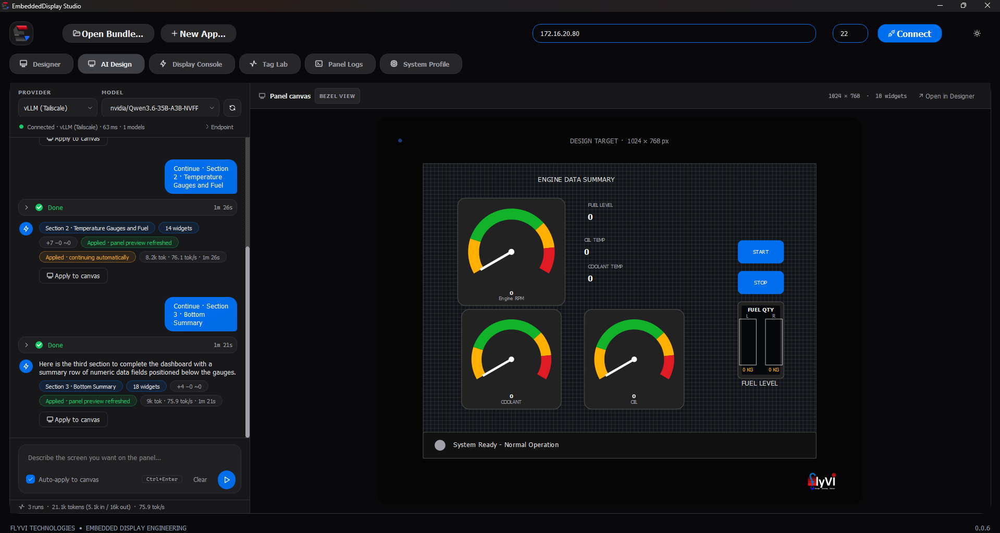
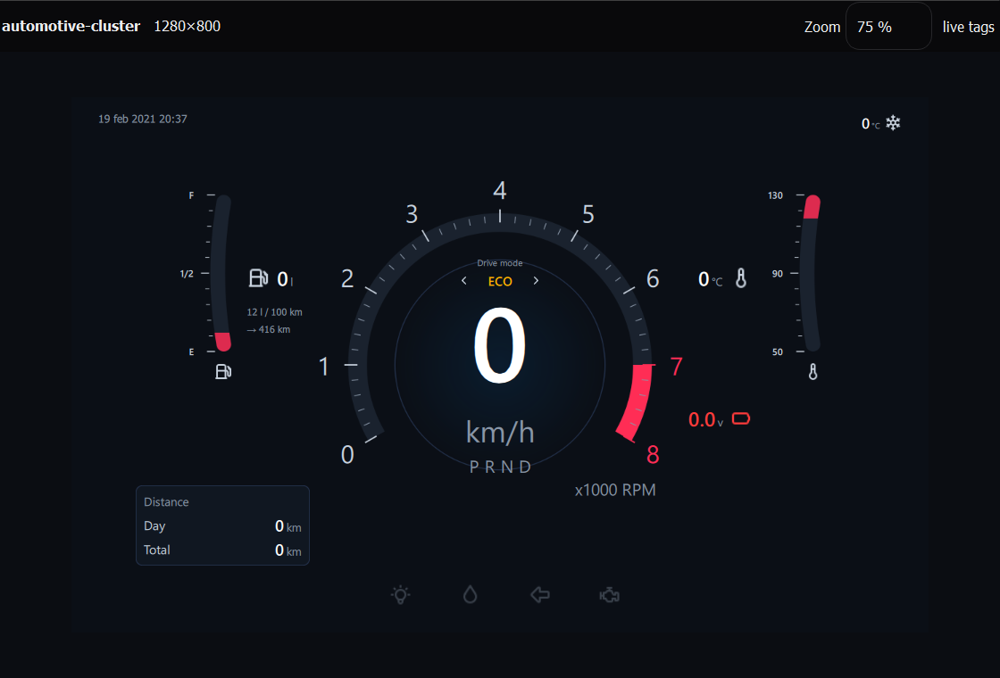
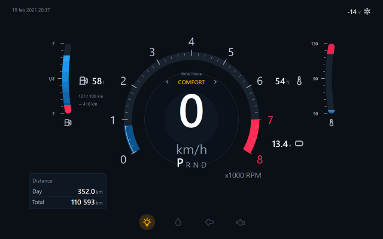

<div align="center">


### Describe it, draw it, or bring your own — HMI platform for embedded Linux panels

**EmbeddedDisplay Studio** turns a written brief, a drawing on a canvas, or an existing Qt 5/6 application into a screen running on an embedded Linux panel — previewed live at the panel's real geometry, validated, and deployed atomically over SSH with automatic rollback.
Built for industrial, vehicle, marine, avionics, instrumentation and kiosk HMIs — with tag-driven data, no image reflash, and no hardware code in the app.

<br />

[](../../releases/latest)
[](#the-hardware-it-runs-on)
[](https://github.com/Hitheshkaranth/EmbeddedDisplayStudio/actions/workflows/ci.yml)
[](LICENSE)

[](https://www.python.org/)
[](https://doc.qt.io/qtforpython-6/)
[](ui/qml/)
[](yocto/)
[](#ai-design)

</div>

---

<div align="center">



<em>An engine dashboard, described in a sentence and built in three sections by
a model running on the local network. Each section landed on the panel canvas
as it arrived; the live preview reloaded behind it; the chips on every turn say
exactly what changed. The same widgets go on to <strong>Preview</strong> and
<strong>Deploy</strong> through the pipeline below — no bundle had to be opened
first.</em>

<br /><br />


<em>The engine dashboard open in the Studio's own Designer, connected to the
panel at the top of the window — library and layers to the left, the canvas
inside a bezel of the real glass with every widget drawn by its own QML, the
logo image selected with its eight resize handles, and the property,
tag-binding (with its warning and critical thresholds), actions and chat
inspectors to the right. The canvas is 1024 × 768 because that is what the
connected panel reported.</em>

</div>

---

## The idea

A machine builder ships one panel image. Their customers — or their own app
team — put a screen on it in whichever of three ways suits the job, and push
it to the panel with one button or one command. The app never touches a GPIO
line, an ADC node or a serial port: it binds to **tags** that arrive over a
loopback socket, and the platform does the rest.


<sub>Source: <a href="docs/assets/architecture.mmd"><code>docs/assets/architecture.mmd</code></a></sub>

Three layers, deliberately decoupled:

| | Layer | Owns | Knows nothing about |
|---|---|---|---|
| **1** | `hmi-hwd` — hardware abstraction daemon | GPIO, ADC, UART, safe states | pixels |
| **2** | `hmi-gui` — app loader + tag engine | QML, bindings, the customer bundle | hardware |
| **3** | deployment | atomic install, health check, rollback | either of the above |

---

## Three ways to a screen

Every path ends in the same place: a **bundle** — a directory with a
`manifest.json` and an entry point — that the Studio previews in a bezel of the
real panel, validates, packages and installs atomically. What differs is how
the bundle comes to exist.

| | Start from | What the Studio does | Then |
|---|---|---|---|
| **Describe it** — [AI Design](#ai-design) | A sentence: *"engine data summary with RPM, coolant and oil gauges, fuel quantity and start/stop"* | Sends the brief to a local or cloud model with a system prompt built from the widget library, streams the answer, parses it into widgets in sections, and puts them on the canvas with the live preview refreshed | Tune in the Designer, bind to tags, **Deploy** |
| **Draw it** — [Visual Designer](#visual-designer) | An empty canvas the size of the panel's glass | Library, layers, inspector, tag bindings, undo; generates the QML and the manifest for you | **Preview**, **Deploy** |
| **Bring your own** — [Writing an app](#writing-an-app) | An existing Qt Quick or Qt Widgets application, Qt5 or Qt6 | Detects the entry point and Qt binding, proposes the manifest, previews the real app live, checks its imports against the panel | **Deploy** |

The three are not silos. A described screen is a Designer project the moment
it lands; a drawn screen is an ordinary bundle the moment it is generated; an
imported application can sit beside a designed one on the same panel and be
rolled back to.

---

## What you need

### To run the Studio

The packaged Windows **`EmbeddedDisplayStudio.exe`** and Linux x86-64 release
need no Python installation: each carries its own Python, PySide6 and standard
library. Download the build for your workstation from the
[latest release](../../releases/latest). The Studio deploys applications to
64-bit ARM panels over SSH; the Linux x86-64 build is the desktop authoring and
deployment tool, not the panel runtime itself.

From a checkout:

| | |
|---|---|
| **Python** | 3.12 — the version CI runs and the executable is built from |
| **PySide6** | `6.8.1`, pinned in `requirements.txt` |
| **pyserial** | `3.5`, only for the simulated hardware daemon |
| **An SSH client** | `ssh` and `scp`. Windows: the built-in OpenSSH at `System32\OpenSSH`, which the tool resolves by absolute path so a PATH wrapper cannot shadow it |

```bash
python -m pip install -r requirements.txt
python main.py
```

Previewing a **PySide2** bundle needs a second interpreter with PySide2
installed, because the two bindings cannot share a process. It is found on PATH
or named explicitly with `HMI_PREVIEW_PYTHON_QT5`. This is the one thing the
packaged executable cannot supply for itself; PySide6 bundles preview with no
Python on the machine at all.

### To use AI Design

A model, reachable over HTTP. Nothing else is installed and nothing runs in the
background:

| | |
|---|---|
| **Local, private** | [Ollama](https://ollama.com) — `ollama serve` and pull a model; the Studio finds it at `127.0.0.1:11434` with no configuration |
| **Your own server** | A **vLLM** (or any OpenAI-compatible) endpoint, on the LAN or over Tailscale — the screenshot above was generated by one |
| **Hosted** | OpenAI, Anthropic or Google — paste an API key once, it is remembered per provider |

The Designer, preview and deploy do not depend on any of this. A Studio with no
model configured is the same Studio, minus one tab's worth of typing.

### To reach a panel

Key-based SSH as `root`, and nothing else from this end:

```bash
ssh-copy-id root@<panel-ip>
```

### On the panel

| | |
|---|---|
| **A 64-bit Linux image** | Yocto or similar, with **systemd**, and **Wayland/Weston** for the display |
| **A complete Python 3** | Read this twice: a Yocto image can ship `python3-core` alone — no `json`, `socket`, `hashlib` or `ctypes` — and the installer itself cannot run on that. `provision_panel.py` puts a self-contained interpreter at `/opt/hmi-python`, which every target script prefers |
| **A Qt runtime** | PySide6 for a Qt6 application; PySide2 at `/opt/hmi-python-qt5` for a Qt5 one. A panel can carry both |
| **coreutils** | `flock`, `tar` and `sha256sum` — `hmi-install` serialises on the first and verifies with the last |
| **libgpiod, IIO, pyserial** | Only for real I/O. Each is optional: `hmi-hwd` disables the feature it cannot reach rather than refusing to start |

If the panel is running a stock image, install the platform onto it first — no
reflash needed:

```bash
python deploy/provision_panel.py --host <panel-ip> --check   # survey only
python deploy/provision_panel.py --host <panel-ip>
```

`--check` names anything that would stop the board hosting the platform. Run it
before assuming an image is ready.

### The hardware it runs on

The platform is not tied to one module. It needs a 64-bit ARM Linux board that
can put pixels on a display and accept an SSH connection; everything below that
is the application's business, not the platform's.

<div align="center">


<sub>Source: <a href="docs/assets/hardware.mmd"><code>docs/assets/hardware.mmd</code></a></sub>

</div>

| | Needed | Why |
|---|---|---|
| **CPU** | 64-bit ARM, quad core in practice | Qt and the interpreter both live here; the tag engine is idle most of the time |
| **RAM** | 2 GB comfortably | A Qt Widgets application with its runtime sits in the low hundreds of MB |
| **Storage** | ~2 GB free after the OS | Retention keeps `current`, `previous` and three more releases; an unpacked release is typically 100–300 MB |
| **Display** | Whatever the manifest declares | The Studio composes the preview at that geometry, and the panel reports its real size on connect |
| **Touch** | Optional | Nothing in the platform requires it |
| **Network** | Ethernet or Wi-Fi | SSH on port 22 is the only channel the Studio uses — no agent, no broker, no open port on the panel beyond sshd |
| **GPU** | Optional | Qt Widgets renders through the raster engine and issues no desktop GL calls |

Field I/O is entirely optional and independently so: `hmi-hwd` disables the
feature it cannot reach rather than refusing to start, so a board with no ADC
still runs an application that only uses digital inputs.

---

### To develop on it

The full suite needs a POSIX shell with `flock`, so run it on Linux or under
WSL; on Windows the installer and shell-validator suites skip. Regenerating the
diagrams in this README needs `npx` and `@mermaid-js/mermaid-cli`.

### No hardware at all

Everything above is for a real panel. The whole stack also runs on a desktop —
see [Quick start](#quick-start), where the daemon simulates its I/O.

---

## Quick start

**On your laptop — no hardware needed.** The daemon simulates I/O so the whole
stack runs on a desktop.

```bash
python -m pip install PySide6

# terminal 1 — simulated hardware
python daemon/hmi_hwd.py --config daemon/hwd.json --sim

# terminal 2 — the panel UI, in a window
python gui/hmi_loader/main.py --apps-dir apps/demo-app --windowed

# terminal 3 — EmbeddedDisplay Studio
python main.py
```

### From a sentence to a deployed screen

The shortest path through the Studio, and the one the screenshot at the top of
this page shows:

1. **AI Design** — pick a provider and a model (the status line confirms
   `Connected · <provider> · <latency> · <n> models`), type what the screen
   should show, `Ctrl+Enter`. The model answers in sections of up to eight
   widgets; each section is parsed, merged, put on the canvas and previewed
   as it arrives, and the next one is requested automatically until the
   design says it is complete.
2. **Designer** — the result is already here as an ordinary project. Move
   things, rename, restyle, and bind each gauge to the dotted tag that will
   feed it. **Preview** regenerates the QML and reloads the live panel. There
   is no bundle to open first: the Designer creates one under
   `Documents/EmbeddedDisplay Studio/projects/<name>/` the first time Preview
   or Deploy needs it, and the Studio adopts it as the current bundle.
3. **Tag Lab** — drive those tags with a sine, a ramp or a constant and watch
   the gauges move before any hardware exists.
4. **Connect** — target IP in the header, `ssh-copy-id root@<panel-ip>` once
   beforehand. The Studio reads the panel's real display geometry and
   retargets both the bezel and the canvas to it.
5. **Deploy** — from the Designer toolbar or the Display Console. The bar
   names each stage; the panel must render the screen within 25 s or rolls
   itself back.

### Running EmbeddedDisplay Studio

```bash
python -m pip install PySide6              # once
python main.py                             # from the repository root
```

`--bundle <dir>` opens an application on start; with no argument the last one
is restored. The window is one header — target address, port, **Connect** /
**Disconnect**, **Open Bundle…**, **New App…**, theme — over six workspaces:

| Tab | What it is for |
|---|---|
| **Designer** | Draw or edit the screen on a canvas the size of the panel's glass; bind widgets to tags; Preview, Generate, Deploy |
| **AI Design** | Describe the screen; the model builds it in sections onto the same canvas, with the run log and panel canvas side by side |
| **Display Console** | Target details, the bundle's verdict, **Deploy to Target**, **Rollback**, **Restart GUI**, and the releases the panel still holds |
| **Tag Lab** | Inject signals into any tag the app declares — sine, square, ramp, noise, constant — before the I/O exists |
| **Panel Logs** | Follow the journal from `hmi-gui` and `hmi-hwd` live, which is where a fault an hour after a good deploy shows up |
| **System Profile** | What the live release costs the board: package, footprint, filesystem split, free RAM |

### Sharing the deploy key

A panel trusts one SSH key — the one `deploy/provision_panel.py` put into its
`/root/.ssh/authorized_keys`. Until now that key lived in one person's
`~/.ssh`, and "copy this file, then type the host, user and port" was how
it reached the next person. A **deploy key bundle** is one file that carries
the key pair and the panel's address:

<div align="center">



<sub>Source: <a href="docs/assets/key-sharing.mmd"><code>docs/assets/key-sharing.mmd</code></a></sub>

</div>

In *Display Console → Target Details*, **Export key…** writes the bundle
from the Key field (or the `~/.ssh` default key); **Import key…** on the
other machine installs it under `~/.ssh/hmi-deploy/` with owner-only
permissions (`0600`, `icacls` on Windows — OpenSSH refuses anything looser),
fills Key, Target IP, User and Port, and saves them. The same from a
terminal:

```bash
python -m tools.hmi_deployer.deploy_key export --host 172.16.20.70 --out line3.hmikey
python -m tools.hmi_deployer.deploy_key import line3.hmikey
```

**Export verifies before it packs.** The Key field may name one key while the
link actually works through another (ssh also offers the `~/.ssh` defaults),
so Export tries each key *on its own* against the panel and packs the one the
panel accepts — a bundle that opens the door, not the one that happened to be
typed. **Import verifies after it installs** and says in plain words what is
wrong when the link is not there: no OpenSSH client on this machine, panel
unreachable, host key mismatch, key not trusted by the panel, or file
permissions. `python -m tools.hmi_deployer.deploy_key verify --host <ip>`
does the same from a terminal.

The file contains a private key: hand it over directly. A passphrase-protected
key is refused, because the Studio deploys non-interactively (`BatchMode`).

The bundle also carries the panel's SSH **host key** (read with `ssh-keyscan`
at export). Import writes it into the other user's `known_hosts`, replacing
any entry another board left behind at the same DHCP address — the usual
cause of "Host key verification failed" on the first Connect. When a stale
entry is hit anyway, Connect explains it and offers to forget the stored key.

Then, for an application you already have:

1. **Open Bundle…** — point it at the directory. The manifest is validated, or
   proposed and written for you if there is none, and the application starts
   rendering in the bezel at the target's resolution. The preview is live, not
   a picture: click it, drag it, type into it, and the events reach the widget
   under your cursor in the real application.
2. **Target IP** and **Port** in the header, with `root` and the private key
   that reaches the panel under **Target Details** on the Display Console.
3. **Connect** — proves the link, reports the panel's real display size and
   which release is live on it. The badge beside it carries the link state,
   and the bezel re-composes itself at the resolution the panel reported.
4. **Deploy to Target** — everything in [the pipeline below](#from-a-python-app-to-the-panel).
   The bar names the stage it is in, and the console carries the panel's own
   words.
5. **Rollback** returns to the previous release. **Installed Releases** reaches
   any of the others the board still holds: activating one re-points the panel
   at it and makes the outgoing release the new rollback target, so it is
   undoable in turn. **Restart GUI** restarts what is running.

**From the command line**, for CI or a headless machine:

```bash
ssh-copy-id root@<panel-ip>                       # once
./deploy/deploy_to_hmi.sh -H <panel-ip> -b ./my-qt-app
```

If the panel is running a stock image rather than one built from
`yocto/meta-hmi`, install the platform onto it first — no reflash needed:

```bash
python deploy/provision_panel.py --host <panel-ip> --check   # survey only
python deploy/provision_panel.py --host <panel-ip>
```

`--check` surveys the board and names anything that would stop it hosting the
platform. Read it before assuming a stock image is ready: a **base** vendor
image ships `python3-core` alone — no `json`, no `socket`, no `ctypes` — and no
Qt, which is enough to stop the installer, the loader and any application. See
[`deploy/README.md`](deploy/README.md#what-a-minimal-image-is-still-missing) for
what to add and where the scripts expect it.

If the new app fails to render within 25 s, the panel **rolls itself back** to the
previous release and the command exits non-zero. A bad deploy cannot leave a
machine without a UI.

A successful deploy also makes the app the panel's **boot default**: once the
release has been proven to render, `hmi-gui.service` is enabled, so a power
cycle brings the same application back with no further action. Deploying is the
only step — there is nothing to enable by hand afterwards.

---

## From a Python app to the panel

What happens between pressing **Deploy to Target** and the application being the
panel's boot default. Every step is the same whether it is driven from the
window or from `deploy_to_hmi.sh`.


<sub>Source: <a href="docs/assets/deploy-pipeline.mmd"><code>docs/assets/deploy-pipeline.mmd</code></a></sub>

A few of those steps are worth their own sentence.

**Nothing is converted.** There is no build, no freezing, no cross-compilation:
the panel carries a complete CPython and the Qt binding the manifest asks for,
so the application runs there from the same sources it runs from on your
machine. What the pipeline does is decide what travels, prove it arrived
intact, and swap it in without a window where the panel has no UI.

**The dependency check reads the application, not a list.** Every file that
would be packaged is parsed, each absolute import reduced to its top-level
name, and the standard library, the bundle's own modules, the Qt bindings the
platform pins, and anything guarded by `try: … except ImportError` are removed.
What is left is what pip must supply — and the panel is asked to *import* each
one, because a wheel built for another architecture is present on disk and
still fatal at startup.

**What travels is what runs.** Build outputs, caches and VCS metadata are
excluded by one packer shared with the CLI, so the same folder produces a
byte-identical tarball either way, and the checksum the target verifies does
not depend on which tool sent it.

**The swap cannot leave the panel dark.** `current` is promoted by `rename(2)`,
never `rm` then `ln`. If the new release does not signal readiness within 25 s,
the symlink swaps back and the previous release is restarted — the deploy fails
and the machine still has its UI.

---

## Writing an app

A bundle is a directory. Two files are enough.

```
my-qt-app/
├── manifest.json
└── main.qml
```

```json
{
  "schema": 1,
  "name": "line-controller",
  "version": "1.4.0",
  "entry": "main.qml",
  "runtime": "qml",
  "screen": { "width": 1280, "height": 800 },
  "tags_required": ["ai.pot", "di.estop", "do.relay1"]
}
```

Only four fields are required — `schema`, `name`, `version` and `entry`. The
rest are optional: `screen` defaults to 1280x800, `tags_required` to none,
`runtime` to `qml`. This is the smallest manifest that validates:

```json
{ "schema": 1, "name": "line-controller", "version": "1.4.0", "entry": "main.qml" }
```

`runtime` is optional and defaults to `qml`:

| runtime | entry | How it runs on the panel |
| --- | --- | --- |
| `qml` | `*.qml` | Loaded into the shell that is already running. Gets `Tags`/`Bus` injected, previews live in Studio. |
| `python` | `*.py` | Exec'd as the GUI process itself — for an existing Qt Widgets application that owns its own window. |

### What makes a bundle acceptable

The Studio validates before it packages, and the panel validates again after it
unpacks, using the same code. A bundle that opens in the window is a bundle that
will install.

**The shape.** Any directory, with `manifest.json` at its root and the entry
point somewhere inside it. No build step, no layout convention, no imports from
this repository — the application does not know it is being deployed.

```
my-qt-app/
├── manifest.json          required, at the root
├── main.py                the entry named by the manifest
├── ui/  assets/  ...      whatever else the app needs
└── .hmiignore             optional, extra exclusions
```

**The rules, and what each one prevents:**

| Field | Rule | Why it is checked here |
|---|---|---|
| `schema` | exactly `1` | A future format should fail on the laptop, not halfway through an install |
| `name` | `^[a-z0-9][a-z0-9._-]{0,63}$` | It becomes a directory on the panel and a filename on the host; a case-insensitive filesystem anywhere in that chain would let two apps collide |
| `version` | `1.4`, `1.4.0`, `2.0.0-rc1`, `1.0.0+build7` | It names artefacts, so it cannot be arbitrary text |
| `entry` | relative, no `..`, and the file must exist | An absolute or escaping path would resolve somewhere else entirely on the target |
| `runtime` | `qml` needs a `.qml` entry, `python` needs a `.py` | A mismatch would otherwise fail only on the panel, after the swap |
| `qt_binding` | must match what the sources actually import | Declaring the wrong one starts the wrong interpreter, and the app dies on its first import |
| `screen` | positive integers | A string here is a mistake worth catching before it reaches a board |
| `tags_required` | list of strings | These are seeded into the tag map so bindings resolve on the first frame |

Only `schema`, `name`, `version` and `entry` are required. `runtime` defaults to
`qml`, `screen` to 1280x800, `tags_required` to none, `qt_binding` to `pyside6`.

**Size.** 500 MB per bundle, enforced on both sides. Build outputs, caches and
VCS metadata are excluded automatically — `.git`, `__pycache__`, `build`,
`dist`, `node_modules`, `.venv`, `*.egg-info`, `.pytest_cache` and the rest —
so the number is about your application, not your working directory. Add
`.hmiignore` for anything else.

**No manifest?** Point the Studio at the directory anyway. It looks for
`main.qml`, `Main.qml`, `app.qml`, then `main.py`, `app.py`, `__main__.py`,
detects the Qt binding from the sources, and offers to write the manifest for
you. QML is preferred when a project contains both.

**What the application must not do:** touch a GPIO line, an ADC node or a
serial port. It binds to tags. That is the whole contract, and it is what lets
the same bundle run on a bench, in a preview and on a panel.

### Qt5 and Qt6 applications on the same panel

A native Python app also declares which binding it imports, because the two
cannot share an interpreter — PySide2 is Qt5-only and was never built past
Python 3.11:

```json
{ "runtime": "python", "entry": "main.py", "qt_binding": "pyside2", "qt": ">=5.15" }
```

| qt_binding | Runtime on the panel | For |
| --- | --- | --- |
| `pyside6` (default) | `/opt/hmi-python` — CPython 3.12 + PySide6 | Qt6 apps, and the QML loader |
| `pyside2` | `/opt/hmi-python-qt5` — CPython 3.11 + PySide2 + a private Qt 5.15 | Existing Qt5 apps |

The Qt5 runtime is not installed by default. Add it once per panel:

```bash
./deploy/provision_pyside2.sh --host <panel-ip>     # run from Linux or WSL
```

It ships its own Qt 5.15 rather than using the one already on the panel
image, because that is a **GLES** build while every available aarch64
PySide2 binary is compiled against desktop GL — loading one against the other
fails with `undefined symbol: _ZTI18QOpenGLTimeMonitor`. The panel's own Qt5 is
left untouched.

Already have a Qt app? Open it in Studio; it detects the entry point **and
the binding**, and writes the manifest for you.

Build outputs, caches and VCS metadata are left out of the bundle
automatically, by both the CLI and Studio — they share one packer, so the
same folder produces a byte-identical tarball either way. For anything else that
lives in the folder but is not part of the running application — source
archives, packaged installers, capture logs — add a `.hmiignore` next to the
manifest, one glob per line.

```qml
import QtQuick
import Shadcn 1.0          // the design kit ships on the device

ShCard {
    ShGauge {
        label: "Input Voltage"
        value: Bus.value("ai.pot", 0)     // missing tags degrade, never crash
        minValue: 0; maxValue: 3.3; unit: "V"
        thresholdWarning: 2.5; thresholdFault: 3.0
    }

    ShSwitch { onToggled: Bus.write("do.relay1", checked) }

    ShBadge {
        text: Tags.online ? "ONLINE" : "LINK LOST"
        variant: Tags.online ? "success" : "destructive"
    }
}
```

Two context properties are injected for you:

* **`Tags`** — live values, bound declaratively. Dots become underscores, so
  `ai.pot` reads as `Tags.ai_pot`. `Tags.online` tracks the hardware link.
* **`Bus`** — commands and safe reads: `Bus.write()`, `Bus.pulse()`,
  `Bus.uart_tx()`, `Bus.value(name, fallback)`.

`Bus.value()` is the habit worth forming: it returns your fallback for a tag that
is missing, null, or not published yet, so a screen written against a sensor that
isn't fitted still renders.

---

## EmbeddedDisplay Studio

The desktop tool. Describe, draw or import a screen, watch it run inside a
photo-real mock-up of the panel, then push it.

One window, six workspaces across the top — **Designer**, **AI Design**,
**Display Console**, **Tag Lab**, **Panel Logs**, **System Profile** — over a
header that holds the panel's address, port, **Connect** and **Disconnect**.
Everything below is about the panel that header points at.

**Authoring**

* **AI Design** — write a brief and a local or cloud model builds the screen
  onto the Designer canvas, in sections, with the live preview refreshed as
  each lands. Every turn is a foldable execution shell — request, streamed
  reasoning, streamed response, parsed design, canvas diff, token usage — so
  nothing the model did is hidden. Ollama, OpenAI, Anthropic, Google, vLLM
  over Tailscale, or any OpenAI-compatible server with a pasted key. Details
  in [AI Design](#ai-design).
* **A Designer that is in the window, not beside it** — searchable widget
  library with favorites, a layer tree, an inspector with paired X/Y and
  W/H cells and live colour swatches, a tag-binding inspector with format,
  scale, unit and threshold expressions, and an offline Design Chat for
  text commands. The same toolbar previews, generates and deploys. Details
  in [Visual Designer](#visual-designer).
* **No bundle required to start** — an empty Studio, a brief or a blank
  canvas is enough. The first Preview or Deploy provisions a bundle under
  `Documents/EmbeddedDisplay Studio/projects/<name>/`, never on top of an
  existing design, and the Studio adopts it as the current bundle.
* **A cockpit-ready avionics palette** — attitude, airspeed/altitude tape,
  heading compass, VSI, flight director, turn coordinator, engine gauge,
  engine bar, dual-tank fuel quantity, annunciator and compact data-field
  widgets, all bindable to live tags, with EFIS colours that hold across
  light and dark modes.
* **An automotive cluster palette** — arc cluster gauge with redline band
  and centre readout, gear indicator, curved fuel / coolant level bar,
  readout with icon and warn limits, drive-mode selector, telltale lamps,
  icon tiles, trip-info box, segmented battery bar and a top-view tyre
  pressure display — modelled on a classic instrument cluster and an EV
  infotainment screen. Every one binds to tags; the interactive ones write
  back through actions. Two ready-made cluster projects ship as design
  presets (see [Design presets](#design-presets)).
* **The canvas is the real thing** — each widget on the Designer canvas is
  drawn with its own QML, rendered offscreen at the canvas zoom and cached,
  so what you lay out is what the glass will show; not a sketch of it.
  Toggle **Live QML** next to Grid and Snap.
* **Resize from any handle** — all eight handles on a selected widget drag
  their own edge; the cursor names the direction.
* **Scaffold** — "New App…" writes a valid starter bundle, already importing
  the design kit.
* **Adopts apps that were never written for this platform** — point it at an
  existing Qt project with no `manifest.json` and it detects the entry point
  *and the binding*, proposes a manifest and writes it for you.

**Preview**

* **True WYSIWYG** — the bezel contains a live QML engine rendering *your
  actual app* at target resolution with the same tag engine the device runs.
  Not a screenshot, not an approximation.
* **A Live Preview window** — Preview also opens the design in a window of
  its own at the panel's resolution, on the same tag engine, so a drive-mode
  selector or a start button can be operated at full size while Tag Lab, the
  simulator or the connected panel feeds it. Zoom 50–150 %; also **Open Live
  Preview** beside Deploy for any loaded QML bundle.
* **An operable bezel, not a photograph** — clicks, drags, wheel and keys are
  mapped from panel pixels into the application's own window and delivered as
  real Qt events, so the preview is something you use rather than watch.
* **Live or simulated data** — connected, telemetry is relayed from the real
  daemon over SSH; offline, a built-in simulator drives plausible values.
* **Panel picker** — preview against 5.0" 800×480, 7" 1024×600,
  7"/10.1"/12.1" 1280×800 or 15.6" 1920×1080, with the live resolution
  reported under the bezel. The preview never shrinks below a readable size
  and always holds the panel's aspect ratio.
* **The connected panel outranks the picker** — on Connect the Studio reads
  the SOM's DRM connector and adopts its real pixel geometry, for the bezel
  *and* the designer canvas. A design opened afterwards is retargeted to the
  glass that is plugged in, so nobody lays out widgets against a screen that
  is not there and finds out after a deploy.
* **Qt Widgets apps preview live too.** A `runtime: python` bundle owns its
  own window, so it cannot be composited into the QML scene. It is run
  unmodified in a child process instead, forced to the target resolution, and
  its frames are streamed into the bezel — real application, real fonts,
  before you deploy it. Nothing appears on your desktop: the window is kept
  unmapped with `WA_DontShowOnScreen`.
* **Qt5 applications too** — a PySide2 bundle is previewed by a second
  interpreter, because the two bindings cannot share a process. The binding
  is read from the bundle's sources and the child is told which Qt to host.
  Point `HMI_PREVIEW_PYTHON_QT5` at a PySide2 interpreter, or skip it — the
  bundle still deploys and runs on the panel's own Qt5 runtime.

**Deploy**

* **Validation before upload** — every manifest rule is checked host-side,
  with the offending field named.
* **It checks the panel can run the app before sending it.** The bundle's
  third-party imports are read off its source, the panel is asked whether it
  can import each one under the interpreter that bundle will use, and
  anything missing is named and offered for installation. A missing package
  does not degrade an application, it kills it on its first import and leaves
  the panel restart-looping on the release before it.
* **Nothing blocks the window.** Packaging, upload, install, rollback,
  restart and journal tail all run on worker threads, and the bar reports the
  stage it is in — a sweeping bar while the bundle is packed, then bytes and
  throughput for the upload, then the installer's own steps as the panel
  reaches them. A step that fails names what failed: an unreachable panel is
  reported as an unreachable panel, not as whatever the step was trying to
  do.
* **Rollback, releases, restart** — the previous release is one button away;
  every release the panel still holds is listed from the panel itself and can
  be activated; the GUI can be restarted without a reboot.
* **Connect and Disconnect** — Connect probes the display, pulls the panel's
  tag catalogue into the Designer and starts the telemetry relay; Disconnect
  tears all of that down again (and cancels a connect still in flight), so
  the Studio can be pointed at another board or back at Tag Lab without a
  restart.
* **Deploy keys that travel** — the panel trusts one SSH key. **Export key…**
  packs it and the panel's address into a `.hmikey`; a colleague presses
  **Import key…** and can Connect and Deploy at once. The flow, and what
  the panel actually holds, is in [Sharing the deploy key](#sharing-the-deploy-key).

**Diagnose**

* **Tag Lab** — drive any declared tag with a deterministic waveform, pin a
  sensor, flip an interlock; the bound tags of the open bundle are wired up
  automatically.
* **Panel Logs** — the journal from `hmi-gui` and `hmi-hwd`, followed live.
* **System Profile** — the active release, its footprint on flash, the
  filesystem split and the RAM left over, read back over SSH.
* **Ships as one file** — `EmbeddedDisplayStudio.exe` carries its own Python,
  PySide6 and the whole standard library, so it previews a customer
  application on a machine with no Python installed at all.

<div align="center">


<em><strong>Display Console.</strong> The deployment view, connected to a
panel: the header's <strong>Connected</strong> badge with <strong>Disconnect</strong>
beside it, the target's user and key with <strong>Export key…</strong> /
<strong>Import key…</strong> under them, the display geometry read off the
panel, the readiness checklist, the bundle's verdict —
<code>Bundle Valid: automotive-cluster v1.0.0 [QML]</code> — and the one button
that sends it, with <strong>Open Live Preview</strong> beneath. Further down:
<strong>Rollback</strong> to the release that worked, <strong>Restart GUI</strong>
without a reboot, and the releases the panel still holds, listed from the
panel itself. The bar and the console report the installer's own steps as the
panel reaches them.</em>

<br /><br />



<em><strong>Live Preview window.</strong> The same generated QML the panel
runs, in a window of its own at 1280 × 800 (shown at 75 %), on the Studio's
tag engine — here with no feed connected, so every bound value sits at its
fallback and the battery readout is already red. Tag Lab, the simulator or a
connected panel drives it; the drive-mode chevrons and tiles are operable.</em>

<br /><br />


<em><strong>Bezel preview.</strong> A customer's Qt5 application running inside
the preview of the panel, beside the target it deploys to — connected here to a
10.1", 1024 × 768 panel, which is the geometry the bezel composes it at.</em>

<br /><br />


<em><strong>Tag Lab.</strong> Drive the application with signals instead of
hardware: a sine on a bus voltage, a square wave on an interlock, a constant on
a contactor. The panel's behaviour can be exercised long before the I/O it
binds to exists.</em>

<br /><br />


<em><strong>Panel Logs.</strong> The journal from the panel's own services,
followed live. Here it is doing the job it exists for: the hardware daemon is
crash-looping on a missing standard-library module, and the restart counter is
in the thousands — a fault no deploy would have reported, because the deploy
succeeded.</em>

<br /><br />


<em><strong>System Profile.</strong> What the release costs the board, read
back over SSH: the active package and where it landed, the application against
its compressed size, how the root filesystem divides between the OS image, the
application and free space, and the RAM left over.</em>

<br /><br />


<em><strong>Light mode.</strong> The same window and the same panel; the theme
follows the operator, and the preview inside the bezel follows the theme with
it.</em>

</div>

---

## Built for the field

**The daemon cannot be crashed by its socket.** Malformed JSON, wrong types,
oversized frames, binary noise and invalid UTF-8 are counted and answered with a
typed error code — or with silence where no correlation id can be recovered,
which also stops it being used as a UDP reflector. Logging is rate-limited so a
flooding client cannot fill the journal. Outputs are driven to configured safe
states on `SIGTERM`, and systemd watchdog keep-alives are sent every cycle.

**Deployment is atomic and self-healing.** The bundle lands in a tmpfs, so a
failed upload never touches flash. It is checksum-verified, extracted to a
staging directory, validated again on the target, then promoted by a single
`rename(2)` onto the `current` symlink — never `rm` then `ln`, which would leave a
window with no UI. The GUI must recreate its ready-file within 25 s or the
symlink swaps back.

**Validation happens twice, from one implementation.** The host CLI, the target
installer and the desktop tool all call `schema/manifest.py`; the target still
validates independently of the host, as it must, but not by different rules.
They used to be three separate implementations that had drifted apart in both
directions — a bundle that passed on a laptop and was refused on the panel is
worse than one that fails everywhere.

**Both libgpiod generations.** BSP 6 ships libgpiod 1.6, BSP 7 ships 2.x, and
their Python APIs are incompatible. Both are implemented and selected at import.

---

## Design system

Every pixel — on the panel and on the desktop — comes from a Qt port of
[shadcn/ui](https://github.com/shadcn-ui/ui) with [Tabler](https://github.com/tabler/tabler-icons)
icons vendored offline. Same tokens, same variant names, same geometry.

`ShButton` · `ShInput` · `ShCard` · `ShBadge` · `ShSwitch` · `ShProgress` ·
`ShSeparator` · `ShAlert` · `ShTabs` · `ShLabel` · `ShSkeleton` · `ShDialog`
— plus HMI additions `ShGauge`, `ShStatDot`, `ShValueTile`, and the avionics
set `ShDataField`, `ShAttitude`, `ShTape`, `ShCompass`, `ShVSI`,
`ShEngineGauge`, `ShAnnunciator`, `ShFlightDirector`, `ShTurnCoordinator`,
`ShEngineBar`, `ShFuelQuantity`.

```bash
python ui/gallery.py --theme dark      # every component, every state
```

Light and dark are switchable at runtime and both default to dark; icons are
re-rendered in the new palette on every switch, so nothing goes black-on-black.
`ui/tokens.json` is the single source of truth, and a test fails if `Theme.qml`
ever drifts from it.

---

## Layout

```
docs/CONTRACT.md      the normative interface spec — read this first
schema/               shared formats: manifest validation, bundle packing, dependency scan
daemon/               Layer 1  hardware daemon + tag map
gui/                  Layer 2  loader, tag engine, shell, fallback screen
apps/demo-app/        a worked example, and the pipeline's test fixture
ui/                   design system: tokens, QML kit, QSS, icons, gallery
designer/             the visual designer: model, canvas, widget registry, QML generator
target/               systemd units, atomic installer, Wayland launcher
deploy/               deploy_to_hmi.sh — the CLI; provision_panel.py — onboard a stock image
tools/hmi_deployer/   EmbeddedDisplay Studio: main window, deployer, device panel, Tag Lab,
                      AI design (ai_design.py — providers and streaming; ai_generator.py —
                      parser, diff and section merge; ai_tab.py — the tab)
yocto/meta-hmi/       bitbake layer that puts it all in the image
tests/                protocol, integration and cross-validator suites
```

---

## Verification

```bash
python tests/run_all.py          # 738 tests, 52 of them Linux-only
```

| Area | Coverage |
|---|---|
| Daemon protocol | error codes, silence on unparseable input, `seq` monotonicity, survives hostile frames |
| Tag engine | daemon → UDP → QML binding, command write-back, fallback on missing tags |
| Bundle validation | one implementation, three callers; minimal, README and malformed manifests |
| Install atomicity | unique release ids, running release survives redeploy, traversal refused before extraction |
| Fallback screen | the card lays out, sections do not overlap, the error text is shown |
| Design tokens | `tokens.json` and `Theme.qml` cannot drift |
| Gallery render | painted pixels asserted, not just "it ran" |
| Native preview | a real Qt Widgets app renders at the target resolution with content, and answers a click |
| Qt5 bundles | a real **PySide2** application reaches the bezel, hosted by a second interpreter |
| Qt binding | the binding is read from the sources, and a manifest that disagrees is refused |
| Connected display | the detected panel geometry reaches the preview *and* the designer, and survives opening a design drawn for another screen |
| Theme contract | the designed colour mode reaches the manifest, the loader and the panel |
| Designer | model, reparenting, containers, arrange, assets, toolbars, generator, deploy, and Preview provisioning a bundle when none is open |
| Dependency scan | imports against stdlib, bundle-local and guarded ones; distribution names; the commands sent to the panel |
| Deploy bookkeeping | a step that finishes late cannot delete the files of the deploy that replaced it |
| SSH commands | every argv the Studio builds, including the display probe and the release list |
| AI Design | streaming events for every provider protocol (`reasoning_content`, `<think>`, Anthropic/Gemini thought blocks, NDJSON usage), BYOK config round-trip, secrets kept out of URLs, multi-turn history, canvas diff, section metadata and merge, truncation salvage, the registry-driven system prompt |
| Capture | the Studio switches to a tab where the preview is live before a bezel capture |

### The release gate

A green source tree says nothing about the artefact. Tagging builds
`EmbeddedDisplayStudio.exe` on CI and then **runs it**: the binary previews a
fixture application whose imports were never visible to the build, grabs its
bezel, and `tests/verify_smoke_capture.py` asserts the fixture's colour is
actually in the picture. Only a binary that passed that is attached to a
release — 0.0.1 shipped one that died on a customer application's first
standard-library import while every test above passed.

> **Run the installer tests on Linux.** Windows has no `flock`, so the
> atomic-swap and cross-validator suites skip there rather than pretending to
> pass — and the runner prints how many tests skipped, because a skip is not a
> pass. CI runs the whole suite on Linux and fails if anything skips.
> `tests/README.md` has the WSL command.

---

## Building the image

```bash
bitbake-layers add-layer /path/to/meta-hmi
bitbake <your-bsp-reference-image>
```

`yocto/README.md` covers prerequisite layers (including the meta-qt6 caveat for
PySide6), how each recipe's `files/` directory maps onto this repository, and how
to verify on the target.

### Why no containers

This targets the **native** Yocto reference image. No Docker, no
container OS, no container runtime — every component is a systemd unit on the
rootfs. Less to boot, less to update, less to explain to a certification body.

---

## Before first power-on

GPIO offsets, IIO device names and UART aliases are **board specific**.
`daemon/hwd.json` ships a documented default for one reference module and
carrier board. Confirm yours:

```bash
gpioinfo                 # GPIO chip and line offsets
iio_info                 # ADC device name and channels
ls /dev/serial/by-id/*   # stable UART aliases
```

Pins must first be released from their default pinmux with a device-tree
overlay, however your BSP applies them. `daemon/README.md` walks through it.

---

## Visual Designer

**The editor is in the Studio, not beside it** — it is the second window at the
top of this page. A widget library and layer tree on the left, the canvas drawn
inside the same bezel the preview uses and labelled with the geometry it is
designing for, and the property, tag-binding and Design Chat inspectors on the
right. The same window then previews, generates and deploys what you drew: no
export step, no second tool, and no hand-off where the design and the bundle
can disagree.

**Starting.** Select **Designer** and draw. If a bundle is open the design is
saved beside it as `project.edsui`; if none is, the first **Preview** or
**Deploy** provisions one under `Documents/EmbeddedDisplay Studio/projects/<name>/`
— named after the project, with a numeric suffix rather than overwriting an
existing folder — and the Studio adopts it as the current bundle. A design
handed over from [AI Design](#ai-design) arrives here the same way.

**The canvas.** Selection, rubber-band multi-selection, movement, resize
handles, copy/paste, duplicate, keyboard nudging, z-order, grid snapping and
alignment are on the canvas itself. Double-click a caption to edit its text,
double-click an image widget to choose its file, right-click for the context
menu. Delete removes the selection but never text inside an editor. Two
compact command rows — file/edit and page/geometry above, arrange, Preview,
Generate and Deploy on the canvas bar — keep the whole workflow visible at
laptop widths.

**The library and layers.** The widget library is searchable and has a
favorites filter (right-click or `Ctrl+F` on an entry); favorites persist. The
layer tree mirrors the page's containment and selection both ways.

**The inspector.** Generated from the central widget registry, so every widget
edits its own properties: paired X/Y and W/H cells, live colour swatches, and
an empty state when nothing is selected. The binding inspector connects
bindable properties to the same dotted tag names Tag Lab and the deployed
`TagEngine` use, with an optional format, multiplier, offset, unit, warning
expression and critical expression per binding. **Design Chat** takes offline
text commands — `add Value Tile named inputVoltage`,
`set inputVoltage title=Input Voltage`, `bind inputVoltage value=power.input_voltage`,
`remove inputVoltage` — through an adapter kept separate from the model, so the
designer runtime never needs the network.

**Preview and Deploy.** **Preview** saves the project, generates QML into
`generated/`, updates `manifest.json` and reloads the result through the
Studio's live preview. **Deploy** confirms the deployment name, does the same,
validates, and hands the bundle to the same pipeline an imported application
uses.

Avionics controls use the same data path as every other live HMI value. Bind,
for example, `ShFuelQuantity.leftValue` to `fuel.left.quantity` and
`rightValue` to `fuel.right.quantity`; generated QML reads them through
`Bus.value(tag, fallback)`. The underlying program can publish those dotted
tags through the hardware daemon's UDP telemetry protocol, or Tag Lab can drive
them with constant, ramp, sine, square or noise signals before hardware is
available. Pitch, roll, heading, vertical speed, engine values, flight-director
commands, turn rate, slip, annunciator state and both fuel tanks are exposed as
bindable properties in the same way.

The editable source is `project.edsui`, a human-readable JSON document. It is
not generated QML. A designed bundle has this shape:

```text
project.edsui
generated/
  Main.qml
  Settings.qml
assets/
manifest.json
```

`manifest.json` remains the runtime/deployment contract. Generation updates its
name, screen resolution, colour mode, QML entry and `tags_required`, so Tag Lab
simulation, preview and target deployment all use the established runtime — the
mode the design was drawn in is the mode the panel boots in, rather than a
default the loader picks on its own.

**The canvas follows the glass.** When the Studio is connected, the panel's real
geometry — read from its DRM connector, not from the manifest — sets the canvas
size, and keeps it: a design saved for another screen is retargeted on open
rather than quietly moving the canvas back to whatever that file was drawn for.
Widget coordinates are never touched by this; the surface moves, the design does
not. Disconnected, the saved screen stands, because then the file is the only
authority on its own geometry. Images are copied into the project's `assets/`
and kept as project-relative paths; absolute machine paths are rejected.

Version 1 intentionally supports only `.edsui` → QML generation. Arbitrary QML
is left untouched and is not imported or round-tripped. Container hierarchy is
represented in the model and generator; the initial canvas primarily optimizes
top-level absolute-positioned HMI screens. Threshold metadata is preserved in
bindings but is not yet converted into visual state expressions by the QML
backend.

The visual designer is implemented as part of EmbeddedDisplayStudio using
ordinary PySide6 APIs and does not incorporate Qt Designer source code. It adds
no third-party dependency; the model and generator use Python's standard
library, and the editor uses the project's existing PySide6 dependency.

---

## AI Design

**Turn a written brief into a running panel screen.**  Switch to the
**AI Design** tab, pick a provider and model, describe the screen you want and
the Studio streams the model's answer, parses it into Designer widgets, draws
them on the panel canvas and refreshes the live preview — all without leaving
the window.  The same widgets then generate, preview and deploy through exactly
the pipeline a hand-drawn design uses.

The screenshot at the top of this page is this tab: the brief asked for an
engine data summary; the model returned it as Section 1 (gauges), Section 2
(temperature gauges and fuel) and Section 3 (bottom summary), each applied to
the canvas as it arrived.  The chips on every turn say what happened —
`14 widgets`, `+7 −0 ~0`, `Applied · panel preview refreshed`,
`8.2k tok · 76.1 tok/s · 1m 26s`.

### The layout

| Region | What it is |
|---|---|
| **Provider / Model** | Which endpoint answers and which model it runs.  The status line beneath shows the live probe: `Connected · vLLM (Tailscale) · 63 ms · 1 models`.  **Endpoint** expands to edit the base URL or paste a key. |
| **Run log** | One foldable *execution shell* per turn — request, thinking, response, parsed design, canvas diff, usage — followed by the result chips and an **Apply to canvas** button that re-applies that turn later. |
| **Composer** | The brief.  **Auto-apply to canvas** (default on) puts each result on the canvas as it lands; `Ctrl+Enter` sends; **Clear** empties the conversation; the ▶ button becomes **Stop** while a run is live. |
| **Session strip** | `3 runs · 21.1k tokens (5.1k in / 16k out) · 75.9 tok/s` — totals for the whole session. |
| **Panel canvas** | The design drawn inside the panel bezel at the design target (`1024 × 768`), with the widget count and an **Open in Designer** shortcut.  It is the same canvas the Designer edits, so what you see here is what deploys. |

### Providers

| Provider | How | Needs |
|---|---|---|
| **Ollama** | Local model, zero configuration | `ollama serve` running |
| **OpenAI** | `api.openai.com` | API key |
| **Anthropic** | `api.anthropic.com` | API key |
| **Google** | `generativelanguage.googleapis.com` | API key |
| **vLLM (Tailscale)** | A vLLM server reached over your Tailscale network | Tailscale + the server's key, if any |
| **BYOK** | Any OpenAI-compatible server | Base URL + key |

The tab probes the endpoint when it opens and again on the refresh button, and
merges the models the endpoint actually serves into the **Model** list; the
field stays editable for anything not listed.  Base URL and key are remembered
per provider, so switching between a local Ollama and a hosted model is one
click.

### How a brief becomes widgets

1. **System prompt from the palette.**  The prompt sent with every brief is
   built from the Designer's own widget registry and the current screen size,
   so the model only knows about widgets the panel can actually render
   (`ShGauge`, `ShValueTile`, `ShButton`, …) and lays them out for the glass
   you are targeting.
2. **Sectioned generation.**  Large screens do not fit in one response, and a
   truncated JSON design is worthless.  The Studio therefore asks for the design
   *in sections of at most eight widgets*.  Each section says whether the design
   is complete and, if not, names the next section; the Studio queues
   `Continue · Section n · <label>` automatically, tells the model which widget
   ids already exist so it never repeats them, and merges each section into the
   running project.  Up to eight sections run unattended; after that the tab
   pauses and asks you to review before continuing.  A response that hits the
   model's output limit is salvaged for whatever widgets it did finish and the
   rest is requested again.
3. **Parse and diff.**  The answer is parsed into `DesignerProject` /
   `DesignerWidget` objects — unknown widget types fall back to a plain
   rectangle rather than failing the whole design — and diffed against what is
   on the canvas.  The chips report `+added −removed ~changed`; expand
   **Canvas changes** in the shell for the ids.
4. **Apply.**  With auto-apply on, the merged project replaces the canvas as
   one undoable step, so `Ctrl+Z` in the Designer takes you back to the
   previous turn.  The AI title (`AI Design`, `AI Design (partial)`) is coerced
   to a deployable name (`ai-design-partial`) so the manifest is valid.
5. **Preview.**  Applying also runs the Designer's own Preview: the QML is
   generated, the manifest updated, and the bundle reloaded into the live
   panel.  **You do not need a bundle open first** — if none is, the Designer
   provisions one under `Documents/EmbeddedDisplay Studio/projects/<name>/`,
   named after the design and never on top of an existing one, and the Studio
   adopts it as the current bundle.  From there **Preview** and **Deploy** in
   the Designer, and the Display Console, behave exactly as they do for any
   other bundle.
6. **Multi-turn.**  Up to three prior turns ride along with a new brief, so
   "make the RPM gauge bigger" or "add a coolant warning" edit the design on the
   canvas instead of starting over.  **Stop** cancels a run at the next token.

### Reading the execution shell

Every turn produces a foldable record that stays open while the run is live
and folds once the conclusion lands:

| Row | Content |
|---|---|
| **Head** | spinner / ✓ / ✗, status word (`Sending request… → Connecting… → Thinking… → Writing… → Parsing design… → Done`), elapsed |
| **Request** | `POST <url>`, model, brief length |
| **Thinking** | The model's reasoning as it streams — `reasoning_content`, `<think>` tags, Anthropic/Gemini thought blocks |
| **Response** | The streamed answer — foldable, live-scrolling |
| **Parsed design** | Widget count and types recovered from the output |
| **Canvas changes** | `+added −removed ~changed` with ids listed inside |
| **Usage** | `in · out · total · tok/s · TTFT · elapsed` |

Counts prefixed with `~` are estimated from characters; they are replaced by
provider-reported usage when those arrive.  The chips under each turn summarise
the same record at a glance:

| Chip | Meaning |
|---|---|
| `Section 2 · Temperature Gauges and Fuel` | Which section of a multi-section design this turn produced |
| `14 widgets` | Widgets in the merged design after this turn |
| `+7 −0 ~0` | Canvas diff: added, removed, changed |
| `Applied · panel preview refreshed` | The design is on the canvas and the live panel reloaded it |
| `Applied · continuing automatically` | Another section is queued and will start when this one exits |
| `Stopped after 8 sections` | The unattended limit; review the canvas and send a new brief |
| `8.2k tok · 76.1 tok/s · 1m 26s` | Tokens, throughput and wall time for the turn |

### Where the AI output goes next

The AI tab never writes QML itself.  It hands a `DesignerProject` to the
Designer, and everything downstream — QML generation, `manifest.json`,
`tags_required`, bundle validation, packaging, the atomic install on the panel
and rollback if the app fails to come up — is the same code path a hand-drawn
design uses.  Tune the result in the Designer (bind the gauges to real tags,
resize, restyle), then **Deploy**.  Tag Lab can drive the bound tags before the
panel is even connected.

### Design presets

When the brief text mentions certain domain keywords the AI tab automatically
appends a **design preset** to the system prompt: a hand-built layout exemplar
and a style guide that steer the model toward the right idiom.  Two presets ship
with the Studio today:

| Preset | Brief keywords | What it adds |
|---|---|---|
| **Automotive cluster** | `automotive`, `cluster`, `car`, `dashboard`, `speedometer`, `rpm`, `fuel`, `gear` | Dark instrument-cluster template with arc gauge, readouts, level bars, telltales and trip info. |
| **EV infotainment cluster** | `ev`, `electric`, `soc`, `battery`, `tyre`, `tpms`, `carplay`, `android auto` | EV dashboard with dual round gauges, tyre-pressure display, SOC segment bar and icon tiles. |

A preset is just a validated ``.edsui`` project (loadable in the Designer
itself) plus a short composition guide.  You can list them with the CLI:

```
python -m tools.hmi_deployer.design_presets --list
```

### A cluster that drives itself

`sim.car.*` values are a drive cycle, not a sweep: sixty seconds that idle in
P, pull away through the gears, cruise in fourth, kick down for a sprint to
the redline, brake, cruise in ECO and stop — with rpm derived from speed and
gear, the coolant warming to 90 °C, fuel and SOC creeping down, the trip
counting and the indicators blinking. Put a value such as `sim.car.rpm_k`,
`sim.car.speed` or `sim.car.gear` on any widget property and the page carries
its own clock; no daemon, no Tag Lab, and it runs the same on the canvas, in
the Live Preview window and on the panel.

<div align="center">



</div>

`designer/templates/automotive_cluster_demo.edsui` is the cluster preset
with every binding replaced by a `sim.car.*` value — open it, press Preview,
or deploy it to a bench panel as a demonstrator. The full list of values is
`CAR_TAGS` in `designer/generators/qml_generator.py`.

### What changed recently

**0.0.9**

* `sim.car.*` drive cycle and the `automotive_cluster_demo` preset: a cluster
  that drives itself on the canvas, in the Live Preview window and on the
  panel.
* Deploy keys: Export verifies the key against the panel and packs the one it
  accepts; the bundle carries the panel's host key; Import installs it,
  verifies the link and explains any failure (no ssh client, unreachable,
  host-key mismatch, key not trusted, permissions). Connect offers to forget
  a stale host key.
* Size-like properties have floors: a cleared or negative font size, dot size
  or segment count can no longer blank every widget on the page.
* The gear indicator ignores a numeric gear from a simulator.

**0.0.8**

* **A cluster that drives itself**: `sim.car.*` values run a 60 s drive cycle
  on any page, and `automotive_cluster_demo.edsui` is the cluster preset
  running on it. Deploy keys carry the panel's host key, so an imported key
  connects at once instead of failing host-key verification.
* **Automotive widget set**: `ShClusterGauge`, `ShGearIndicator`, `ShAutoLevel`,
  `ShAutoReadout`, `ShDriveMode`, `ShTelltale`, `ShIconTile`, `ShTripInfo`,
  `ShSegmentBar`, `ShVehicleStatus` — after a classic instrument cluster and an
  EV infotainment screen; 47 Tabler cluster icons vendored.
* **Design presets**: a brief that reads like a cluster or an EV dashboard gets
  a style guide and a hand-built exemplar in the AI prompt; the two templates
  open as projects too.
* **The canvas is the real thing**: each widget is drawn with its own QML,
  rendered offscreen and cached, instead of a painted sketch ("Live QML").
* **Live Preview window**: Preview runs the design in its own window at the
  panel's resolution on the Studio's tag engine, so controls can be operated.
* Resize from any of the eight handles; **Disconnect** beside Connect;
  **Export / Import key** (`.hmikey`) so another user can deploy to a panel.
* Generator never emits a property or enum a widget does not declare (an
  AI-invented `active` on a status dot used to fail the deploy on the panel);
  a bound text property falls back to `""`, not `0`.
* Panel: the GUI loader finds the validator in the panel layout, the
  provisioner ships `modbus.py`, 32-bit Modbus tags read both registers.

**0.0.7**

* AI Design → Designer → Preview no longer requires an open bundle; the
  Designer provisions one and the Studio adopts it.
* AI project titles are coerced to valid manifest names, so a generated
  design always validates.
* Sectioned generation: designs are requested in ≤ 8-widget sections, merged
  by widget id, and continued automatically until complete.
* The AI tab hides the runtime preview like the Designer does; bezel capture
  picks a tab where the preview is live.

**0.0.6**

* AI Design tab: Ollama, OpenAI, Anthropic, Google, vLLM and BYOK; streaming
  reasoning, response and usage; canvas diff and multi-turn context.
* The Designer restyled in the same vocabulary: flat panels, icon-only tools,
  searchable library with favorites, layer tree, paired inspector cells.
* `TagEngine` gained `list_tags` and `unsubscribe` QML slots.

---

---

<div align="center">

**MIT licensed** — see [`LICENSE`](LICENSE). Tabler Icons are MIT; their notice
is in `ui/icons/LICENSE.tabler`. The packaged Studio executable also carries
PySide6 and Qt, redistributed unmodified under the LGPL-3.0.

</div>
