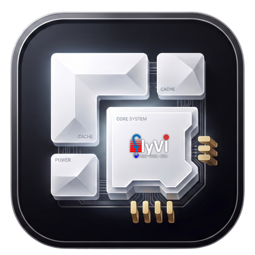
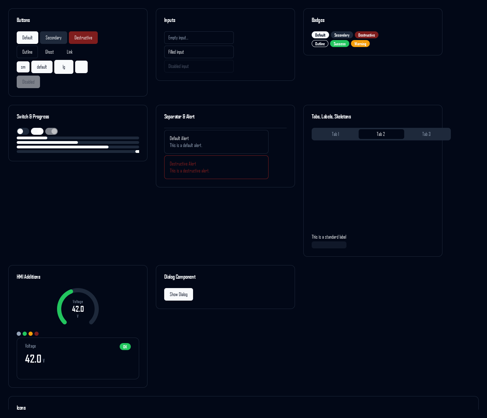

<div align="center">



# EmbeddedDisplay

### Bring Your Own App — HMI platform for Toradex Verdin i.MX8M Plus

Ship the panel once. Let anyone drop their own Qt app onto it in seconds — over SSH, with no rebuild, no image reflash, and no hardware code in the app.

<br />

[](https://www.toradex.com/computer-on-modules/verdin-arm-family/nxp-imx-8m-plus)
[](https://developer.toradex.com/linux-bsp/)
[](https://wayland.freedesktop.org/)
[](https://systemd.io/)

[](https://doc.qt.io/qtforpython-6/)
[](https://www.python.org/)
[](https://libgpiod.readthedocs.io/)
[](https://www.kernel.org/doc/html/latest/driver-api/iio/index.html)

[](https://github.com/shadcn-ui/ui)
[](https://github.com/tabler/tabler-icons)
[](tests/)
[](#why-no-containers)

</div>

---

<div align="center">


<em>EmbeddedDisplay — the customer's app running inside a live panel preview, with real telemetry from the hardware daemon.</em>

</div>

---

## The idea

A machine builder ships one panel image. Their customers — or their own app team —
write a Qt/QML application and push it to the panel with a single command. The
app never touches a GPIO line, an ADC node or a serial port: it binds to **tags**
that arrive over a loopback socket, and the platform does the rest.

```
        YOUR LAPTOP                                   THE PANEL
 ┌──────────────────────────┐                ┌────────────────────────────────┐
 │  HMI App Studio          │                │  hmi-gui.service               │
 │   drag in a Qt app       │   scp bundle   │   loader + tag engine          │
 │   see it in a real bezel │ ─────────────► │   /opt/hmi_apps/current        │
 │   one-click deploy       │   ssh install  │            ▲                   │
 ├──────────────────────────┤                │            │ UDP/JSON          │
 │  deploy_to_hmi.sh        │                │            ▼                   │
 │   the same thing, in CI  │                │  hmi-hwd.service               │
 └──────────────────────────┘                │   libgpiod · IIO · UART        │
                                             └────────────────────────────────┘
```

Three layers, deliberately decoupled:

| | Layer | Owns | Knows nothing about |
|---|---|---|---|
| **1** | `hmi-hwd` — hardware abstraction daemon | GPIO, ADC, UART, safe states | pixels |
| **2** | `hmi-gui` — app loader + tag engine | QML, bindings, the customer bundle | hardware |
| **3** | deployment | atomic install, health check, rollback | either of the above |

---

## Quick start

**On your laptop — no hardware needed.** The daemon simulates I/O so the whole
stack runs on a desktop.

```bash
python -m pip install PySide6

# terminal 1 — simulated hardware
python daemon/hmi_hwd.py --config daemon/hwd.json --sim

# terminal 2 — the panel UI, in a window
python gui/hmi_loader/main.py --apps-dir apps/demo-app --windowed

# terminal 3 — HMI App Studio
python -m tools.hmi_deployer.app
```

**On the panel.**

```bash
ssh-copy-id root@<panel-ip>                       # once
./deploy/deploy_to_hmi.sh -H <panel-ip> -b ./my-qt-app
```

If the new app fails to render within 25 s, the panel **rolls itself back** to the
previous release and the command exits non-zero. A bad deploy cannot leave a
machine without a UI.

---

## Writing an app

A bundle is a directory. Two files are enough.

```
my-qt-app/
├── manifest.json
└── main.qml
```

```json
{
  "schema": 1,
  "name": "line-controller",
  "version": "1.4.0",
  "entry": "main.qml",
  "runtime": "qml",
  "screen": { "width": 1280, "height": 800 },
  "tags_required": ["ai.pot", "di.estop", "do.relay1"]
}
```

`runtime` is optional and defaults to `qml`:

| runtime | entry | How it runs on the panel |
| --- | --- | --- |
| `qml` | `*.qml` | Loaded into the shell that is already running. Gets `Tags`/`Bus` injected, previews live in App Studio. |
| `python` | `*.py` | Exec'd as the GUI process itself — for an existing PySide6/Qt Widgets application that owns its own window. |

Already have a Qt app? Open it in App Studio; it detects the entry point and
writes the manifest for you.

```qml
import QtQuick
import Shadcn 1.0          // the design kit ships on the device

ShCard {
    ShGauge {
        label: "Input Voltage"
        value: Bus.value("ai.pot", 0)     // missing tags degrade, never crash
        minValue: 0; maxValue: 3.3; unit: "V"
        thresholdWarning: 2.5; thresholdFault: 3.0
    }

    ShSwitch { onToggled: Bus.write("do.relay1", checked) }

    ShBadge {
        text: Tags.online ? "ONLINE" : "LINK LOST"
        variant: Tags.online ? "success" : "destructive"
    }
}
```

Two context properties are injected for you:

* **`Tags`** — live values, bound declaratively. Dots become underscores, so
  `ai.pot` reads as `Tags.ai_pot`. `Tags.online` tracks the hardware link.
* **`Bus`** — commands and safe reads: `Bus.write()`, `Bus.pulse()`,
  `Bus.uart_tx()`, `Bus.value(name, fallback)`.

`Bus.value()` is the habit worth forming: it returns your fallback for a tag that
is missing, null, or not published yet, so a screen written against a sensor that
isn't fitted still renders.

---

## HMI App Studio

The desktop tool. Import a bundle, watch it run inside a photo-real mock-up of
the panel, then push it.

* **True WYSIWYG** — the bezel contains a live QML engine rendering *your actual
  app* at target resolution with the same tag engine the device runs. Not a
  screenshot, not an approximation.
* **Live or simulated data** — connected, telemetry is relayed from the real
  daemon over SSH; offline, a built-in simulator drives plausible values.
* **Validation before upload** — every manifest rule is checked host-side, with
  the offending field named.
* **Scaffold** — "New App…" writes a valid starter bundle, already importing the
  design kit.
* **Panel picker** — preview against 5.0" 800×480, 7" 1024×600, 7"/10.1"/12.1"
  1280×800 or 15.6" 1920×1080, with the live resolution reported under the
  bezel. The preview never shrinks below a readable size and always holds the
  panel's aspect ratio.
* **Adopts apps that were never written for this platform** — point it at an
  existing Qt project with no `manifest.json` and it detects the entry point,
  proposes a manifest and writes it for you. QML apps preview live; Python/Qt
  Widgets apps are deployed as the GUI process itself.
* Deploy, rollback, restart and journal tail, all off the UI thread.

<div align="center">




<em>Left: the panel screen, bound to live tags. Right: the component gallery
(<code>python ui/gallery.py --theme dark</code>).</em>

</div>

---

## The tag protocol

JSON over UDP on loopback. Deliberately boring, so anything can speak it.

```jsonc
// daemon → clients, every 100 ms
{ "t": "tags", "seq": 4711, "ts": 1755600000.123,
  "tags": { "ai.pot": 1.842, "di.estop": false, "do.relay1": true } }

// client → daemon
{ "id": "c-17", "cmd": "set", "tag": "do.relay1", "value": 1 }
{ "t": "ack", "id": "c-17", "ok": true }
```

| Prefix | Meaning | Writable |
|---|---|---|
| `ai.` | analog input (IIO ADC), float | — |
| `di.` | digital input (GPIO), bool | — |
| `do.` | digital output (GPIO), bool | **yes** |
| `uart.` | serial link | `uart.tx` |
| `sys.` | daemon health | — |

A tag whose hardware read failed is published as `null`, never omitted — so a QML
binding always resolves. The full specification is [`docs/CONTRACT.md`](docs/CONTRACT.md).

---

## Built for the field

**The daemon cannot be crashed by its socket.** Malformed JSON, wrong types,
oversized frames, binary noise and invalid UTF-8 are counted and answered with a
typed error code — or with silence where no correlation id can be recovered,
which also stops it being used as a UDP reflector. Logging is rate-limited so a
flooding client cannot fill the journal. Outputs are driven to configured safe
states on `SIGTERM`, and systemd watchdog keep-alives are sent every cycle.

**Deployment is atomic and self-healing.** The bundle lands in a tmpfs, so a
failed upload never touches flash. It is checksum-verified, extracted to a
staging directory, validated again on the target, then promoted by a single
`rename(2)` onto the `current` symlink — never `rm` then `ln`, which would leave a
window with no UI. The GUI must recreate its ready-file within 25 s or the
symlink swaps back.

**Validation happens twice, identically.** Host CLI, target installer and the
desktop tool implement the same manifest rules, and a test suite asserts all
three agree — because a bundle that passes on a laptop and is refused on the
panel is worse than one that fails everywhere.

**Both libgpiod generations.** BSP 6 ships libgpiod 1.6, BSP 7 ships 2.x, and
their Python APIs are incompatible. Both are implemented and selected at import.

---

## Design system

Every pixel — on the panel and on the desktop — comes from a Qt port of
[shadcn/ui](https://github.com/shadcn-ui/ui) with [Tabler](https://github.com/tabler/tabler-icons)
icons vendored offline. Same tokens, same variant names, same geometry.

`ShButton` · `ShInput` · `ShCard` · `ShBadge` · `ShSwitch` · `ShProgress` ·
`ShSeparator` · `ShAlert` · `ShTabs` · `ShLabel` · `ShSkeleton` · `ShDialog`
— plus HMI additions `ShGauge`, `ShStatDot`, `ShValueTile`.

```bash
python ui/gallery.py --theme dark      # every component, every state
```

Light and dark are switchable at runtime; the panel defaults to dark, the desktop
tool to light. `ui/tokens.json` is the single source of truth, and a test fails
if `Theme.qml` ever drifts from it.

---

## Layout

```
docs/CONTRACT.md      the normative interface spec — read this first
daemon/               Layer 1  hardware daemon + tag map
gui/                  Layer 2  loader, tag engine, shell, fallback screen
apps/demo-app/        a worked example, and the pipeline's test fixture
ui/                   design system: tokens, QML kit, QSS, icons, gallery
target/               systemd units, atomic installer, Wayland launcher
deploy/               deploy_to_hmi.sh — the CLI
tools/hmi_deployer/   HMI App Studio
yocto/meta-hmi/       bitbake layer that puts it all in the image
tests/                protocol, integration and cross-validator suites
```

---

## Verification

```bash
python tests/run_all.py          # 21 tests
```

| Area | Coverage |
|---|---|
| Daemon protocol | error codes, silence on unparseable input, `seq` monotonicity, survives hostile frames |
| Tag engine | daemon → UDP → QML binding, command write-back, fallback on missing tags |
| Bundle validation | all three implementations agree, in both directions |
| Design tokens | `tokens.json` and `Theme.qml` cannot drift |
| Gallery render | painted pixels asserted, not just "it ran" |

> **Run the installer tests on Linux.** Windows has no `flock`, names Python
> differently and translates paths, so the atomic-swap suite skips there rather
> than pretending to pass. `tests/README.md` has the WSL command.

---

## Building the image

```bash
bitbake-layers add-layer /path/to/meta-hmi
bitbake tdx-reference-multimedia-image
```

`yocto/README.md` covers prerequisite layers (including the meta-qt6 caveat for
PySide6), how each recipe's `files/` directory maps onto this repository, and how
to verify on the target.

### Why no containers

This targets the **native** Toradex Yocto reference image. No Docker, no
TorizonOS, no container runtime — every component is a systemd unit on the
rootfs. Less to boot, less to update, less to explain to a certification body.

---

## Before first power-on

GPIO offsets, IIO device names and UART aliases are **board specific**.
`daemon/hwd.json` ships a documented default for a Verdin i.MX8M Plus on a
Dahlia carrier. Confirm yours:

```bash
gpioinfo                 # GPIO chip and line offsets
iio_info                 # ADC device name and channels
ls /dev/verdin-*         # stable UART aliases
```

Pins must first be released from their default pinmux with a Toradex device-tree
overlay (`/boot/overlays.txt`). `daemon/README.md` walks through it.

---

<div align="center">

**MIT licensed.** Tabler Icons are MIT — see `ui/icons/LICENSE.tabler`.

</div>
