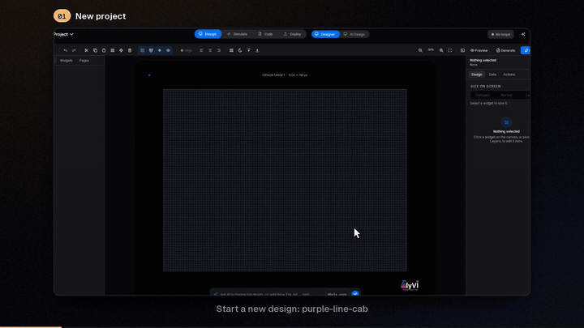
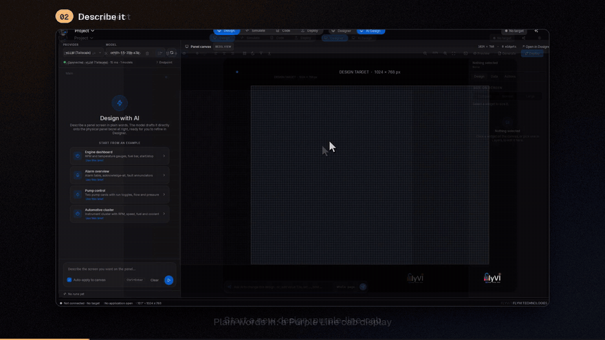
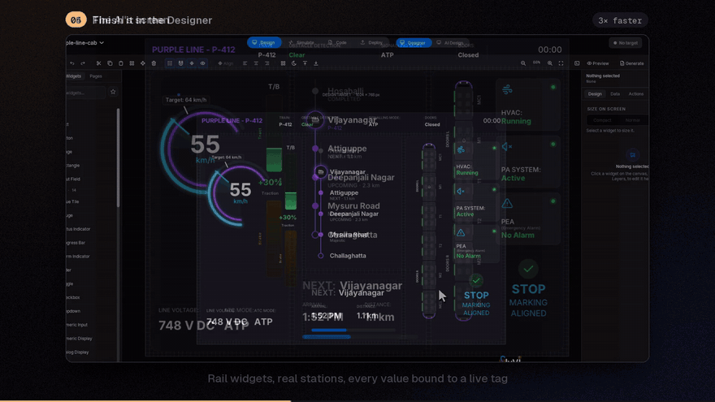
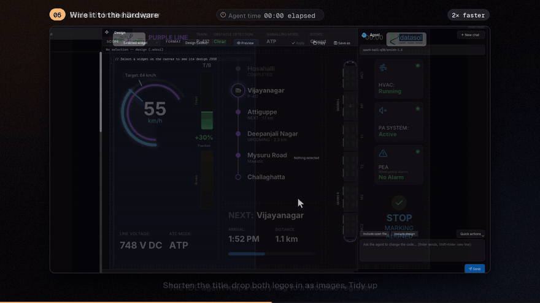
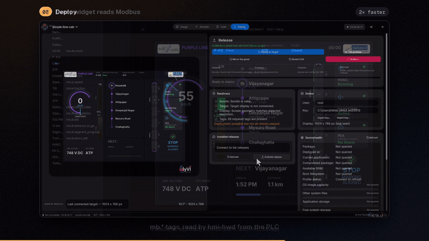
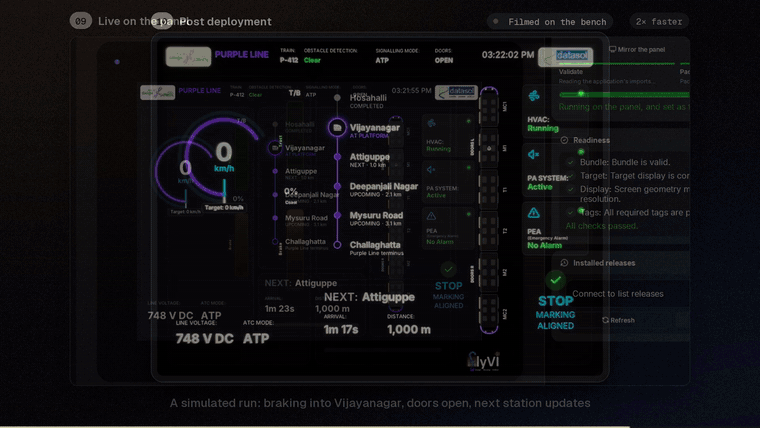
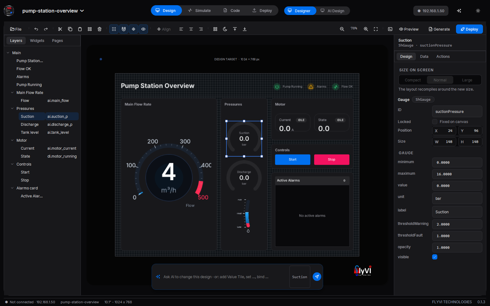
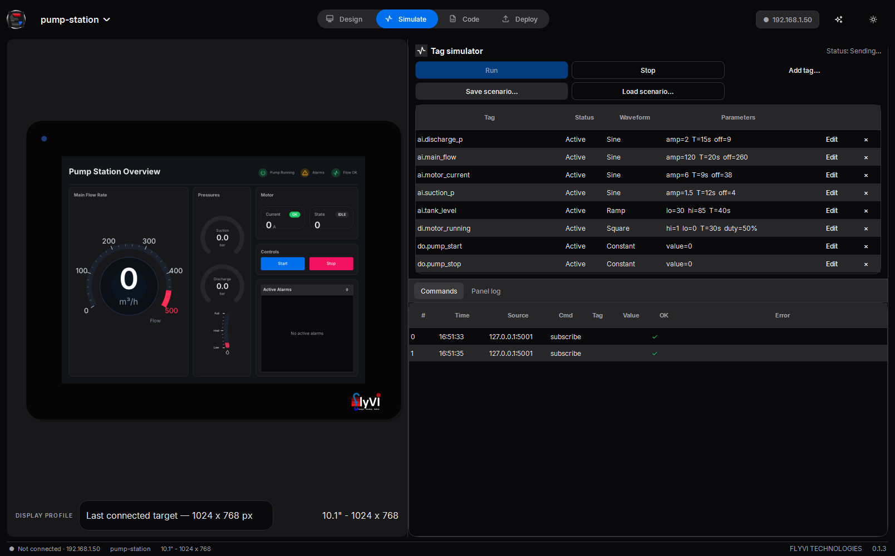
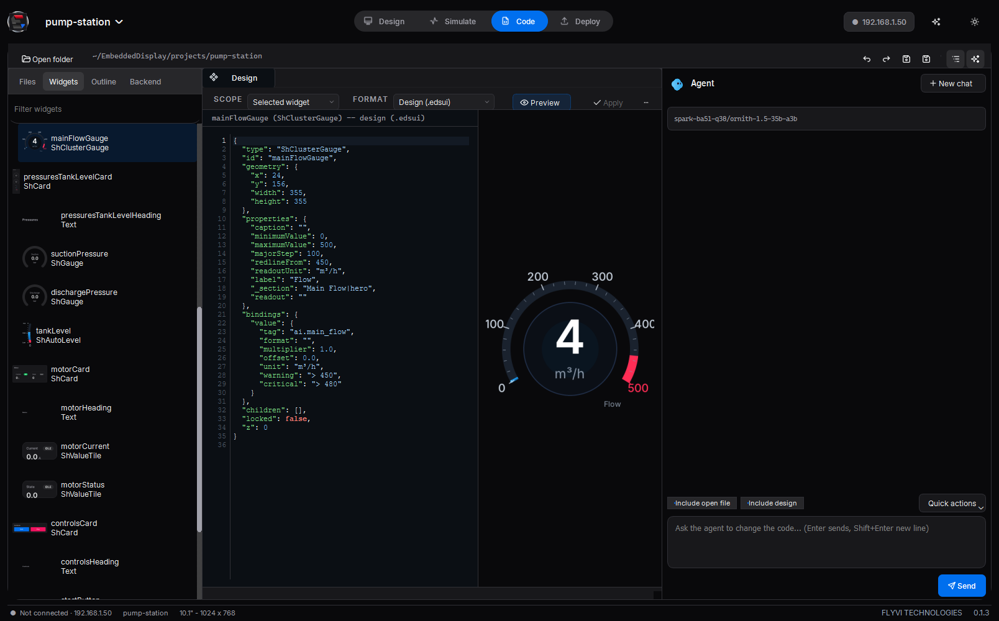
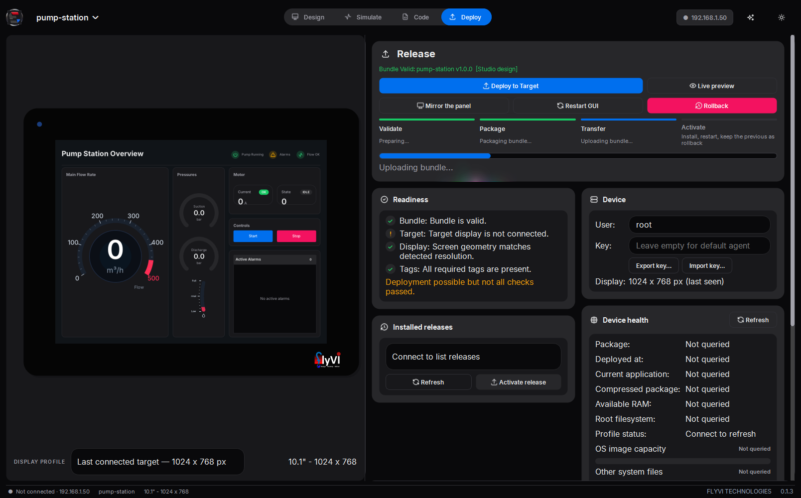

<div align="center">


### Describe it. Design it. Wire it. Ship it to the glass.

A desktop studio for embedded Linux HMI panels — an AI designer, a canvas the size of the panel,<br />
a coding agent that wires your PLC, and one-click deploys to a 1.4 MB C + LVGL runtime that rolls itself back.

[](../../releases/latest)
[](https://github.com/Hitheshkaranth/EmbeddedDisplayStudio/actions/workflows/ci.yml)
[](LICENSE)
[](#hackathon)

[](https://www.python.org/)
[](native/hmi-ui/)
[](docs/GUIDE.md#ai-design)
[](yocto/)

**[Quick start](#quick-start)** &nbsp;·&nbsp; **[Features](#features)** &nbsp;·&nbsp; **[How it works](#how-it-works)** &nbsp;·&nbsp; **[Guide](docs/GUIDE.md)** &nbsp;·&nbsp; **[Changelog](CHANGELOG.md)**

<br />



<sub>One sentence to a running <strong>Namma Metro Purple Line</strong> cab display on a real Toradex panel — every step inside the Studio.</sub>

</div>

<br />

<a id="hackathon"></a>

> [!NOTE]
> #### Presented at the Berkeley × DeepMind Hackathon
> EmbeddedDisplay Studio was presented at the **Berkeley × DeepMind Hackathon**: a brief described in plain words, designed by AI, wired to the hardware and deployed to a real embedded panel — live, from one desktop app.

<br />

## Features

<table>
<tr>
<td width="50%" valign="top">

<h4>AI generates the UI</h4>
<sub>Describe the screen in plain words. The model plans the content; a deterministic compiler lays it out for the panel's glass — including a full train cab display from one brief.</sub>
</td>
<td width="50%" valign="top">

<h4>Edit it in the Designer</h4>
<sub>The AI's screen is an ordinary design. Edit text, drop in logos, bind tags, set alarms and actions — then <strong>Tidy up</strong> re-lays the page.</sub>
</td>
</tr>
<tr>
<td width="50%" valign="top">

<h4>A coding agent wires the hardware</h4>
<sub>The IDE's agent maps every value to a Modbus register on your PLC, rebinds the design and proves it with the hardware daemon's self-test.</sub>
</td>
<td width="50%" valign="top">

<h4>Deploy with rollback</h4>
<sub>Validate, upload, checksum, atomic swap. If the screen does not render within 25 s the panel rolls itself back. Mirror the live glass in the Studio.</sub>
</td>
</tr>
</table>

<div align="center">

<br /><sub>The deployed design on the real 10.1" panel, driven by the bench simulator.</sub>
</div>

<br />

**Also in the box**

- **The panel's own renderer, everywhere** — canvas and previews are drawn by the same C runtime that runs on the glass, so what you see is what ships.
- **51 widgets** — industrial, avionics, automotive and rail (speed arc, station line, train consist…), each in QML and in C. Save any group as a **custom widget**.
- **Simulate without hardware** — Tag Lab waveforms, and `tagsim` flies a whole aircraft or runs a train between stations so every reading agrees.
- **Operator runtime** — expression bindings, action lists with confirm, alarm priorities, latching and shelving, history, keypad, screen idle.
- **Bring your own Qt app** — PySide6 and PySide2 applications deploy too; the Studio installs their runtime on demand.

## How it works

<div align="center">

</div>

| | Layer | Owns |
|:-:|---|---|
| **1** | `hmi-hwd` — hardware daemon (C) | GPIO, ADC, serial, Modbus TCP/RTU, CAN, USB/HID, I2C/SPI sensors, history, safe states |
| **2** | `hmi-ui` — panel runtime (C + LVGL, DRM/KMS) | the design file, bindings, alarms, pixels |
| **3** | deployment | atomic install, health check, rollback |

Widgets never touch hardware: they bind to **tags** that arrive over a loopback socket ([the contract](docs/CONTRACT.md)).

## Quick start

> [!TIP]
> No hardware needed: the daemon simulates its I/O and Tag Lab drives any tag a design invents.

**Packaged** — download the Windows or Linux build from the [latest release](../../releases/latest). Nothing to install.

**From source** (Python 3.12):

```bash
python -m pip install -r requirements.txt
python main.py
```

**A panel** (once, over SSH, no reflash):

```bash
ssh-copy-id root@<panel-ip>
python deploy/provision_panel.py --host <panel-ip>
```

Then: **Design → AI Design**, describe the screen → **Simulate** → connect the panel from the device chip → **Deploy**.

## Documentation

| | |
|---|---|
| **[The guide](docs/GUIDE.md)** | The Studio's modes, AI Design, Code, deploying, the runtime, bundles, architecture, hardware |
| **[Contract](docs/CONTRACT.md)** | Wire protocol, bundle format, filesystem layout, reliability rules |
| **[AI layout compiler](docs/AI_LAYOUT_COMPILER.md)** | How a brief becomes a screen |
| **[Code IDE and agent](docs/CODE_SECTION.md)** | The Code mode and its opencode agent |
| **[Hardware daemon and tagsim](daemon/README.md)** | `hmi-hwd`, Modbus, the historian and the bench simulator |
| **[Changelog](CHANGELOG.md)** | Every release |

<details>
<summary><strong>Screenshots</strong></summary>
<br />
<table>
<tr>
<td width="50%"><p align="center"><sub>Design</sub></p></td>
<td width="50%"><p align="center"><sub>Simulate</sub></p></td>
</tr>
<tr>
<td width="50%"><p align="center"><sub>Code</sub></p></td>
<td width="50%"><p align="center"><sub>Deploy</sub></p></td>
</tr>
</table>
</details>

## What's new

<table>
<tr>
<td width="33%" valign="top"><strong>A hardware daemon in C</strong><br /><sub><code>hmi-hwd</code> drops Python: GPIO, ADC, serial, Modbus TCP/RTU, CAN, USB and HID devices, I2C/SPI sensors and the historian, same wire protocol.</sub></td>
<td width="33%" valign="top"><strong>Connections and a Modbus map</strong><br /><sub>One list of model endpoints for AI Design and the agent; a design's tags become PLC registers in one click, tested against a simulated PLC.</sub></td>
<td width="33%" valign="top"><strong>Find, watch, simulate</strong><br /><sub>Find panels on the network, a link that recovers by itself, clock sync, drop-in images and brand, and Tag Lab simulating the open design.</sub></td>
</tr>
</table>

<br />

<div align="center">

**MIT licensed** — see [`LICENSE`](LICENSE). LVGL and Tabler Icons are MIT; the packaged Studio carries PySide6 and Qt, unmodified, under the LGPL-3.0.

<sub>FLYVI TECHNOLOGIES · EMBEDDED DISPLAY ENGINEERING</sub>

</div>
