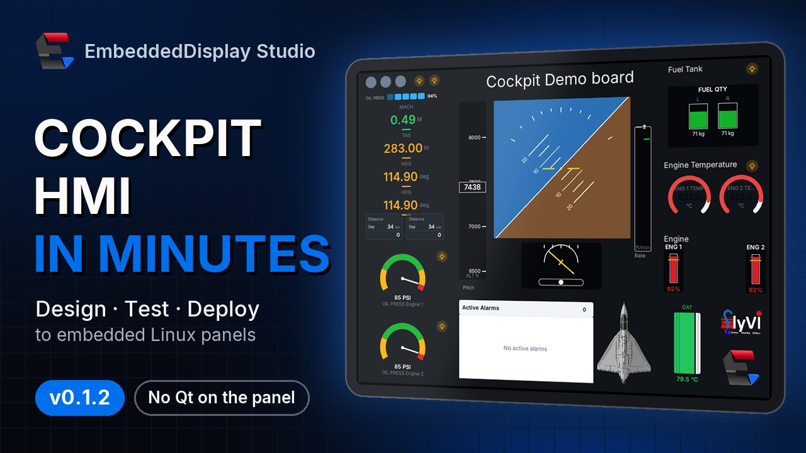
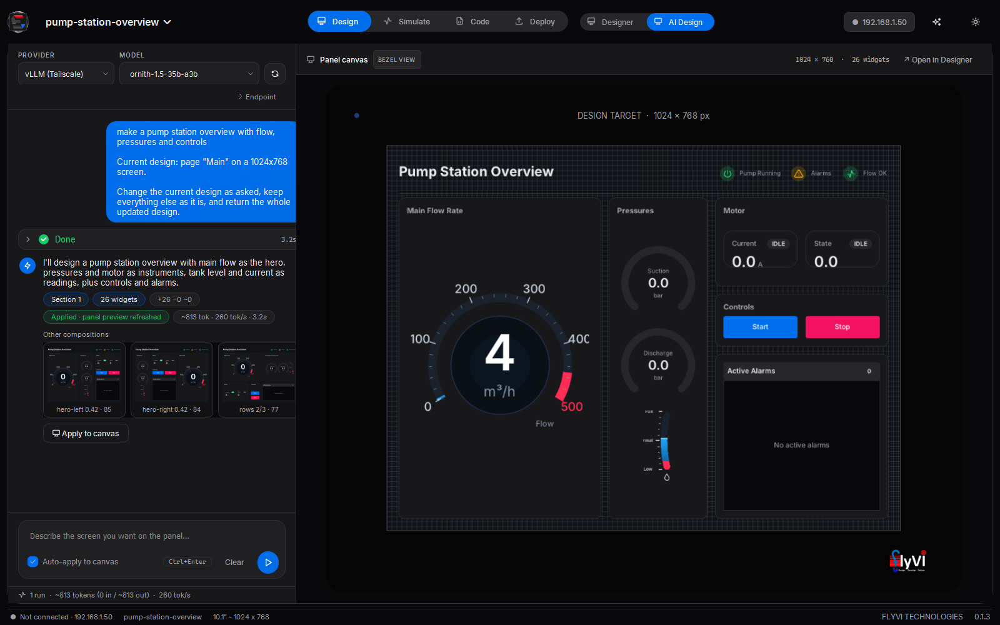
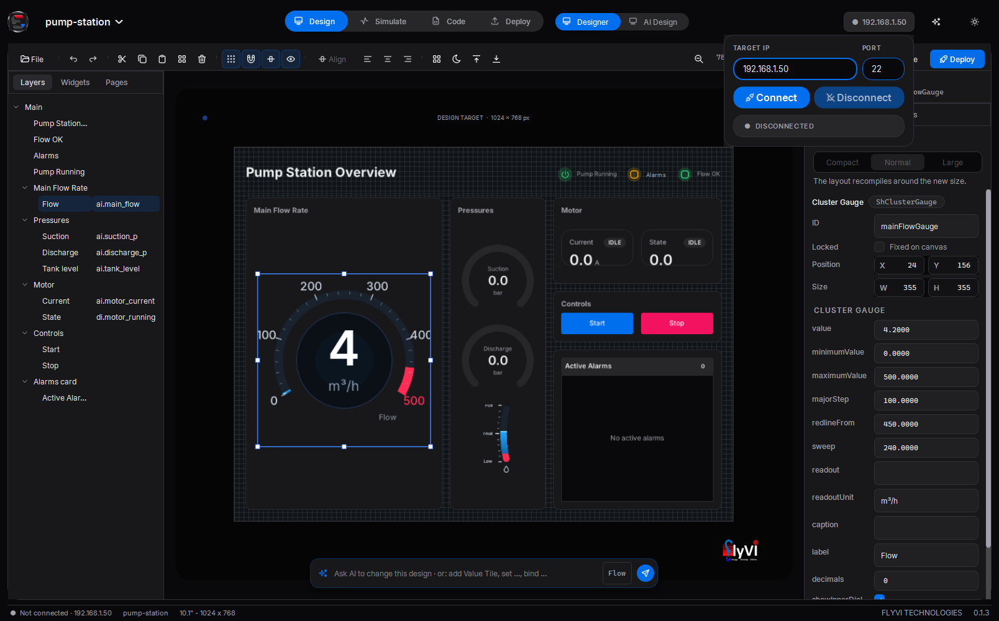
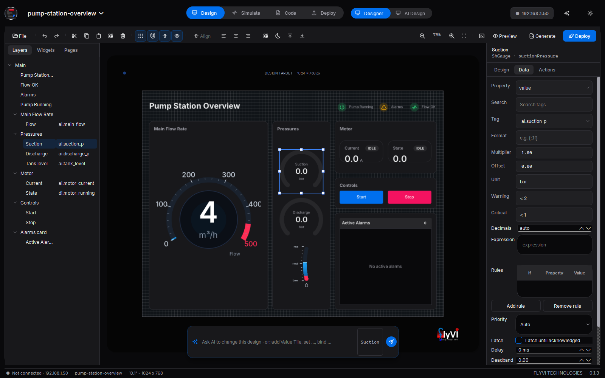
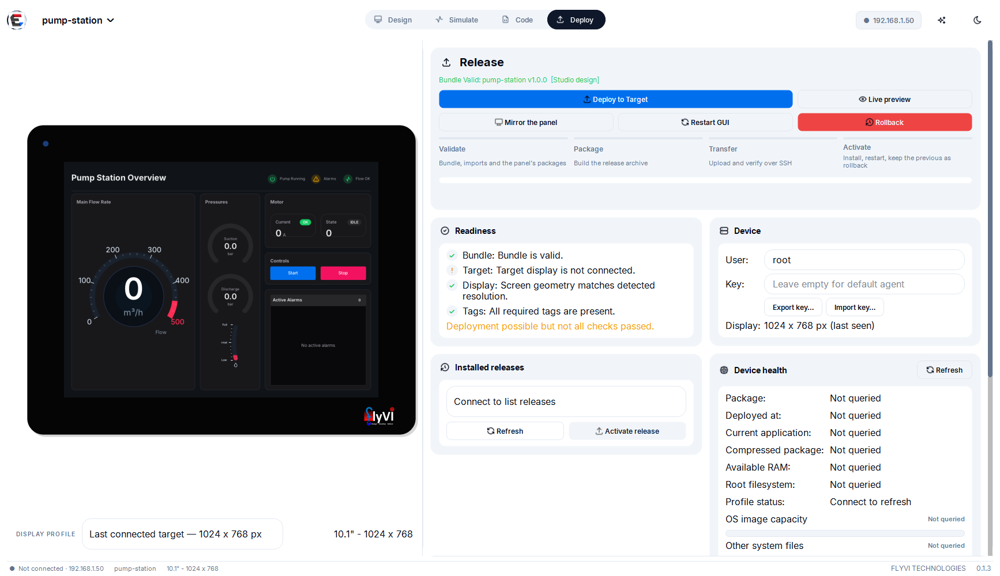
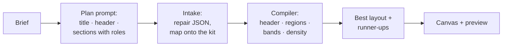
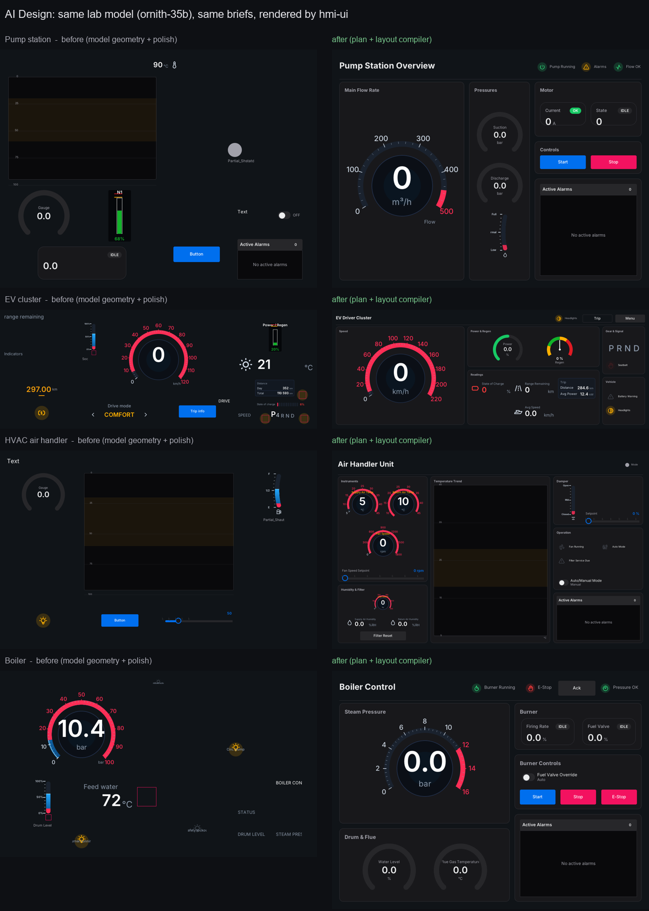
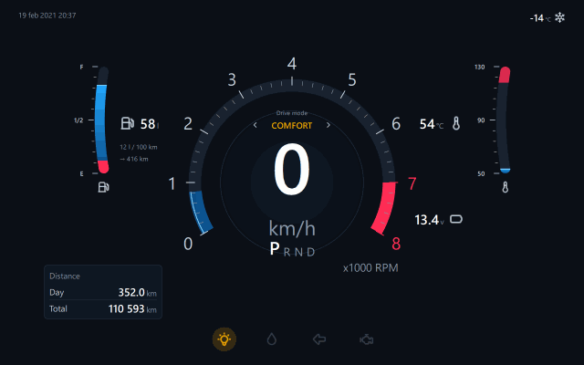
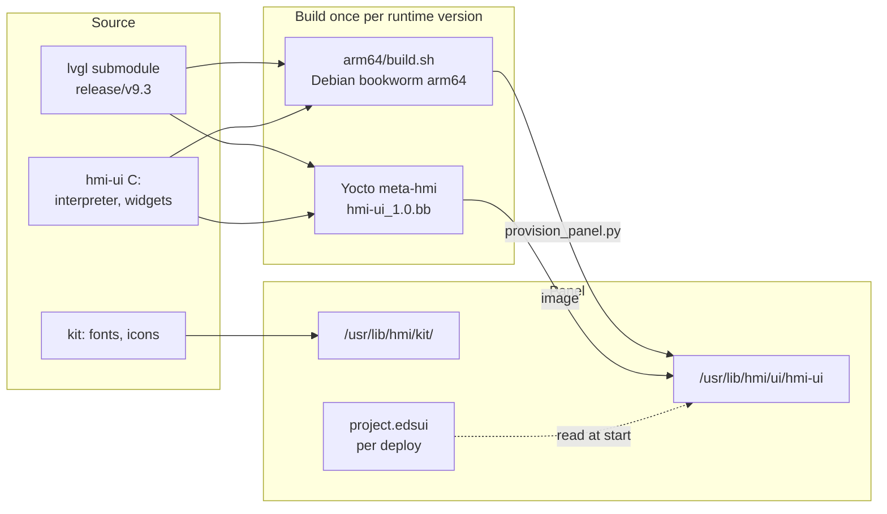

<div align="center">


# EmbeddedDisplay Studio

**Describe it, draw it, or bring your own — and ship it to the glass.**

A desktop studio for embedded Linux HMI panels. Write a brief and a model builds the screen, or draw it on a canvas the size of the panel, or open an existing Qt application — then preview it with the panel's own renderer and deploy it over SSH, atomically, with automatic rollback. The panel runs a 1.4 MB C + LVGL runtime that reads the design file directly: no Qt, no compositor, no per-design build.

<br />

[](../../releases/latest)
[](https://github.com/Hitheshkaranth/EmbeddedDisplayStudio/actions/workflows/ci.yml)
[](LICENSE)
[](#)
[](https://youtu.be/h-ITQebSflg)

[](https://www.python.org/)
[](https://doc.qt.io/qtforpython-6/)
[](native/hmi-ui/)
[](yocto/)
[](#quick-start)
[](#ai-design)

<br />

[**Quick start**](#quick-start) &nbsp;·&nbsp; [**The Studio**](#the-studio) &nbsp;·&nbsp; [**AI Design**](#ai-design) &nbsp;·&nbsp; [**Simulate**](#simulate) &nbsp;·&nbsp; [**Code**](#code) &nbsp;·&nbsp; [**Deploying**](#deploying) &nbsp;·&nbsp; [**The panel runtime**](#the-panel-runtime) &nbsp;·&nbsp; [**Qt apps**](#qt-applications) &nbsp;·&nbsp; [**Changelog**](CHANGELOG.md)

</div>

<br />

<div align="center">

<a href="https://youtu.be/h-ITQebSflg"></a>

<sub>▶ <strong><a href="https://youtu.be/h-ITQebSflg">Watch the two-minute tour</a></strong> — describe it, draw it, test it and ship it to the glass.</sub>

</div>

<br />

## From a sentence to a running cab display

One brief, end to end, on a real panel: a **Namma Metro Purple Line** driver cab display for train P-412, westbound from Hosahalli through Vijayanagar to Mysuru Road. Ornith 1.5 on our own GPU server plans it, the Studio lays it out, a person finishes it in the Designer, the Ornith agent in the IDE wires it to a Modbus PLC, and it is deployed to a Toradex Verdin panel.

<div align="center">

</div>

<table>
<tr>
<td width="33%" valign="top">

<p><strong>1 · Describe it</strong><br /><sub>Plain words in. Ornith plans the content; the compiler knows a cab display — the line across the top, speed left, route middle, the train right — and draws it with the Rail widgets.</sub></p>
</td>
<td width="33%" valign="top">

<p><strong>2 · Finish it</strong><br /><sub>The AI's screen stays. Shorten the title, drop both logos into the header as images, and <strong>Tidy up</strong> places them.</sub></p>
</td>
<td width="33%" valign="top">

<p><strong>3 · Wire it</strong><br /><sub>The agent in the IDE gives every value a Modbus register on the PLC, rebinds the design and proves it with the daemon's self-test.</sub></p>
</td>
</tr>
<tr>
<td width="33%" valign="top">

<p><strong>4 · Ship it</strong><br /><sub>Validate, upload, checksum, atomic swap. The mirror shows the bench simulator's train brake into Vijayanagar, open its doors and move on to Attiguppe.</sub></p>
</td>
<td width="33%" valign="top">

<p><strong>5 · On the glass</strong><br /><sub>The real 10.1-inch panel, filmed on the bench: the train pulls out of Vijayanagar for Attiguppe and every reading follows it.</sub></p>
</td>
<td width="33%" valign="top">
<p><strong>What it took</strong></p>
<sub>

* one brief and two image files
* [`designer/layout/cab.py`](designer/layout/cab.py) — the cab layout
* five Rail widgets, in QML and in C
* [`daemon/tagsim.py`](daemon/tagsim.py) — a train for the bench
* no hand-placed widgets

</sub>
</td>
</tr>
</table>

<br />

<div align="center">


<sub><strong>Design mode</strong> — a pump station overview the AI planned and the layout compiler laid out, drawn by the panel's own renderer. The suction gauge is selected: its layer on the left, <strong>Size on screen</strong> and its properties on the right, and the AI composer under the canvas.</sub>

</div>

<br />

<table>
<tr>
<td width="25%" valign="top">
<a href="#ai-design"></a>
<p><strong>Describe it</strong><br /><sub>The model plans the content; a compiler lays it out for the glass.</sub></p>
</td>
<td width="25%" valign="top">
<a href="#simulate"></a>
<p><strong>Test it</strong><br /><sub>Drive every tag with a waveform before the I/O exists.</sub></p>
</td>
<td width="25%" valign="top">
<a href="#code"></a>
<p><strong>Code it</strong><br /><sub>The design as JSON, the C behind each widget, and a coding agent.</sub></p>
</td>
<td width="25%" valign="top">
<a href="#deploying"></a>
<p><strong>Ship it</strong><br /><sub>Validate, package, transfer, activate — with rollback.</sub></p>
</td>
</tr>
</table>

---

## The idea

A machine builder ships one panel image. Their customers — or their own app team — put a screen on it and push it with one button or one command. The app never touches a GPIO line, an ADC node or a serial port: it binds to **tags** that arrive over a loopback socket, and the platform does the rest.

<div align="center">

</div>

| | Layer | Owns | Knows nothing about |
|:-:|---|---|---|
| **1** | `hmi-hwd` — hardware daemon | GPIO, ADC, UART, Modbus, safe states | pixels |
| **2** | `hmi-ui` — panel runtime | the design file, bindings, alarms, pixels on DRM/KMS | hardware |
| **3** | deployment | atomic install, health check, rollback | either of the above |

Three ways to a screen, one pipeline after it:

| | Start from | Runs on the panel as |
|---|---|---|
| **Describe it** — [AI Design](#ai-design) | *"An engine page for a turboprop: torque, ITT, Ng, fuel flow and an alarm list"* | a Studio design, drawn by `hmi-ui` |
| **Draw it** — [Designer](#the-studio) | an empty canvas the size of the panel's glass | a Studio design, drawn by `hmi-ui` |
| **Bring your own** — [Qt apps](#qt-applications) | an existing PySide6 or PySide2 application | the application itself, with a Qt runtime the Studio installs at deploy |

---

## Quick start

> [!TIP]
> No hardware needed to start. The hardware daemon simulates its I/O and Tag Lab drives any tag a design invents, so the whole flow runs on a desktop.

**Packaged** — download `EmbeddedDisplayStudio.exe` (Windows) or the Linux x86-64 build from the [latest release](../../releases/latest). It carries its own Python, PySide6 and pip; nothing to install.

**From a checkout** — Python 3.12:

```bash
python -m pip install -r requirements.txt
python main.py                                            # --bundle <dir> to open one
python daemon/hmi_hwd.py --config daemon/hwd.json --sim   # optional: simulated I/O
```

**A panel**, once — key-based SSH as root, then the platform installed onto a stock image, no reflash:

```bash
ssh-copy-id root@<panel-ip>
python deploy/provision_panel.py --host <panel-ip> --check   # survey only
python deploy/provision_panel.py --host <panel-ip>
```

**From a sentence to the glass**

1. **Design → AI Design** — pick a provider and model, describe the screen, <kbd>Ctrl</kbd>+<kbd>Enter</kbd>. Or type the brief into the composer under the Designer's canvas.
2. **Design → Designer** — the result is an ordinary project; check each instrument's tag on the **Data** tab.
3. **Simulate** — drive those tags from Tag Lab.
4. **The device chip** — enter the panel's address and **Connect**; the panel's real display size retargets the canvas.
5. **Deploy** — the panel must draw the screen within 25 s, or it rolls itself back.

---

## The Studio

One window, four modes. A single header row carries the project menu (**New app…**, **Open bundle…**), the mode switch, a view switch where a mode has more than one view, the **device chip**, and the motion and theme buttons. A status bar along the foot reads the link, the open app and the display.

| Mode | Views | |
|---|---|---|
| **Design** | **Designer** · **AI Design** | Draw the screen on a canvas the size of the panel's glass, or describe it and let a model build it there |
| **Simulate** | Simulate | Tag Lab beside the panel, with its command log and the panel's journal in a drawer |
| **Code** | Code | Files, an outline of every widget, the tag backend, the design as the panel reads it, the C behind each widget, and a coding agent |
| **Deploy** | Deploy | The release, the four deploy steps, readiness, installed releases, the device and its health |

The mode remembers its last view, and follows when something else opens a view: **Open in Designer** from AI Design lands in Design.

**The device chip.** The panel's address and port, **Connect** and **Disconnect** live in the chip's popover; the chip itself shows the address and goes green when the link is up.

<div align="center">

</div>

**The Designer.** One toolbar: a **File** menu, undo and redo, clipboard, grid, snap and **object snap** (to sibling and parent edges; <kbd>Ctrl</kbd> bypasses), align, **Tidy up**, z-order, **Screen idle**, zoom, then **Preview**, **Generate** and **Deploy**. On the left, **Layers** (a tree that mirrors the page), **Widgets** (a searchable library with favorites) and **Pages**. On the right, the selected widget in three tabs:

* **Design** — **Size on screen** (*Compact*, *Normal*, *Large*; on a compiled page the layout recompiles around it), then position, size and every property the widget registry declares.
* **Data** — the tag binding: format, multiplier, offset, unit, **warning / critical** thresholds, fixed decimals, an **expression** instead of a tag, rules that set another property from the reading, and the alarm's priority, latch, delay and deadband.
* **Actions** — what a press, toggle or change does: write, pulse, toggle, increment, navigate, back, acknowledge, shelve; any list can ask **Cancel / OK** first.

Resize from any of the eight handles. Align, match size and distribute act on selected free siblings only, never across parents. **Tidy up** runs the layout compiler again on a page it built, and composes any other page with the grid, each widget's own proportions and the style pass.

**The AI composer.** A prompt under the canvas, scoped to the selection or the whole page. `add Value Tile`, `set …`, `bind …` and `remove …` run offline at once; anything else goes to AI Design with the current design as context, and the answer lands back on the canvas as one undo step.

No bundle is needed to start: the first Preview, Deploy or AI result creates one under `Documents/EmbeddedDisplay Studio/projects/<name>/`.

**The canvas follows the glass.** On **Connect** the Studio reads the panel's real geometry from its DRM connector and retargets the canvas and the bezel to it.

**51 widgets from one registry** — shadcn/ui-derived basics (`ShButton`, `ShInput`, `ShCard`, `ShTabs`, …), industrial (`ShGauge`, `ShValueTile`, `ShTrendChart`, `ShAlarmTable`, …), avionics (`ShAttitude`, `ShTape`, `ShCompass`, `ShVSI`, `ShFlightDirector`, `ShEngineGauge`, `ShFuelQuantity`, `ShAnnunciator`, …), automotive (`ShClusterGauge`, `ShGearIndicator`, `ShDriveMode`, `ShTelltale`, `ShTripInfo`, `ShVehicleStatus`, …) and **rail**: `ShSpeedArc` (speed with its ATP/ATO target), `ShTractionBar` (traction above zero, braking below), `ShStationLine` (the route, the train on it and a note per station), `ShTrainConsist` (the cars and both sides' doors) and `ShStatusCard` (an on-board system in words). Every one binds to tags; interactive ones write back through actions, and each is drawn the same by the QML kit and by `hmi-ui`.

**Custom widgets.** Select a group on the canvas and **Save as custom widget**: it lands in the palette's **Custom** section (stored as `.edswidget` under `Documents/EmbeddedDisplay Studio/widgets`), and placing it drops a copy with fresh ids, its bindings and styling intact.

<table>
<tr>
<td width="50%"><p align="center"><sub><strong>Data</strong> — the gauge's tag, its thresholds, an optional expression and rules, and how its alarm behaves.</sub></p></td>
<td width="50%"><p align="center"><sub><strong>Light mode</strong> — the theme follows the operator; the design keeps its own colour mode for the panel.</sub></p></td>
</tr>
</table>

### Simulate

Tag Lab lists every tag the open design binds. Drive each one with a constant, ramp, sine, square or noise waveform; scenarios save and replay. **Run** makes Tag Lab the Studio's tag source — what the Live Preview window shows — and it answers the preview's own commands, so a button pressed in the bezel changes a tag here. The drawer underneath holds the **Commands** log (subscriptions, writes, acks) and the **Panel log**, the journal of `hmi-ui` and `hmi-hwd` on a connected panel, followed live with a filter.

<div align="center">

</div>

---

## AI Design

Describe the screen; the Studio streams the model's answer, reads it as a content plan, lays it out for the panel's glass and puts it on the canvas. From there it previews and deploys exactly like a hand-drawn design.

<div align="center">

<br /><sub>A finished turn: the brief, the execution shell (<code>26 widgets</code>, <code>+26 −0 ~0</code>, <code>Applied · panel preview refreshed</code>), the runner-up layouts as thumbnails, and the compiled screen on the panel canvas.</sub>
</div>

| Provider | How | Needs |
|---|---|---|
| **Ollama** | local, zero configuration | `ollama serve` |
| **OpenAI** · **Anthropic** · **Google** | hosted | an API key, remembered per provider |
| **vLLM** | your own server on the network or tailnet — preset `http://spark-ba51:8080`, `qwen3.8-35b-a3b` | the server's API key |
| **BYOK** | any OpenAI-compatible server | base URL + key |

The status line tells a server that is not there (`unreachable`) from one that refused the key (`API key required` / `rejected`), and a saved model the server no longer serves is replaced by one it does.

### How a brief becomes a screen

A language model is worst at geometry, and geometry is the longest part of its reply. So the model is not asked for any: it says *what* the screen shows, and a deterministic compiler decides *where*.


```mermaid
flowchart LR
    B[Brief] --> P[Plan prompt:<br/>title · header ·<br/>sections with roles]
    P --> I[Intake:<br/>repair JSON,<br/>map onto the kit]
    I --> C[Compiler:<br/>header · regions ·<br/>bands · density]
    C --> V[Best layout +<br/>runner-ups]
    V --> A[Canvas + preview]
```

1. **A content plan, not coordinates** — the prompt is built from the widget registry and the target screen, so the model only names widgets the panel can draw, with their real property names. It returns a title, header lamps or navigation, and three to six sections, each with a role (`hero`, `instruments`, `readings`, `trend`, `alarms`, `status`, `controls`) and its widgets' labels, units, ranges, bindings and actions. It may ask for `"size": "compact" | "normal" | "large"` on a section or a widget.
2. **Intake** — `designer/layout/intake.py` reads the reply the way it was meant: lenient JSON repairs missing quotes, early closers, truncation and comments; a duplicated key spills into a new object instead of overwriting a section; property synonyms, icons and invented widget types are mapped onto the kit. Undeclared properties are dropped, tags lowercased, actions on signals a widget cannot emit removed.
3. **Compile** — `designer/layout/compiler.py` never reads model geometry. A header (title left, lamps and navigation right), then the body is *searched*, not templated: every row and column partition and hero placement is scored by a cost model — content fit, each card's minimum, hero prominence, empty cards and slivers. Inside a card, faces share a row height, tiles a grid, controls sit at the foot. Every card gets the minimum its content needs before the rest is shared by weight.
4. **Density** — the same search runs with widgets at 100 % down to 60 % of their design size, and a crowded screen shrinks only when that lays it out clearly better. Size wishes multiply in; controls never go under 32 px.
5. **Semantics** — Stop and Trip buttons become destructive, navigation outline; a bound gauge shows its live value; repeated names are folded (a hero's caption becomes its card's title).
6. **Apply** — one undo step on the canvas, the preview reloads, and the runner-up layouts wait as thumbnails. The last three turns ride along, so *"make the flow gauge bigger"* edits rather than restarts. Every widget carries its section, so **Size on screen** and **Tidy up** recompile the same plan.

<div align="center">

<br /><sub>Same model, same briefs: the old geometry pipeline on the left, plan and compile on the right — every one drawn by the panel's renderer. The design notes, measurements and roadmap are in <a href="docs/AI_LAYOUT_COMPILER.md">docs/AI_LAYOUT_COMPILER.md</a>.</sub>
</div>

The older path — the model writes geometry, archetypes and a critic polish it, oversized designs split into linked pages — is still there as the fallback (`ai/layoutEngine = polish`).

### Cab displays

A brief about a train — metro, rail, tram, a driver's cab — adds a cab guide to the plan prompt, and a plan holding the Rail widgets is laid out by [`designer/layout/cab.py`](designer/layout/cab.py) the way drivers read one, whatever the screen size:

| Where | What | From the plan |
|---|---|---|
| top | the line's name in its colour, the train's fields, a clock, logos at either end | title, header `ShDataField`s, a `clock` text, header images |
| left | speed arc with its target, traction / brake bar, two readings | the *Drive* section |
| middle | the station line, then **NEXT:** the next station with its ETA, distance and hop progress | the *Route* and *Next station* sections |
| right | the consist with its doors, up to three system cards, a platform callout | the *Train* section |

The compiler also puts right what models get wrong on these screens: a car count instead of car names, a progress in percent, a whole line of stations (it keeps a window round the next station and the terminus), a "current station" tile beside the station line, a doors status card instead of the consist, a system name too long for its card. What is always live on a cab — speed, target, traction, the station line, the next station, ETA, distance, doors, clock — is bound to a tag even when the plan left it static. A logo dropped into the header in the Designer is put on a plate at that end by **Tidy up**.

<details>
<summary><strong>The execution shell, presets and the self-driving cluster</strong></summary>

<br />

Every turn is a foldable **execution shell** — request, thinking, response, parsed design, canvas diff (`+added −removed ~changed`), usage (`in · out · tok/s · TTFT`) — with chips such as `Section 2 · Fuel`, `14 widgets`, `Applied · panel preview refreshed`. A reasoning model's thinking pass is off by default: it counts against the output budget, and a long one returns no design at all.

**Design presets.** On the polish path, a brief that reads like an automotive cluster or an EV dashboard gets a hand-built exemplar and a style guide appended to the prompt (`python -m tools.hmi_deployer.design_presets --list`).

**A cluster that drives itself.** `sim.car.*` values are a sixty-second drive cycle, so a page bound to them carries its own clock on the canvas, in the Live Preview window and on the panel. `designer/templates/automotive_cluster_demo.edsui` is the preset wired to it.

<div align="center"></div>

</details>

---

## Code

The project as code, with a coding agent beside it.

<div align="center">

</div>

* **Files, Widgets, Outline, Backend** — the bundle's folder as a tree; a Widgets list with live thumbnails; an **Outline** of every widget on every page with its tags and binding issues (filter to bound widgets, issues or one tag); and a **Backend** table with one row per tag — read/write access, the widgets that use it, its live value and status. **Generate backend…** writes a runnable UDP backend into `backend/`, with a stub per tag, `tags.json` and `tags.h`.
* **The design as the panel reads it** — pick a widget and its `.edsui` sits beside `hmi-ui`'s render; edit and **Apply** as one undo step. **Runtime C (hmi-ui)** shows `native/hmi-ui/src/widgets/w_<type>.c`, the file compiled into the runtime. Any file opens in a tabbed editor (C, Python, QML, JSON, `.edsui`).
* **The agent** — [opencode](https://opencode.ai) driven over its HTTP server in the project folder, on the model configured in opencode. It is told about the design — pages, the selected widget, its tags and issues — and offers quick actions; thinking, tools, file links and permission prompts show in the transcript, and an edited file reloads in its tab. Install once with `npm i -g opencode-ai`. Notes in [docs/CODE_SECTION.md](docs/CODE_SECTION.md).

---

## Deploying

**Deploy mode** is one page: the **Release** card (**Deploy to Target**, **Live preview**, **Mirror the panel**, **Restart GUI**, **Rollback**), then the four steps of a deploy — **Validate**, **Package**, **Transfer**, **Activate** — each lit as the progress bar reaches it and marked failed with the reason when one goes wrong. Below: a **Readiness** checklist (bundle, target, display geometry, tags), the panel's **Installed releases**, the **Device** (user, key, export and import of the deploy key, the display it reported) and its **Health** — the active release, its footprint, the storage split and free RAM, read over SSH while a panel is connected — and the console.

<div align="center">

</div>

<div align="center">

</div>

* **Nothing is converted.** No build and no code generation for the target: the panel interprets `project.edsui` as the Designer saved it.
* **What travels is what runs** — `manifest.json`, `project.edsui` and `assets/`, packed by one packer shared with the CLI so both produce a byte-identical tarball.
* **Validated twice, by one implementation** — the Studio, the CLI and the panel's installer all call `schema/manifest.py`.
* **Readiness is the picture, not the process** — `hmi-install` starts the bundle's GUI service and waits for `/run/hmi/gui-ready`, touched only once the first page is on the glass.
* **The swap cannot leave the panel dark** — tmpfs landing, checksum, staging, validation, then `rename(2)`. No readiness within 25 s and the previous release comes back.
* **Boot default, rollback, releases, restart** — a proven release boots next time; the previous one is a button away; any release the panel still holds can be activated.

> [!NOTE]
> **Seeing the glass.** **Mirror the panel** signals the runtime, copies `/run/hmi/screen.png` and paints it at a frame a second — the panel itself, live values and all. By hand: `ssh <panel> 'kill -USR1 $(pidof hmi-ui)' && scp <panel>:/run/hmi/screen.png .`

**From the command line**, for CI or a headless machine — options in [`deploy/README.md`](deploy/README.md):

```bash
./deploy/deploy_to_hmi.sh deploy -H <panel-ip> -b ./trip-and-maintenance
```

<details>
<summary><strong>Sharing the deploy key</strong></summary>

<br />

A panel trusts one SSH key. A **deploy key bundle** (`.hmikey`) carries the key pair and the panel's address, so a colleague can Connect and Deploy at once.

<div align="center"></div>

**Export key…** tries each candidate key on its own against the panel and packs the one it accepts, with the panel's host key. **Import key…** installs it under `~/.ssh/hmi-deploy/` with owner-only permissions, writes the host key into `known_hosts`, fills the device chip's connection fields and verifies the link — naming the problem in plain words when there is one.

```bash
python -m tools.hmi_deployer.deploy_key export --host 172.16.20.70 --out line3.hmikey
python -m tools.hmi_deployer.deploy_key import line3.hmikey
```

The file holds a private key: hand it over directly. Passphrase-protected keys are refused; the Studio deploys non-interactively.

</details>

---

## The panel runtime

`hmi-ui` is the program that draws every Studio design on the panel: C11 on [LVGL](https://lvgl.io) 9.3, straight to the DRM/KMS device, with no compositor. It interprets `project.edsui` at start — pages, all 46 widget types, bindings, actions, the alarm engine, touch — so a new screen is new data, never a new build.

### How LVGL reaches the HMI

LVGL is not a package on the panel. It is compiled **into** `hmi-ui`: `native/hmi-ui/lvgl` is the upstream repository pinned as a git submodule (`release/v9.3`), configured by `native/hmi-ui/lv_conf.h` and linked statically, as is cJSON. What ships is one executable and a folder of assets:

| On the panel | Size | What it is |
|---|---|---|
| `/usr/lib/hmi/ui/hmi-ui` | ~1.4 MB | the runtime: LVGL, cJSON and the widget kit's C, one aarch64 binary. Links dynamically only against `libdrm`, `libm` and `libc` |
| `/usr/lib/hmi/kit/` | ~2.2 MB | Inter fonts and Tabler icons — what the runtime draws text and icons with |
| `hmi-ui.service`, `/etc/default/hmi-ui` | | the unit that runs it, and its display, touch and log settings |


```mermaid
flowchart LR
    subgraph src[Source]
        L[lvgl submodule<br/>release/v9.3]
        W[hmi-ui C:<br/>interpreter, widgets]
        K[kit: fonts, icons]
    end
    subgraph build[Build once per runtime version]
        A[arm64/build.sh<br/>Debian bookworm arm64]
        Y[Yocto meta-hmi<br/>hmi-ui_1.0.bb]
    end
    subgraph panel[Panel]
        B["/usr/lib/hmi/ui/hmi-ui"]
        KT["/usr/lib/hmi/kit/"]
        D[project.edsui<br/>per deploy]
    end
    L --> A & Y
    W --> A & Y
    A -- provision_panel.py --> B
    Y -- image --> B
    K --> KT
    D -. read at start .-> B
```

There are two ways to put it on a board, and both install the same files:

* **Onto a board already in the field** — `native/hmi-ui/arm64/build.sh` builds the aarch64 binary inside a Debian bookworm arm64 root under qemu (from WSL on Windows). Built against bookworm's glibc 2.36, it runs on any newer glibc, such as a Toradex image's 2.39. `deploy/provision_panel.py --host <ip>` packs that binary, the kit, the units and the installer into one tarball, uploads it and installs it — no reflash.
* **Into an image** — `yocto/meta-hmi` builds the same sources with bitbake: `hmi-ui_1.0.bb` (CMake, `DEPENDS = "libdrm"`) and `hmi-ui-kit_1.0.bb`, pulled in by `packagegroup-hmi`. No Qt layer is needed.

```bash
bitbake-layers add-layer /path/to/meta-hmi
bitbake <your-bsp-reference-image>
```

After that, **deploying a design never touches the runtime**: a deploy carries `project.edsui`, its assets and a manifest, and `hmi-ui` reads them on its next start. Updating the runtime itself — a new LVGL, a widget fix — is a new `hmi-ui` binary, shipped by provisioning again or by the next image.

**The same runtime on the desktop.** `native/hmi-ui/win64/` cross-compiles the identical sources for Windows without the DRM backend. The Studio carries that `hmi-ui.exe` and uses it to draw the canvas, the bezel and the Code previews, so the desktop shows exactly what the glass will draw — `win64/check.sh` compares its renders with the Linux build's.

<details>
<summary><strong>The widget kit is written twice, on purpose</strong></summary>

<br />

| | Where | Who reads it |
|---|---|---|
| **Spec** | `ui/qml/Shadcn/*.qml` — the reference drawing | the desktop Live Preview; humans |
| **Port** | `native/hmi-ui/src/widgets/w_*.c` — the same drawing on LVGL | the panel, and every still image the Studio shows |

`tests/hmi_ui/test_widget_parity.py` renders both and compares them. A parity suite proves only what it renders: drawn at their defaults, four faults hid for a long time — an attitude indicator with sky and ground inverted, a tape whose scale travelled with the needle, a VSI with hard-coded labels, a gauge that ignored the design's range. `hmi-ui --render-widget <Type> --props '{...}' --headless out.png` draws one widget in isolation.

</details>

---

## Qt applications

An existing PySide6 or PySide2 application deploys to the same Qt-free panel. **Project → Open bundle…** detects the entry point and the binding, proposes the manifest, and previews the real application in the bezel — clicks, drags and keys reach it — before anything is sent.

At deploy, the Studio asks the panel what the application needs and lacks, and installs it after one confirmation:

| Piece | What lands on the panel |
|---|---|
| **Launcher** | `hmi-gui-launch`, `hmi-gui.service` (under Weston), its defaults, a Weston drop-in, and an `hmi-install` that starts the right service per bundle |
| **PySide2** | `/opt/hmi-python-qt5` — CPython 3.11, PySide2 5.15 and a private Qt 5.15, assembled on the Studio's PC from Debian bookworm packages (no WSL, no `dpkg-deb`) and cached |
| **PySide6** | PySide6-Essentials wheels into `/opt/hmi-python` |
| **The app's packages** | aarch64 or pure-Python wheels fetched on the PC and installed with `pip --no-index` — the panel needs no internet |

`hmi-install` then starts `hmi-gui.service` and makes it the boot default; deploying a Studio design afterwards hands the display back to `hmi-ui`. Both directions have been run on a Verdin i.MX8M Plus.

> [!IMPORTANT]
> The panel image must already carry **Weston** for a Qt application. A Qt bundle declares its binding, because the two cannot share an interpreter:
> ```json
> { "runtime": "python", "entry": "main.py", "qt_binding": "pyside2", "qt": ">=5.15" }
> ```

The packaged Studio previews PySide6 applications with no Python on the machine; a PySide2 preview needs a PySide2 interpreter on PATH or named with `HMI_PREVIEW_PYTHON_QT5`.

---

## Bundles

A bundle is a directory: `manifest.json` plus the entry it names. Only `schema`, `name`, `version` and `entry` are required; the Designer writes the rest.

```
trip-and-maintenance/
├── manifest.json     runtime, screen, tags_required, alarms
├── project.edsui     the screen itself
└── assets/           images the design refers to
```

| runtime | entry | Runs on the panel as |
|---|---|---|
| `edsui` | `project.edsui` | interpreted by `hmi-ui` — what the Studio writes |
| `python` | `*.py` | the application under Weston, with the Qt runtime installed at deploy |
| `qml` | `*.qml` | legacy: needs the retired native Qt loader |

<details>
<summary><strong>A full manifest, and the rules it is held to</strong></summary>

<br />

```json
{
  "schema": 1,
  "name": "trip-and-maintenance",
  "version": "1.6.0",
  "entry": "project.edsui",
  "runtime": "edsui",
  "screen": { "width": 1024, "height": 768 },
  "theme": "dark",
  "tags_required": ["alt.current", "eng1.egt", "nav.pitch"],
  "alarms": [
    { "tag": "eng1.egt", "label": "ENG 1 TEMP", "unit": "°C",
      "warning": { "op": ">", "value": 650 },
      "critical": { "op": ">", "value": 700 } }
  ]
}
```

| Field | Rule | Why it is checked on the laptop |
|---|---|---|
| `schema` | exactly `1` | a future format should fail here, not halfway through an install |
| `name` | `^[a-z0-9][a-z0-9._-]{0,63}$` | it becomes a directory on the panel and a filename on the host |
| `version` | `1.4`, `1.4.0`, `2.0.0-rc1`, `1.0.0+build7` | it names artefacts |
| `entry` | relative, no `..`, must exist | an escaping path resolves somewhere else on the target |
| `runtime` | `qml` needs `.qml`, `python` needs `.py` | a mismatch would fail only on the panel |
| `qt_binding` | must match what the sources import | the wrong one starts the wrong interpreter |

`runtime` defaults to `qml`, `screen` to 1280×800, `qt_binding` to `pyside6`. Bundles are capped at 500 MB; `.git`, `__pycache__`, `build`, `dist`, `node_modules` and similar are excluded automatically, `.hmiignore` adds more.

</details>

> [!NOTE]
> **The one rule for an application:** never touch a GPIO line, an ADC node or a serial port — bind to tags. That is the whole contract, and it is what lets the same bundle run on a bench, in a preview and on a panel.

---

## Architecture

Three programs and one file; the file is the deliverable and the programs are deliberately ignorant of each other. The normative interface spec is [docs/CONTRACT.md](docs/CONTRACT.md).

**The tag link.** Tags arrive on a loopback UDP socket as JSON. `hmi-hwd` owns GPIO through libgpiod (1.6 and 2.x), analogue inputs through IIO, serial and Modbus, and publishes them on port 5000. `hmi-ui` keeps a tag map with a 2.5 s watchdog and goes visibly offline rather than showing a value that stopped arriving. Tag names are lowercase dotted.

```
hmi-ui  --->  {"cmd":"subscribe","ttl":5}              every 2 s
        <---  {"t":"tags","seq":41,"tags":{"eng1.n1":92.4,"gear.warning":false}}
        --->  {"id":"gui-7","cmd":"set","tag":"do.relay1","value":true}
        <---  {"t":"ack","id":"gui-7","ok":true}
```

**Bindings, thresholds and alarms.** A binding carries a unit and optional `warning` / `critical` thresholds (`"> 650"`). The Designer collects them into the manifest's `alarms`; the runtime's alarm engine raises, clears and timestamps entries that any `ShAlarmTable` shows. Thresholds are absolute, so the dial must be in the same units — a gauge left on 0..100 never reaches 650.

**For the operator** ([CONTRACT §13](docs/CONTRACT.md)). A binding can be an **expression** instead of a tag (`eng1.egt > eng2.egt ? "ENG 1" : "ENG 2"`, `round(fuel.l + fuel.r, 1)`), with fixed decimals and rules that set another property from the reading. A signal runs a list of **actions** — write, pulse, toggle, increment / decrement within limits, navigate, back, acknowledge, shelve — and any list can ask **Cancel / OK** first. **Alarms** have priorities 1–4, latch until acknowledged, wait out an on-delay, respect a deadband and can be shelved; the panel keeps a journal (`/var/lib/hmi/alarm-journal.jsonl`) that an alarm table can show in `history` mode. `hmi-hwd` keeps a SQLite **history** of the tags it lists, trend charts fill from it when a page opens, every value carries its quality, and `python -m tools.hmi_deployer.history_export` pulls a CSV over SSH. On the glass: a range-checked **numeric keypad**, an **on-screen keyboard**, a **No connection to controller** banner, and screen dim and off after inactivity (**Screen idle** in the Designer).

<details>
<summary><strong>What runs on the panel</strong></summary>

<br />

| Unit | What it does |
|---|---|
| `hmi-ui.service` | the runtime: design, bindings, actions, alarms, touch |
| `hmi-hwd.service` | GPIO, ADC, UART, Modbus → tags; safe states on shutdown |
| `hmi-gui.service` | only for a Qt bundle, installed at its first deploy |
| `hmi-tagsim.service` | bench only, optional: flies the deployed design |

| Path | Holds |
|---|---|
| `/opt/hmi_apps/current` | symlink to the running release — never write through it |
| `/opt/hmi_apps/previous` | what a rollback returns to |
| `/opt/hmi-python` | the complete CPython the installer and daemon run on |
| `/run/hmi/gui-ready` | touched once the first page is on the glass |
| `/run/hmi/screen.png` | what the panel shows, written on `SIGUSR1` |

</details>

<details>
<summary><strong>Bench data without an aircraft — <code>hmi-tagsim</code></strong></summary>

<br />

`hmi-hwd --sim` fakes the hardware channels but knows nothing of the tags a design invents. `daemon/tagsim.py` reads the tag list out of the **deployed design** and fills it from a single flight — taxi, climb, cruise, turn, descend, land — so the screen agrees with itself, and ramps that cross a binding's thresholds put real entries in the alarm table. It serves on 5010, leaving `hmi-hwd` on 5000:

```bash
scp daemon/tagsim.py          root@<panel>:/usr/lib/hmi/tagsim.py
scp daemon/hmi-tagsim.service root@<panel>:/etc/systemd/system/
echo 'HMI_UI_EXTRA_ARGS=--daemon-port 5010' >> /etc/default/hmi-ui
systemctl daemon-reload && systemctl enable --now hmi-tagsim && systemctl restart hmi-ui
```

Remove that line from `/etc/default/hmi-ui` to go back to the real inputs.

A design with Rail widgets gets a **train** instead of the flight: it pulls away, cruises at 70 km/h, brakes into the next of the stations its own station line names and stands at the platform with its doors open, so the speed, traction, distance to go, ETA, next station, station line and doors all agree — and the next station changes when the train gets there. `TAGSIM_EXTRA_ARGS="--start 60 --clock-offset 19800"` in `/etc/default/hmi-tagsim` starts it part-way along and corrects a bench panel's clock. Details in [daemon/README.md](daemon/README.md#8-tagsim---flying-a-panel-that-has-no-aircraft-behind-it).

</details>

**Built for the field.** The daemon cannot be crashed by its socket — malformed JSON, oversized frames, binary noise and invalid UTF-8 are counted and answered with a typed error, or with silence where no correlation id survives, so it cannot be used as a UDP reflector. Outputs go to configured safe states on `SIGTERM`, with systemd watchdog keep-alives every cycle.

---

## Hardware

Not tied to one module: a 64-bit ARM Linux board that can put pixels on a display and accept an SSH connection. Developed and exercised on a **Toradex Verdin i.MX8M Plus** with a 10.1" 1024 × 768 panel.

<div align="center">

</div>

| | Needed | |
|---|---|---|
| **OS** | 64-bit Linux, systemd, a DRM/KMS display | `hmi-ui` draws to DRM itself |
| **Python** | a complete Python 3 — or provisioning's `/opt/hmi-python` | the installer and daemon run on it |
| **coreutils** | `flock`, `tar`, `sha256sum` | `hmi-install` serialises and verifies with them |
| **Weston** | only for a Qt bundle | the Qt application runs under it |
| **RAM** | 1 GB for Studio designs, 2 GB for Qt apps | `hmi-ui` runs in a few MB |
| **Storage** | ~2 GB free | releases are retained; the Qt5 runtime is ~300 MB |
| **Network** | Ethernet or Wi-Fi, SSH on 22 | the only channel the Studio uses |
| **Field I/O** | optional, each on its own | `hmi-hwd` disables what it cannot reach |

**Before first power-on**, confirm the board-specific parts `daemon/hwd.json` assumes (`gpioinfo`, `iio_info`, `ls /dev/serial/by-id/*`) and release the pins from their default pinmux with a device-tree overlay — `daemon/README.md` walks through it.

---

## Look and feel

Every pixel comes from a port of [shadcn/ui](https://github.com/shadcn-ui/ui) with [Tabler](https://github.com/tabler/tabler-icons) icons vendored offline; `ui/tokens.json` is the single source of truth and a test fails if `Theme.qml` drifts from it.

The Studio's motion is [Libraries.dev](https://github.com/Jakubantalik/Libraries.dev) (MIT, © 2026 Jakub Antalik) ported to plain QPainter in `ui/python/fx/` — no web engine, no OpenGL, no numpy: **liquid tabs** in the navigation, a **border beam** on whatever is working, **thinking orbs** for the AI run, a **bot avatar** for the coding agent, a **liquid-metal** mark, a **pixel mosaic** while a preview renders, and a **working glow** under the agent. One timer drives them all and stops when nothing moves; the sparkles button turns motion off. Notes in [docs/UI_FX.md](docs/UI_FX.md).

---

## Repository

```
docs/CONTRACT.md      the normative interface spec — read this first
schema/               manifest validation, bundle packing, dependency scan
daemon/               Layer 1: hmi-hwd, the tag map, tagsim
native/hmi-ui/        Layer 2: the panel runtime — C11 + LVGL (submodule), its Windows preview build
native/hmi-gui/       the Qt application launcher and unit, and the retired native QML loader
gui/                  the retired Python QML loader; its TagEngine drives the Live Preview
designer/             the Designer: model, canvas, registry, generators, layout, the Code IDE
tools/hmi_deployer/   the Studio: window, deploy, Qt runtime on demand, AI Design, Tag Lab, mirror
ui/                   design system: tokens, QML kit, icons, QPainter effects
target/               the installer (hmi-install), units, tmpfiles
deploy/               deploy_to_hmi.sh and the provisioning scripts
packaging/            the PyInstaller spec for the packaged Studio
yocto/meta-hmi/       the bitbake layer
tests/                over 1,700 tests
```

---

## Verification

```bash
python tests/run_all.py            # over 1,700 tests
native/hmi-ui/build.sh --test      # the runtime's C tests
```

> [!NOTE]
> The installer and shell suites need `flock`, so they skip on Windows — the runner prints how many skipped, because a skip is not a pass. CI runs the whole suite on Linux; `tests/README.md` has the WSL command.

| Area | Coverage |
|---|---|
| Daemon | error codes, silence on unparseable input, `seq` monotonicity, hostile frames |
| Install | atomic swap, traversal refused before extraction, rollback, the GUI service per runtime, boot default |
| Panel runtime | protocol conformance and widget parity against the QML kit, through a real `hmi-ui` |
| Bundles | one validator, three callers; the dependency scan and offline wheel install |
| Qt on demand | the panel check, launcher and runtime installs, the PySide2 runtime assembled from `.deb` streams |
| Designer | model, canvas, inspector tabs, size wishes, the AI composer, object snap, generator, Live Preview, repairs on open |
| Layout | the plan intake and compiler (regions, bands, density, size wishes, recompiles), and the polish path: grid, archetypes, fit and pages, scale repairs, the critic |
| AI Design | streaming for every provider, the key-aware probe, sections and merge, tag and action repairs |
| Code | project files, editor tabs, the opencode client on a recorded stream, the agent panel |
| Studio | the four modes and their views, the device chip, the deploy steps and readiness, connect/disconnect, deploy keys, mirror, the frozen entry points |

**The release gate.** Tagging builds `EmbeddedDisplayStudio.exe` on CI and then **runs it**: the binary previews a fixture whose imports were never visible to the build, grabs its bezel, and `tests/verify_smoke_capture.py` checks the fixture's colour is in the picture. Only a binary that passed is attached to a release.

---

## What's new

**Since 0.1.3**

<table>
<tr>
<td width="33%" valign="top"><strong>AI Design builds cab displays</strong><br /><sub>A train brief comes out as a driver's cab screen — line, train, speed, route, the next station, the consist and its systems — laid out by <code>designer/layout/cab.py</code>, with what is always live bound even when the model forgot.</sub></td>
<td width="33%" valign="top"><strong>Rail widgets and custom widgets</strong><br /><sub>Speed arc, traction bar, station line, train consist and status card, in QML and in the C runtime; save any group as a custom widget and place it from the palette.</sub></td>
<td width="33%" valign="top"><strong>A train on the bench</strong><br /><sub><code>tagsim</code> runs a cab display as one journey: it brakes into the next station, opens its doors and moves on. The agent learns the Modbus hardware layer; the panel mirror rides out a deploy's restart.</sub></td>
</tr>
</table>

**0.1.3**

<table>
<tr>
<td width="33%" valign="top"><strong>Studio 2</strong><br /><sub>Four modes — Design, Simulate, Code, Deploy — instead of seven tabs; the connection in a device chip; a status bar; an AI composer on the canvas; deploy steps you can watch.</sub></td>
<td width="33%" valign="top"><strong>AI Design plans, a compiler lays out</strong><br /><sub>The model writes content, not coordinates; the compiler searches the layout, shrinks a crowded screen, and honours <em>Compact / Normal / Large</em> per widget.</sub></td>
<td width="33%" valign="top"><strong>The panel, for an operator</strong><br /><sub>Expression bindings, action lists with confirm, alarm priorities, latching and shelving, tag history, keypad and keyboard, screen idle.</sub></td>
</tr>
</table>

Every change, and every earlier release, is in [**CHANGELOG.md**](CHANGELOG.md).

---

<div align="center">

**MIT licensed** — see [`LICENSE`](LICENSE). LVGL is MIT; Tabler Icons are MIT, with their notice in `ui/icons/LICENSE.tabler`. The packaged Studio also carries PySide6 and Qt, redistributed unmodified under the LGPL-3.0.

<sub>FLYVI TECHNOLOGIES · EMBEDDED DISPLAY ENGINEERING</sub>

</div>
